# **第二节 Gitlab-Jenkins 版本控制**

## 1、项目准备与流水线调试

### 1-1 准备代码

1. https://github.com/zeyangli/simple-java-maven-app
2. 创建本地Gitlab项目 **`demo-maven-service`**
3. Push 代码到 Gitlab项目 **`demo-maven-service`**

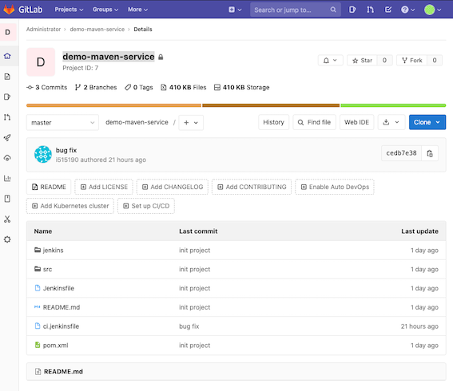

* SSH: **`ssh://git@192.168.33.1:30022/root/demo-maven-service.git`**
* HTTP: **`http://192.168.33.1:30088/root/demo-maven-service.git`**


### 关闭原有的`Gitlab Auto DevOps`

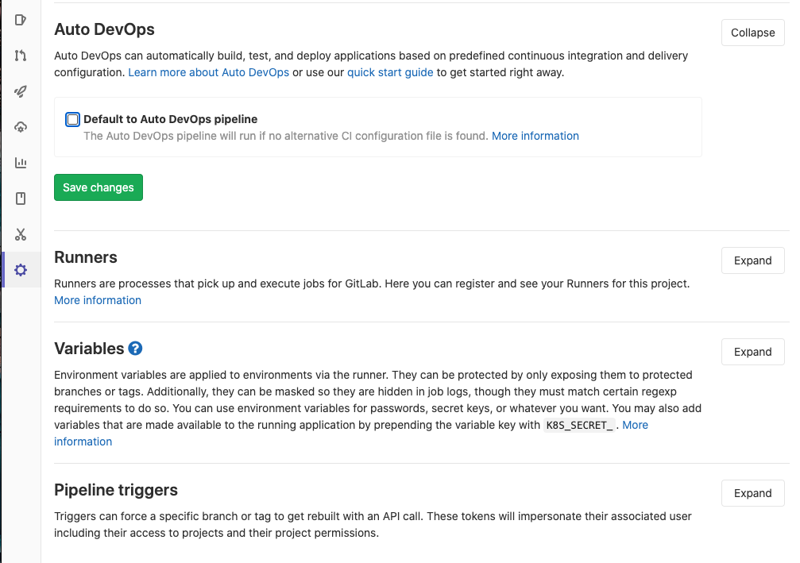

### 1-2 准备`pipeline`代码

**`1ci.jenkinsfile`**

```
#!groovy
@Library('jenkinslib@master') _

def build = new org.devops.buildtools()

pipeline {
 	agent { node { label "hostmachine" }}
 	parameters {
        string(name: 'srcUrl', defaultValue: 'http://192.168.33.1:30088/root/demo-maven-service.git', description: '') 
        choice(name: 'branchName', choices: 'master\nstage\ndev', description: 'Please chose your branch')
        choice(name: 'buildType', choices: 'mvn', description: 'build tool')
        choice(name: 'buildShell', choices: 'clean package -DskipTest\n--version', description: 'build tool')
	}
 	stages{
        stage('Checkout') {
	        steps {
	        	script {
	            	checkout([$class: 'GitSCM', branches: [[name: "${branchName}"]], doGenerateSubmoduleConfigurations: false, extensions: [], submoduleCfg: [], userRemoteConfigs: [[credentialsId: 'gitlab-admin-user', url: "${srcUrl}"]]])
	            } 
	        }
	    }
        
		stage('Build') {
	        steps {
	        	script {
	            	build.Build(buildType,buildShell)
	            } 
	        }
	    }   
    }
 }
```

* `@Library('jenkinslib@master') _` :  `sharedlib` 来自 **Github**: `JenkinslibTest/src/org/devops/buildtools.groovy`

* `Push` 到 local `gitlab-jenkinsfiles` 代码库
	* `ssh://git@192.168.33.1:30022/root/gitlab-jenkinsfiles.git`
	* `http://192.168.33.1:30088/root/gitlab-jenkinsfiles.git`

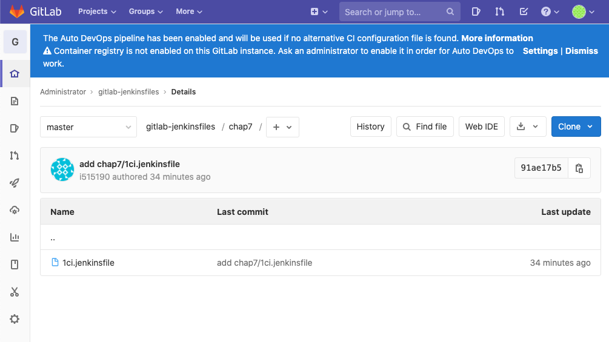

### 1-3 创建`pipeline job`

#### 1-3-1 加入`gitlab secret`: `gitlab-admin-user`

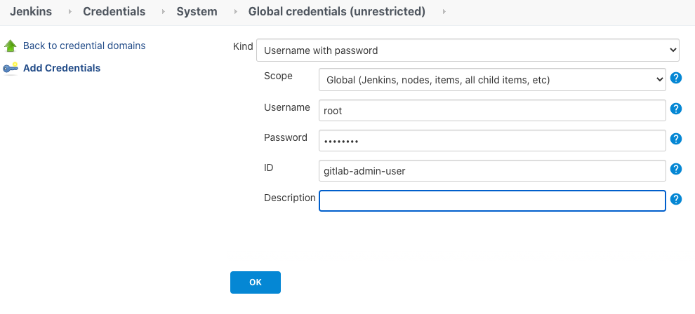

**`demo-maven-service-PUSH`**

* `http://192.168.33.1:30088/root/gitlab-jenkinsfiles.git`
* `Credentials`:  `gitlab-admin-user`
* `*/master`
* `chap7/1ci.jenkinsfile`

#### 1-3-2 Console output

```
Obtained chap7/1ci.jenkinsfile from git http://192.168.33.1:30088/root/gitlab-jenkinsfiles.git
Running in Durability level: MAX_SURVIVABILITY
Loading library jenkinslib@master
Examining Chao-Xi/JenkinslibTest
Attempting to resolve master as a branch
Resolved master as branch master at revision 956a0fa8daa1a53b06ca142bb48555425b977f67
using credential GitHub
 > git rev-parse --is-inside-work-tree # timeout=10
Fetching changes from the remote Git repository
 > git config remote.origin.url https://github.com/Chao-Xi/JenkinslibTest.git # timeout=10
Fetching without tags
Fetching upstream changes from https://github.com/Chao-Xi/JenkinslibTest.git
 > git --version # timeout=10
using GIT_ASKPASS to set credentials Github credential
 > git fetch --no-tags --progress -- https://github.com/Chao-Xi/JenkinslibTest.git +refs/heads/master:refs/remotes/origin/master # timeout=10
Checking out Revision 956a0fa8daa1a53b06ca142bb48555425b977f67 (master)
 > git config core.sparsecheckout # timeout=10
 > git checkout -f 956a0fa8daa1a53b06ca142bb48555425b977f67 # timeout=10
Commit message: "Update deploy.groovy"
 > git rev-list --no-walk 956a0fa8daa1a53b06ca142bb48555425b977f67 # timeout=10
[Pipeline] Start of Pipeline
[Pipeline] node
Running on hostmachine in /home/vagrant/workspace/workspace/demo-maven-service-PUSH
...
```
	
## 2、配置 GitLab 提交触发流水线 (`Generic Webhook Trigger`)

### 2-1 `Jenkins pipeline`添加触发`Webhook Trigger`

```
triggers { 
        GenericTrigger(
            genericRequestVariables: [
                [key: 'runOpts', regexpFilter: '']
            ],
            token: 'demo-maven-service-PUSH',
            silentResponse: false,
            printContributedVariables: true,
            printPostContent: true,
        )
    }
```

**完整代码**

```
#!groovy
@Library('jenkinslib@master') _

def build = new org.devops.buildtools()

pipeline {
 	agent { node { label "hostmachine" }}
 	parameters {
        string(name: 'srcUrl', defaultValue: 'http://192.168.33.1:30088/root/demo-maven-service.git', description: '') 
        choice(name: 'branchName', choices: 'master\nstage\ndev', description: 'Please chose your branch')
        choice(name: 'buildType', choices: 'mvn', description: 'build tool')
        choice(name: 'buildShell', choices: 'clean package -DskipTest\n--version', description: 'build tool')
	}

    triggers { 
        GenericTrigger(
            genericRequestVariables: [
                [key: 'runOpts', regexpFilter: '']
            ],
            token: 'demo-maven-service-PUSH',
            silentResponse: false,
            printContributedVariables: true,
            printPostContent: true,
        )
    }
 	stages{
        stage('Checkout') {
	        steps {
	        	script {
	            	checkout([$class: 'GitSCM', branches: [[name: "${branchName}"]], doGenerateSubmoduleConfigurations: false, extensions: [], submoduleCfg: [], userRemoteConfigs: [[credentialsId: 'gitlab-admin-user', url: "${srcUrl}"]]])
	            } 
	        }
	    }
        
		stage('Build') {
	        steps {
	        	script {
	            	build.Build(buildType,buildShell)
	            } 
	        }
	    }   
    }
 }
```
 
 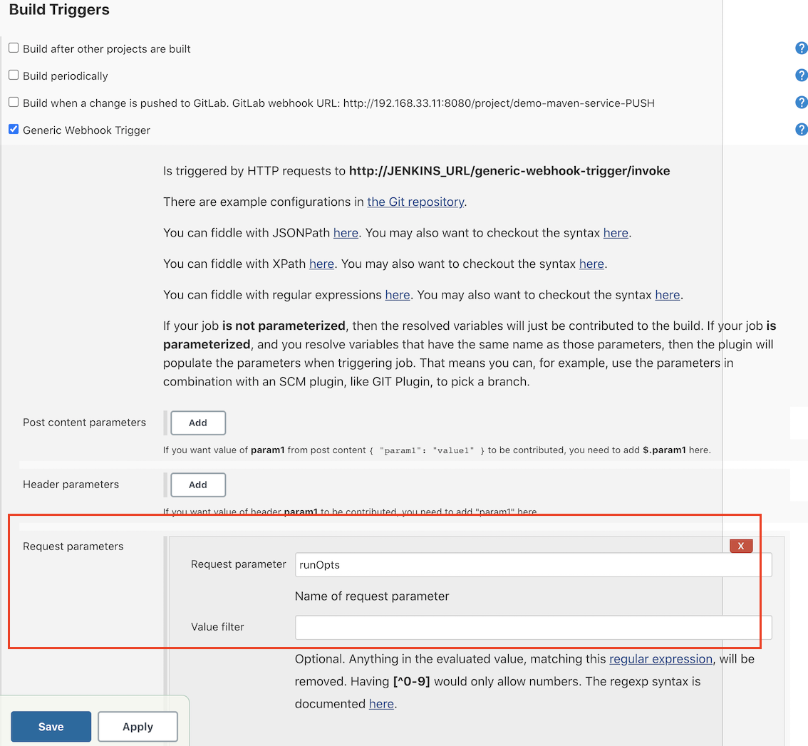
 
 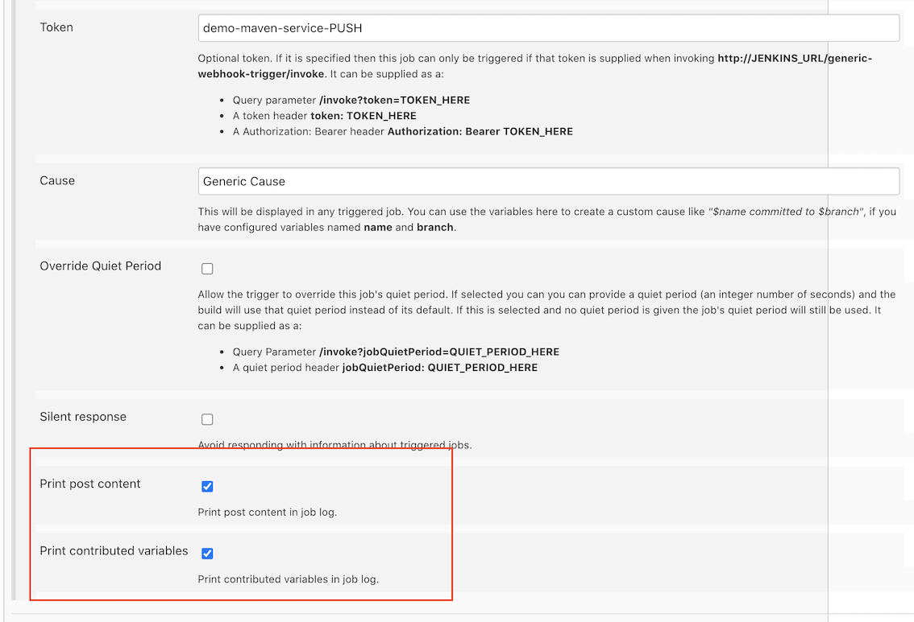
 

### 2-2  `Gitlab` 添加触发`Webhook Trigger`配置

**Enable outbound requests**

**Admin area** -> **Outbound requests** -> **Expand**

 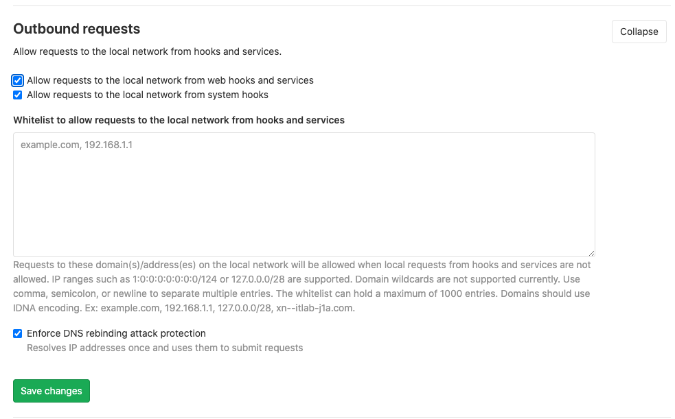

* `demo-maven-services`: `settings -> integration`: `webhook`

* URL: 

```
http://192.168.33.11:8080/generic-webhook-trigger/invoke?token=demo-maven-service-PUSH&runOpts=Gitlabpush
```

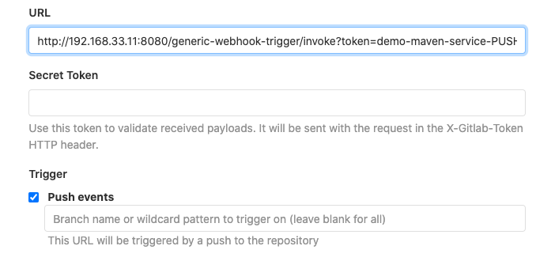

**Test push events**

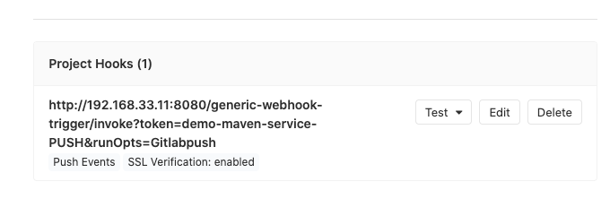
 
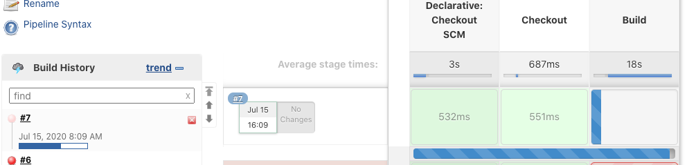

### 2-3 `Console Output`

```
Generic Cause
GenericWebhookEnvironmentContributor
 Received: {
    "object_kind": "push",
    "event_name": "push",
    "before": "9078a6cd451c051b541c151a6c4624a2a0e3d3ba",
    "after": "cedb7e38d4352031c4412cf91a467d0da6bb0bc5",
    "ref": "refs/heads/master",
    "checkout_sha": "cedb7e38d4352031c4412cf91a467d0da6bb0bc5",
    "message": null,
    "user_id": 1,
    "user_name": "Administrator",
    "user_username": "root",
    "user_email": "",
    "user_avatar": "https://www.gravatar.com/avatar/e820bb4aba5ad74c5a6ff1aca16641f6?s=80\u0026d=identicon",
    "project_id": 7,
    "project": {
        "id": 7,
        "name": "demo-maven-service",
        "description": "",
        "web_url": "http://localhost:30088/root/demo-maven-service",
        "avatar_url": null,
        "git_ssh_url": "ssh://git@localhost:30088:30022/root/demo-maven-service.git",
        "git_http_url": "http://localhost:30088/root/demo-maven-service.git",
        "namespace": "Administrator",
        "visibility_level": 0,
        "path_with_namespace": "root/demo-maven-service",
        "default_branch": "master",
        "ci_config_path": null,
        "homepage": "http://localhost:30088/root/demo-maven-service",
        "url": "ssh://git@localhost:30088:30022/root/demo-maven-service.git",
        "ssh_url": "ssh://git@localhost:30088:30022/root/demo-maven-service.git",
        "http_url": "http://localhost:30088/root/demo-maven-service.git"
    },
    "commits": [
        {
            "id": "cedb7e38d4352031c4412cf91a467d0da6bb0bc5",
            "message": "bug fix\n",
            "title": "bug fix",
            "timestamp": "2020-07-17T18:16:44+08:00",
            "url": "http://localhost:30088/root/demo-maven-service/-/commit/cedb7e38d4352031c4412cf91a467d0da6bb0bc5",
            "author": {
                "name": "...",
                "email": "jacob.xi@sap,com"
            },
            "added": [],
            "modified": [
                "ci.jenkinsfile"
            ],
            "removed": []
        },
        {
            "id": "ee4c2ad6b94fea12e3d260500864f6f59a43a8d8",
            "message": "add  ci.jenkinsfile\n",
            "title": "add  ci.jenkinsfile",
            "timestamp": "2020-07-17T18:11:40+08:00",
            "url": "http://localhost:30088/root/demo-maven-service/-/commit/ee4c2ad6b94fea12e3d260500864f6f59a43a8d8",
            "author": {
                "name": "...",
                "email": "jacob.xi@sap,com"
            },
            "added": [
                "ci.jenkinsfile"
            ],
            "modified": [],
            "removed": []
        },
        {
            "id": "9078a6cd451c051b541c151a6c4624a2a0e3d3ba",
            "message": "init project\n",
            "title": "init project",
            "timestamp": "2020-07-17T15:56:21+08:00",
            "url": "http://localhost:30088/root/demo-maven-service/-/commit/9078a6cd451c051b541c151a6c4624a2a0e3d3ba",
            "author": {
                "name": "...",
                "email": "jacob.xi@sap,com"
            },
            "added": [
                "Jenkinsfile",
                "README.md",
                "jenkins/Jenkinsfile",
                "jenkins/scripts/deliver.sh",
                "pom.xml",
                "src/main/java/com/mycompany/app/App.java",
                "src/test/java/com/mycompany/app/AppTest.java"
            ],
            "modified": [],
            "removed": []
        }
    ],
    "total_commits_count": 3,
    "push_options": {},
    "repository": {
        "name": "demo-maven-service",
        "url": "ssh://git@localhost:30088:30022/root/demo-maven-service.git",
        "description": "",
        "homepage": "http://localhost:30088/root/demo-maven-service",
        "git_http_url": "http://localhost:30088/root/demo-maven-service.git",
        "git_ssh_url": "ssh://git@localhost:30088:30022/root/demo-maven-service.git",
        "visibility_level": 0
    }
}


Contributing variables:

    runOpts = Gitlabpush
    runOpts_0 = Gitlabpush
```

`"ref": "refs/heads/master"` is branch name


## 3、分支自动匹配

### 3-1 分支自动替换成提交的分支 

```
...
genericVariables: [ 
                [key: 'branch', value: '$.ref'] 
            ], 
...
```

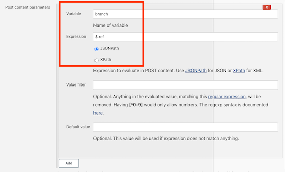

### 3-2 增加获取`hook`参数分支名称

通过`push`代码到`simple-java-maven-app`触发`jenkins pipeline`, 注意分支是通过`git lab webhook`发送过来


**Console output**

```
...
Contributing variables:

    branch = refs/heads/master
    runOpts = Gitlabpush
    runOpts_0 = Gitlabpush
...
```

获取正确的`branchName`:

```
String branchName = "${env.branchName}"
...
stage('Checkout') {
	        steps {
	        	script {   
                    if ("${runOpts}" == "Gitlabpush"){
                        println ("$branch")
                        def reg = "refs/heads/"
                        branchName = "$branch" - reg
                    }
                    
                    println("${branchName}")
				....
```

最终的`ci.jenkinsfile`文件如下

```
#!groovy
@Library('jenkinslib@master') _

def build = new org.devops.buildtools()
String branchName = "${env.branchName}"

#!groovy
@Library('jenkinslib@master') _

def build = new org.devops.buildtools()
String branchName = "${env.branchName}"

pipeline {
 	agent { node { label "hostmachine" }}
 	parameters {
        string(name: 'srcUrl', defaultValue: 'http://192.168.33.1:30088/root/demo-maven-service.git', description: '') 
        // choice(name: 'branchName', choices: 'master\nstage\ndev', description: 'Please chose your branch')
        choice(name: 'buildType', choices: 'mvn', description: 'build tool')
        choice(name: 'buildShell', choices: 'clean package -DskipTest\n--version', description: 'build tool')
	}


    triggers { 
        GenericTrigger(
            genericVariables: [ 
                [key: 'branch', value: '$.ref'] 
            ], 
            genericRequestVariables: [
                [key: 'runOpts', regexpFilter: '']
            ],
            token: 'demo-maven-service-PUSH',
            silentResponse: false,
            printContributedVariables: true,
            printPostContent: true,
        )
    }
 	stages{
        stage('Checkout') {
	        steps {
	        	script {   

                    if ("${runOpts}" == "Gitlabpush"){
                        println ("$branch")
                        def reg = "refs/heads/"
                        branchName = "$branch" - reg
                        // branchName = "${branch}" 
                    }
                    
                    println("${branchName}")

	            	checkout([$class: 'GitSCM', branches: [[name: "${branchName}"]], doGenerateSubmoduleConfigurations: false, extensions: [], submoduleCfg: [], userRemoteConfigs: [[credentialsId: 'gitlab-admin-user', url: "${srcUrl}"]]])
	            } 
	        }
	    }
        
		stage('Build') {
	        steps {
	        	script {
	            	build.Build(buildType,buildShell)
	            } 
	        }
	    }   
    }
 }
```

* Build job 不需要`Manul Build Now` 
* 任一一个`Branch` 的 `push` 都会导致`JenkinsPipeline`被触发

**例如push到master**

```
...

Contributing variables:

    branch = refs/heads/master
    runOpts = Gitlabpush
    runOpts_0 = Gitlabpush
...
[Pipeline] { (Checkout)
[Pipeline] script
[Pipeline] {
[Pipeline] echo
refs/heads/master
[Pipeline] echo
master
...
 > git rev-parse origin/master^{commit} # timeout=10
```

**例如push另外的分支**

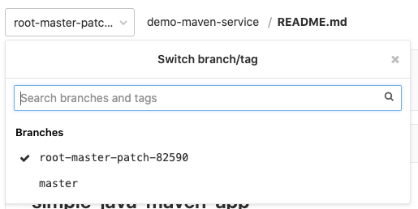

```
...
Contributing variables:

    branch = refs/heads/root-master-patch-82590
    runOpts = Gitlabpush
    runOpts_0 = Gitlabpush
...
refs/heads/root-master-patch-82590
[Pipeline] echo
root-master-patch-82590
[Pipeline] checkout
...
```

## 4、变更 Commit 状态

### 4-1 增加构建描述信息

```
triggers { 
        GenericTrigger(
            genericVariables: [ 
                [key: 'branch', value: '$.ref'], 
                [key: 'userName', value: '$.user_username'],   
                ...
```

* ` [key: 'userName', value: '$.user_username'],` : 添加构建人信息

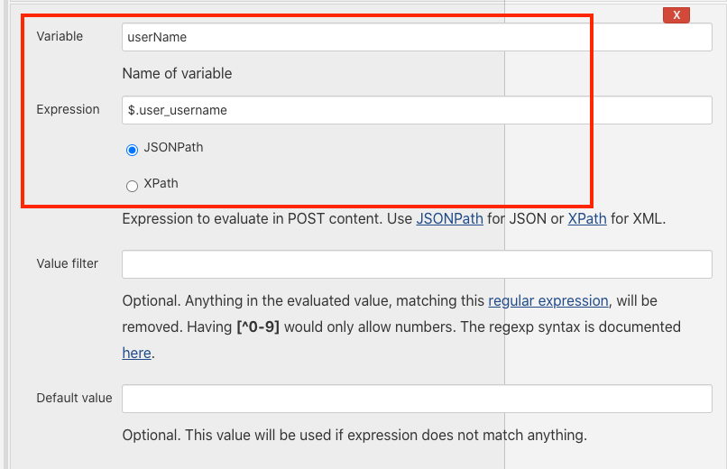


* 变量名称：`currentBuild.description `

```
stages{
        stage('Checkout') {
	        steps {
	        	script {
                    if ("${runOpts}" == "Gitlabpush"){
                    println ("$branch")
                    def reg = "refs/heads/"
                    branchName = "$branch" - reg
                    currentBuild.description = "Trigger by ${userName} ${branch}"
				...
```

* `currentBuild.description = "Trigger by ${userName} ${branch}"`  显示构建信息

修改不同分支下的文件，来触发`pipelinejob`


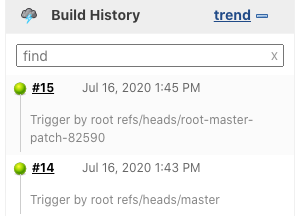


### 4-2 变更 Commit 状态返回到`gitlab`的`commit`信息

* `gitlab pipeline` 接口API 信息: https://docs.gitlab.com/ee/api/commits.html#post-the-build-status-to-a-commit
	* 状态：` [pending, running, success, failed, canceled] `
	* API: `projects/${projectId}/statuses/${commitSha}?state= `

#### 4-2-1 增加`gitlab sharedlibrary function` 

**`src/org/devops/gitlab.groovy`**

```
package org.devops

//封装HTTP请求
def HttpReq(reqType,reqUrl,reqBody){
    def gitServer = "http://192.168.33.1:30088/api/v4"
    withCredentials([string(credentialsId: 'gitlab-token', variable: 'gitlabToken')]) {
      result = httpRequest customHeaders: [[maskValue: true, name: 'PRIVATE-TOKEN', value: "${gitlabToken}"]], 
                httpMode: reqType, 
                contentType: "APPLICATION_JSON",
                consoleLogResponseBody: true,
                ignoreSslErrors: true, 
                requestBody: reqBody,
                url: "${gitServer}/${reqUrl}"
                //quiet: true
    }
    return result
}

//更改提交状态
def ChangeCommitStatus(projectId,commitSha,status){
    commitApi = "projects/${projectId}/statuses/${commitSha}?state=${status}"
    response = HttpReq('POST',commitApi,'')
    println(response)
    return response
}
```

* `gitServer`: 为`girlab server`可以提供的`api`访问地址`http://gitlab-url/api/v4`
* `credentialsId: 'gitlab-token'`: 注意这里有一个`bug`, `gitlab-token` 是注册在`Jenkins Manage Credentials`里面的`gitlab Personal Access Tokens`, 产生地址：

`gitlab -> profile -> personal_access_tokens: JenkinsAPIToken: KePsbG32TCHUGd63v8RR`

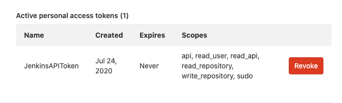

我们需要将这个`token`添加到`jenkins`中， 当我们安装到`gitlab plungin` 我们可以在直接添加`Gitlab API token`

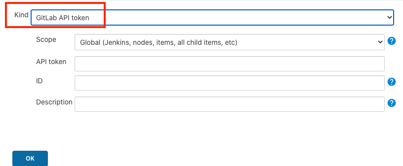

但是我们在后调用这个`token`的时候会报错

```
Error when executing failure post condition:
org.jenkinsci.plugins.credentialsbinding.impl.CredentialNotFoundException: Credentials 'gitlab-token' is of type 'GitLab Personal Access Token' where 'org.jenkinsci.plugins.plaincredentials.StringCredentials' was expected
	at 
...
```

在多方查询过后，本人发现这其实是`gitlab plugin` 在处理`Credential`时候的一个`bug`，至今无人修复，[ Feature: Support Jenkins Credentials for "Secret Token" #494](https://github.com/jenkinsci/gitlab-plugin/issues/494)， 所以根据`ticket`中的描述， `workaround` 的方法是,将这个`token`添加为简单的`jenkins secret tesxt`, that will works

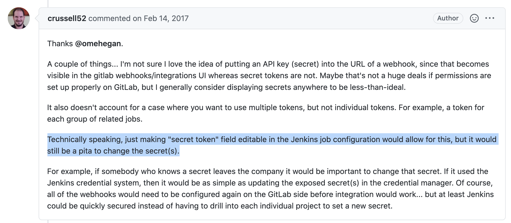


#### 4-2-2 `Jenkinsfiles`调用`sharedlibrary`

```
def gitlab = new org.devops.gitlab()
```

#### 4-2-3 提取构建信息`projectId` 和 `commitSha`

```
...
triggers { 
        GenericTrigger(
            genericVariables: [ 
                [key: 'branch', value: '$.ref'], 
                [key: 'userName', value: '$.user_username'],
                [key: 'projectId', value: '$.project.id'],
                [key: 'commitSha', value: '$.checkout_sha']

            ], 
...
```

#### 4-2-4 返回构建信息到`gitlab`

```
stages{
        stage('Checkout') {
	        steps {
	        	script {
                    if ("${runOpts}" == "Gitlabpush"){
                    println ("$branch")
                    def reg = "refs/heads/"
                    branchName = "$branch" - reg
                    currentBuild.description = "Trigger by ${userName} ${branch}"
                    gitlab.ChangeCommitStatus(projectId,commitSha,"running")
                }
...

post { 
        always { 
            script{
                println("always")
            }
        }

        success { 
            script{
                println("succcess")
                gitlab.ChangeCommitStatus(projectId,commitSha,"success")
            }
        }

        failure { 
            script{
                println("failure")
                gitlab.ChangeCommitStatus(projectId,commitSha,"failed")
            }
        }

        aborted { 
            script{
                println("aborted")
                gitlab.ChangeCommitStatus(projectId,commitSha,"canceled")
            }
        }
    }
```

*   `gitlab.ChangeCommitStatus(projectId,commitSha,"running")`

**最终的`jenkinsfile`**

```
#!groovy
@Library('jenkinslib@master') _

def build = new org.devops.buildtools()
def gitlab = new org.devops.gitlab()

String branchName = "${env.branchName}"

pipeline {
 	agent { node { label "hostmachine" }}
 	parameters {
        string(name: 'srcUrl', defaultValue: 'http://192.168.33.1:30088/root/demo-maven-service.git', description: '') 
        // choice(name: 'branchName', choices: 'master\nstage\ndev', description: 'Please chose your branch')
        choice(name: 'buildType', choices: 'mvn', description: 'build tool')
        choice(name: 'buildShell', choices: 'clean package -DskipTest\n--version', description: 'build tool')
	}


    triggers { 
        GenericTrigger(
            genericVariables: [ 
                [key: 'branch', value: '$.ref'], 
                [key: 'userName', value: '$.user_username'],
                [key: 'projectId', value: '$.project.id'],
                [key: 'commitSha', value: '$.checkout_sha']

            ], 
            genericRequestVariables: [
                [key: 'runOpts', regexpFilter: '']
            ],
            token: 'demo-maven-service-PUSH',
            silentResponse: false,
            printContributedVariables: true,
            printPostContent: true,
        )
    }
 	stages{
        stage('Checkout') {
	        steps {
	        	script {
                    if ("${runOpts}" == "Gitlabpush"){
                    println ("$branch")
                    def reg = "refs/heads/"
                    branchName = "$branch" - reg
                    currentBuild.description = "Trigger by ${userName} ${branch}"
                    gitlab.ChangeCommitStatus(projectId,commitSha,"running")
                }
                            
	            	checkout([$class: 'GitSCM', branches: [[name: "${branchName}"]], doGenerateSubmoduleConfigurations: false, extensions: [], submoduleCfg: [], userRemoteConfigs: [[credentialsId: 'gitlab-admin-user', url: "${srcUrl}"]]])
	            } 
	        }
	    }
        
		stage('Build') {
	        steps {
	        	script {
	            	build.Build(buildType,buildShell)
	            } 
	        }
	    }   
    }

    post { 
        always { 
            script{
                println("always")
            }
        }

        success { 
            script{
                println("succcess")
                gitlab.ChangeCommitStatus(projectId,commitSha,"success")
            }
        }

        failure { 
            script{
                println("failure")
                gitlab.ChangeCommitStatus(projectId,commitSha,"failed")
            }
        }

        aborted { 
            script{
                println("aborted")
                gitlab.ChangeCommitStatus(projectId,commitSha,"canceled")
            }
        }
    }
 }
```
 
#### 4-2-5 触发效果

**Console Output**

```
...

Contributing variables:

    branch = refs/heads/master
    commitSha = 595e88dfb0ae35ae7cf4c4892aae8adba96b4986
    projectId = 7
    runOpts = Gitlabpush
    runOpts_0 = Gitlabpush
    userName = root
...
always
[Pipeline] }
[Pipeline] // script
[Pipeline] script
[Pipeline] {
[Pipeline] echo
succcess
[Pipeline] withCredentials
Masking supported pattern matches of $gitlabToken
[Pipeline] {
[Pipeline] httpRequest
HttpMethod: POST
URL: http://192.168.33.1:30088/api/v4/projects/7/statuses/595e88dfb0ae35ae7cf4c4892aae8adba96b4986?state=success
Content-Type: application/json
PRIVATE-TOKEN: *****
Sending request to url: http://192.168.33.1:30088/api/v4/projects/7/statuses/595e88dfb0ae35ae7cf4c4892aae8adba96b4986?state=success
Response Code: HTTP/1.1 201 Created
Response: 
{"id":18,"sha":"595e88dfb0ae35ae7cf4c4892aae8adba96b4986","ref":"master","status":"success","name":"default","target_url":null,"description":null,"created_at":"2020-07-24T09:57:22.315Z","started_at":"2020-07-24T09:57:22.337Z","finished_at":"2020-07-24T09:57:41.393Z","allow_failure":false,"coverage":null,"author":{"id":1,"name":"Administrator","username":"root","state":"active","avatar_url":"https://www.gravatar.com/avatar/e820bb4aba5ad74c5a6ff1aca16641f6?s=80\u0026d=identicon","web_url":"http://localhost:30088/root"}}
Success code from [100‥399]
[Pipeline] }
[Pipeline] // withCredentials
[Pipeline] echo
Status: 201
```
**gliab commit message: running->success**

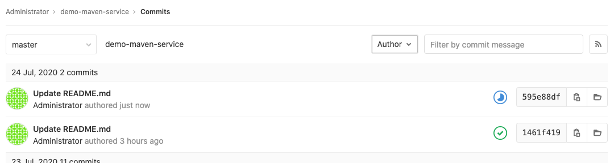
 
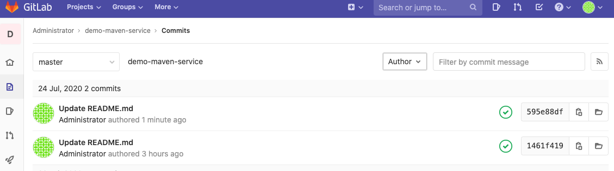


## 5、过滤特殊 push 请求

创建新的分支被认为是一种特殊的`Push`请求，会触发一次`Pipeline Job`, 我们希望通过某些限制方式来禁止这个job 被触发

例如新建的`branch`所产生的`push`信息如下，会有一个40个0的信息

```
{
   "object_kind":"push",
   "event_name":"push",
   "before":"0000000000000000000000000000000000000000",  #40个0
   "after":"595e88dfb0ae35ae7cf4c4892aae8adba96b4986",
   "ref":"refs/heads/test-push01",
 	....
Contributing variables":
	
	branch = refs/heads/test-push01
    commitSha = 595e88dfb0ae35ae7cf4c4892aae8adba96b4986
    projectId = 7
    runOpts = Gitlabpush
    runOpts_0 = Gitlabpush
    userName = root
```

* https://github.com/jenkinsci/generic-webhook-trigger-plugin/tree/master/src/test/resources/org/jenkinsci/plugins/gwt/bdd
* https://github.com/jenkinsci/generic-webhook-trigger-plugin/blob/master/src/test/resources/org/jenkinsci/plugins/gwt/bdd/gitlab/gitlab-push-ignore-create-remove-branch.feature

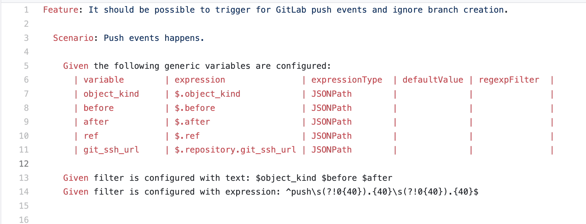

*   Given filter is configured with text: `$object_kind $before $after`
*   Given filter is configured with expression: `^push\s(?!0{40}).{40}\s(?!0{40}).{40}$`

```
triggers { 
        GenericTrigger(
            genericVariables: [ 
                [key: 'branch', value: '$.ref'], 
                [key: 'userName', value: '$.user_username'],
                [key: 'projectId', value: '$.project.id'],
                [key: 'commitSha', value: '$.checkout_sha'],
                [key: 'before', value: '$.before'],
                [key: 'after', value: '$.after'],
                [key: 'object_kind', value: '$.object_kind']
            ], 
            genericRequestVariables: [
                [key: 'runOpts', regexpFilter: '']
            ],
            token: 'demo-maven-service-PUSH',
            silentResponse: false,
            printContributedVariables: true,
            printPostContent: true,

            regexpFilterText: '$object_kind $before $after',
            regexpFilterExpression: '^push\\s(?!0{40}).{40}\\s(?!0{40}).{40}$'
        )
    }
```

* `'^push\\s(?!0{40}).{40}\\s(?!0{40}).{40}$'`

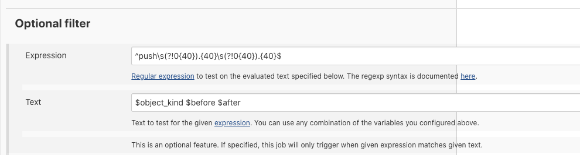

从此新建的`branch`将不会触发新的`pipeline`

```
#!groovy
@Library('jenkinslib@master') _

def build = new org.devops.buildtools()
def gitlab = new org.devops.gitlab()

String branchName = "${env.branchName}"

pipeline {
 	agent { node { label "hostmachine" }}
 	parameters {
        string(name: 'srcUrl', defaultValue: 'http://192.168.33.1:30088/root/demo-maven-service.git', description: '') 
        // choice(name: 'branchName', choices: 'master\nstage\ndev', description: 'Please chose your branch')
        choice(name: 'buildType', choices: 'mvn', description: 'build tool')
        choice(name: 'buildShell', choices: 'clean package -DskipTest\n--version', description: 'build tool')
	}


    triggers { 
        GenericTrigger(
            genericVariables: [ 
                [key: 'branch', value: '$.ref'], 
                [key: 'userName', value: '$.user_username'],
                [key: 'projectId', value: '$.project.id'],
                [key: 'commitSha', value: '$.checkout_sha'],
                [key: 'before', value: '$.before'],
                [key: 'after', value: '$.after'],
                [key: 'object_kind', value: '$.object_kind']
            ], 
            genericRequestVariables: [
                [key: 'runOpts', regexpFilter: '']
            ],
            token: 'demo-maven-service-PUSH',
            silentResponse: false,
            printContributedVariables: true,
            printPostContent: true,

            regexpFilterText: '$object_kind $before $after',
            regexpFilterExpression: '^push\\s(?!0{40}).{40}\\s(?!0{40}).{40}$'
        )
    }
 	stages{
        stage('Checkout') {
	        steps {
	        	script {
                    if ("${runOpts}" == "Gitlabpush"){
                    println ("$branch")
                    def reg = "refs/heads/"
                    branchName = "$branch" - reg
                    currentBuild.description = "Trigger by ${userName} ${branch}"
                    gitlab.ChangeCommitStatus(projectId,commitSha,"running")
                }
                            
	            	checkout([$class: 'GitSCM', branches: [[name: "${branchName}"]], doGenerateSubmoduleConfigurations: false, extensions: [], submoduleCfg: [], userRemoteConfigs: [[credentialsId: 'gitlab-admin-user', url: "${srcUrl}"]]])
	            } 
	        }
	    }
        
		stage('Build') {
	        steps {
	        	script {
	            	build.Build(buildType,buildShell)
	            } 
	        }
	    }   
    }

    post { 
        always { 
            script{
                println("always")
            }
        }

        success { 
            script{
                println("succcess")
                gitlab.ChangeCommitStatus(projectId,commitSha,"success")
            }
        }

        failure { 
            script{
                println("failure")
                gitlab.ChangeCommitStatus(projectId,commitSha,"failed")
            }
        }

        aborted { 
            script{
                println("aborted")
                gitlab.ChangeCommitStatus(projectId,commitSha,"canceled")
            }
        }
    }
 }
```
 
 