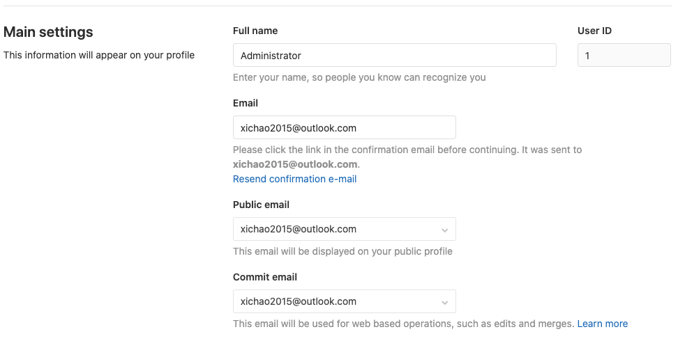
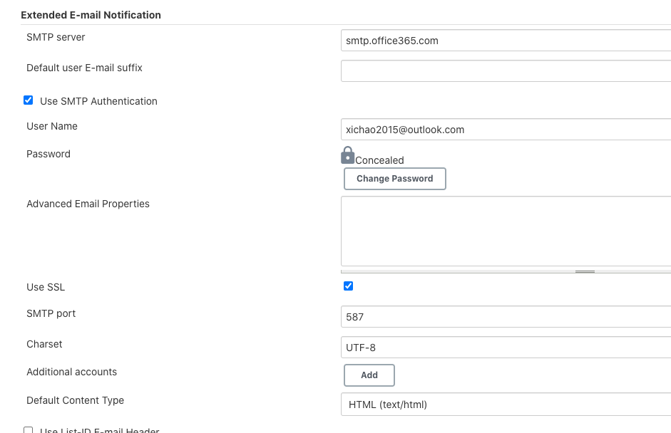
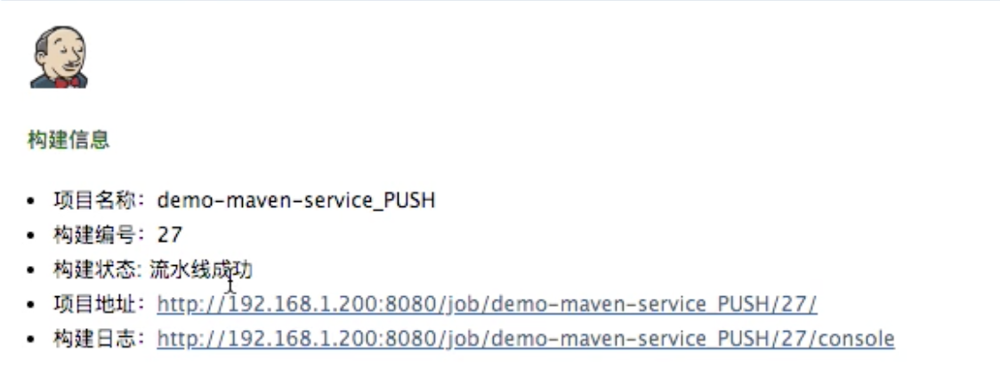
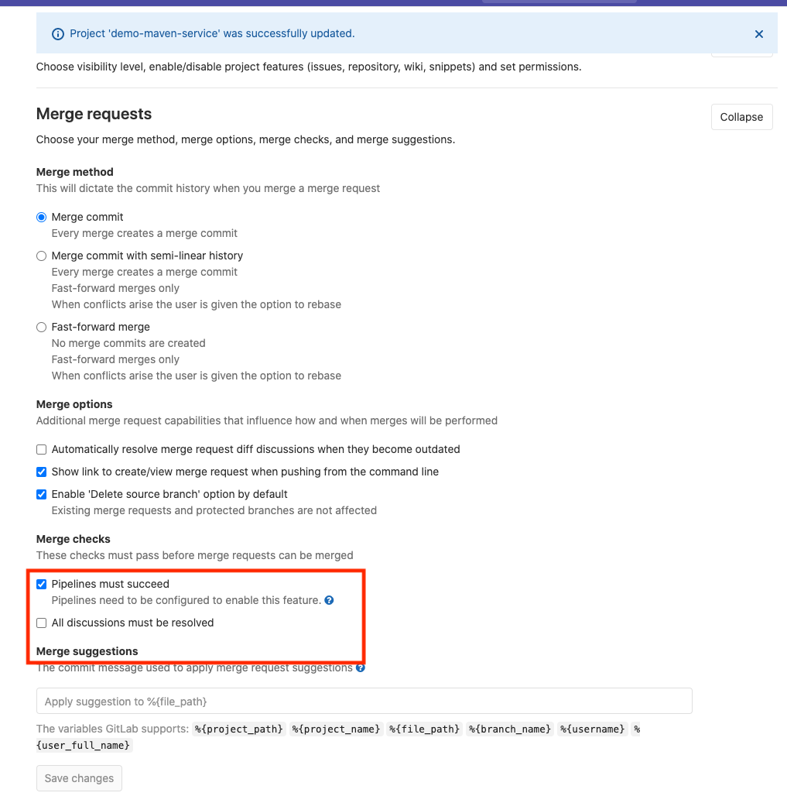
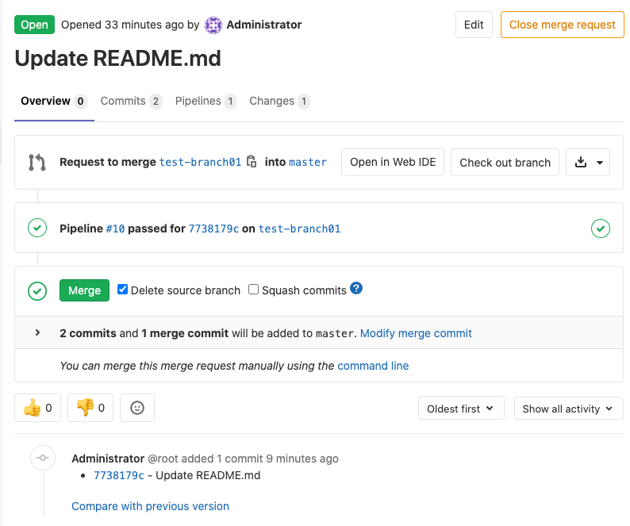

# **第三节 第三节 Gitlab-Jenkins 版本控制（补充）**


## 1、构建邮件通知

* Email Extension: `email-ext` 安装


### 1-1 添加邮件发送模板到`sharedlibrary`

**`src/org/devops/toemail.groovy`**

```
package org.devops

//定义邮件内容
def Email(status,emailUser){
    emailext body: """
            <!DOCTYPE html> 
            <html> 
            <head> 
            <meta charset="UTF-8"> 
            </head> 
            <body leftmargin="8" marginwidth="0" topmargin="8" marginheight="4" offset="0"> 
                
                <table width="95%" cellpadding="0" cellspacing="0" style="font-size: 11pt; font-family: Tahoma, Arial, Helvetica, sans-serif">   
                    <tr> 
                        <td><br /> 
                            <b><font color="#0B610B">Build Information</font></b> 
                        </td> 
                    </tr> 
                    <tr> 
                        <td> 
                            <ul> 
                                <li>Job Name:${JOB_NAME}</li>         
                                <li>Build Id:${BUILD_ID}</li> 
                                <li>Build Status: ${status} </li>                         
                                <li>Build URL:<a href="${BUILD_URL}">${BUILD_URL}</a></li>    
                                <li>Build Log:<a href="${BUILD_URL}console">${BUILD_URL}console</a></li> 
                            </ul> 
                        </td> 
                    </tr> 
                    <tr>  
                </table> 
            </body> 
            </html>  """,
            subject: "Jenkins-${JOB_NAME}Build Information ",
            to: emailUser
        
}
```

### 1-2 添加用户邮件地址到`Gitlab` 

* **`Admin area -> users -> (username) -> Add User Email`**
* **Update User profile settings**



### 1-3 添加新的`Trigger`变量

```
triggers { 
        GenericTrigger(
            genericVariables: [ 
                [key: 'branch', value: '$.ref'], 
                [key: 'userName', value: '$.user_username'],
                [key: 'projectId', value: '$.project.id'],
                [key: 'commitSha', value: '$.checkout_sha'],
                [key: 'before', value: '$.before'],
                [key: 'after', value: '$.after'],
                [key: 'object_kind', value: '$.object_kind'],
                [key: 'userEmail', value: '$.user_email']
            ], 
            ...
```

**Console Output**

```
{
   "object_kind":"push",
   "event_name":"push",
   "before":"c3c7ced66b6c50f472d1c681156e7c16fb41b12c",
   "after":"2bb50eebe62e9cfc401905f4dd47981fc2f8b78e",
   "ref":"refs/heads/master",
   "checkout_sha":"2bb50eebe62e9cfc401905f4dd47981fc2f8b78e",
   "message":null,
   "user_id":1,
   "user_name":"Administrator",
   "user_username":"root",
   "user_email":"xichao2015@outlook.com",
   "user_avatar":"https://www.gravatar.com/avatar/d86ea488c14556309b0c2773c1e1dd6a?s=80\u0026d=identicon",
   ...
   "commits":[
      {
         "id":"2bb50eebe62e9cfc401905f4dd47981fc2f8b78e",
         "message":"Update README.md",
         "title":"Update README.md",
         "timestamp":"2020-07-25T19:35:34+08:00",
         "url":"http://localhost:30088/root/demo-maven-service/-/commit/2bb50eebe62e9cfc401905f4dd47981fc2f8b78e",
         "author":{
            "name":"Administrator",
            "email":"xichao2015@outlook.com"
         },
         ...
}

Contributing variables:

    after = 2bb50eebe62e9cfc401905f4dd47981fc2f8b78e
    before = c3c7ced66b6c50f472d1c681156e7c16fb41b12c
    branch = refs/heads/master
    commitSha = 2bb50eebe62e9cfc401905f4dd47981fc2f8b78e
    object_kind = push
    projectId = 7
    runOpts = Gitlabpush
    runOpts_0 = Gitlabpush
    userEmail = xichao2015@outlook.com
    userName = root
```

### 1-4 在`pipeline`中调用邮件发送方法

```
#!groovy
@Library('jenkinslib@master') _

...
def toemail = new org.devops.toemail()
...
post { 
        always { 
            script{
                println("always")
            }
        }

        success { 
            script{
                println("succcess")
                gitlab.ChangeCommitStatus(projectId,commitSha,"success")
                toemail.Email("Build Success!...",userEmail)
            }
        }

        failure { 
            script{
                println("failure")
                gitlab.ChangeCommitStatus(projectId,commitSha,"failed")
                toemail.Email("Build failed!...",userEmail)
            }
        }

        aborted { 
            script{
                println("aborted")
                gitlab.ChangeCommitStatus(projectId,commitSha,"canceled")
                toemail.Email("Build Canceled!...",userEmail)
            }
        }
    }
}
```

### 1-4 在`Jenkins`中添加`SMTP`信息



### 1-5 触发`job`

**最终pipeline script**

```
#!groovy
@Library('jenkinslib@master') _

def build = new org.devops.buildtools()
def gitlab = new org.devops.gitlab()
def toemail = new org.devops.toemail()

String branchName = "${env.branchName}"

pipeline {
 	agent { node { label "hostmachine" }}
 	parameters {
        string(name: 'srcUrl', defaultValue: 'http://192.168.33.1:30088/root/demo-maven-service.git', description: '') 
        // choice(name: 'branchName', choices: 'master\nstage\ndev', description: 'Please chose your branch')
        choice(name: 'buildType', choices: 'mvn', description: 'build tool')
        choice(name: 'buildShell', choices: 'clean package -DskipTest\n--version', description: 'build tool')
	}


    triggers { 
        GenericTrigger(
            genericVariables: [ 
                [key: 'branch', value: '$.ref'], 
                [key: 'userName', value: '$.user_username'],
                [key: 'projectId', value: '$.project.id'],
                [key: 'commitSha', value: '$.checkout_sha'],
                [key: 'before', value: '$.before'],
                [key: 'after', value: '$.after'],
                [key: 'object_kind', value: '$.object_kind'],
                [key: 'userEmail', value: '$.user_email']
            ], 
            genericRequestVariables: [
                [key: 'runOpts', regexpFilter: '']
            ],
            token: 'demo-maven-service-PUSH',
            silentResponse: false,
            printContributedVariables: true,
            printPostContent: true,

            regexpFilterText: '$object_kind $before $after',
            regexpFilterExpression: '^push\\s(?!0{40}).{40}\\s(?!0{40}).{40}$'
        )
    }
 	stages{
        stage('Checkout') {
	        steps {
	        	script {
                    if ("${runOpts}" == "Gitlabpush"){
                    println ("$branch")
                    def reg = "refs/heads/"
                    branchName = "$branch" - reg
                    currentBuild.description = "Trigger by ${userName} ${branch}"
                    gitlab.ChangeCommitStatus(projectId,commitSha,"running")
                }
                            
	            	checkout([$class: 'GitSCM', branches: [[name: "${branchName}"]], doGenerateSubmoduleConfigurations: false, extensions: [], submoduleCfg: [], userRemoteConfigs: [[credentialsId: 'gitlab-admin-user', url: "${srcUrl}"]]])
	            } 
	        }
	    }
        
		stage('Build') {
	        steps {
	        	script {
	            	build.Build(buildType,buildShell)
	            } 
	        }
	    }   
    }

    post { 
        always { 
            script{
                println("always")
            }
        }

        success { 
            script{
                println("succcess")
                gitlab.ChangeCommitStatus(projectId,commitSha,"success")
                toemail.Email("Build Success!...",userEmail)
            }
        }

        failure { 
            script{
                println("failure")
                gitlab.ChangeCommitStatus(projectId,commitSha,"failed")
                toemail.Email("Build failed!...",userEmail)
            }
        }

        aborted { 
            script{
                println("aborted")
                gitlab.ChangeCommitStatus(projectId,commitSha,"canceled")
                toemail.Email("Build Canceled!...",userEmail)
            }
        }
    }
 }
```

**Console Output**

```
Contributing variables:

    after = 2bb50eebe62e9cfc401905f4dd47981fc2f8b78e
    before = c3c7ced66b6c50f472d1c681156e7c16fb41b12c
    branch = refs/heads/master
    commitSha = 2bb50eebe62e9cfc401905f4dd47981fc2f8b78e
    object_kind = push
    projectId = 7
    runOpts = Gitlabpush
    runOpts_0 = Gitlabpush
    userEmail = xichao2015@outlook.com
    userName = root

...
Sending email to: xichao2015@outlook.com
```




## 2、配置 GitLab 合并流水线

* Email Extension: ` gitlab-merge-request-jenkins` 安装

**当流水线成功后合并分支**

**`settings -> general -> Merge requests`**

**Merge Checks -> Pipeline must success**



