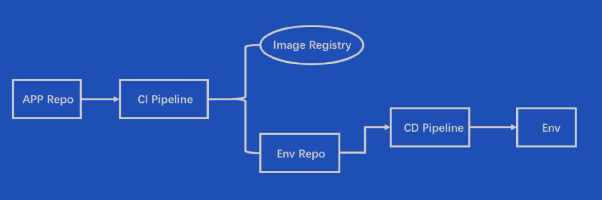
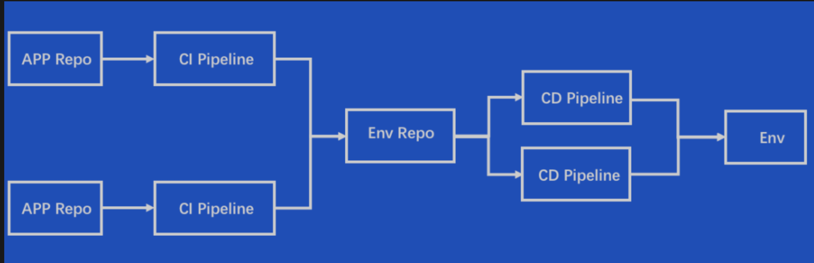
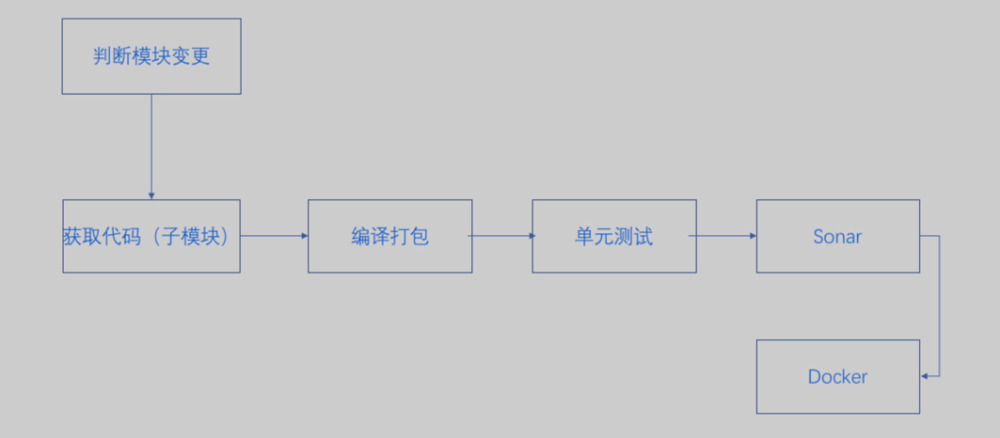
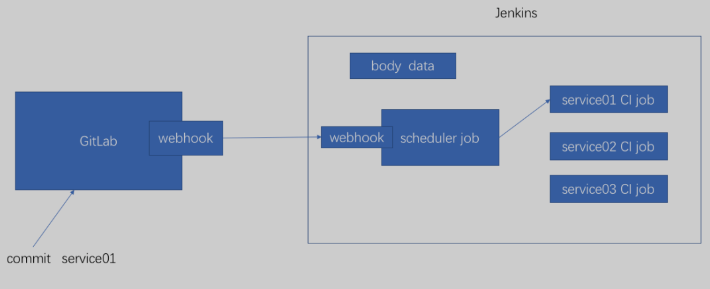
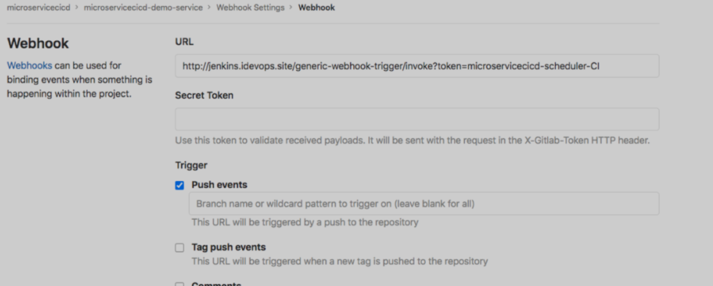
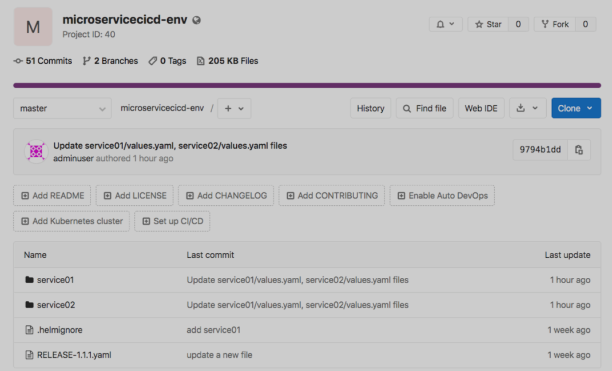
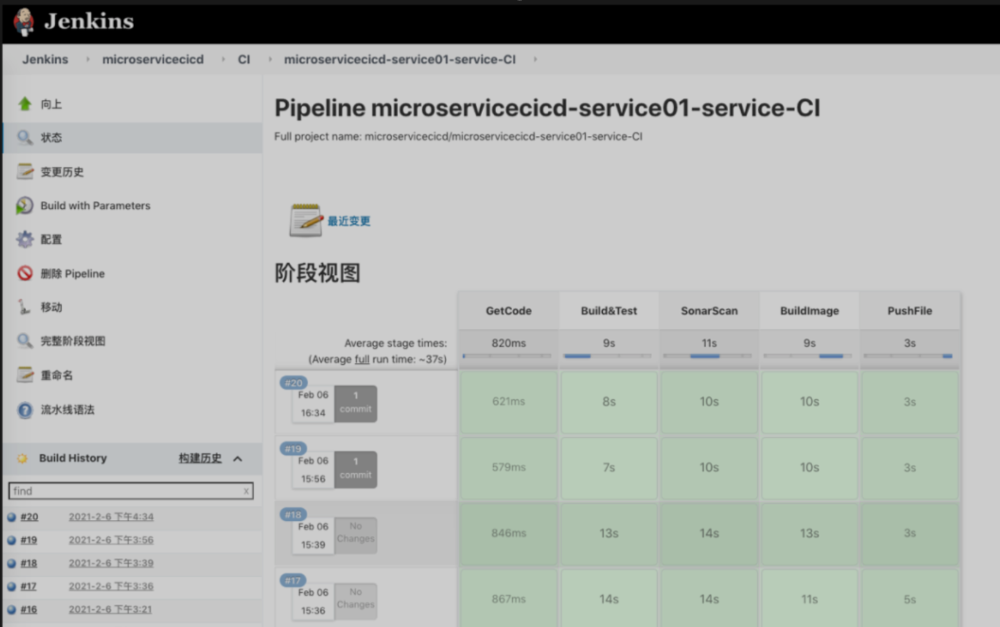
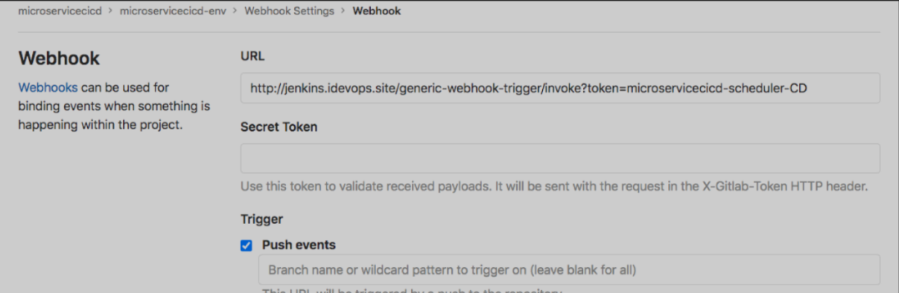
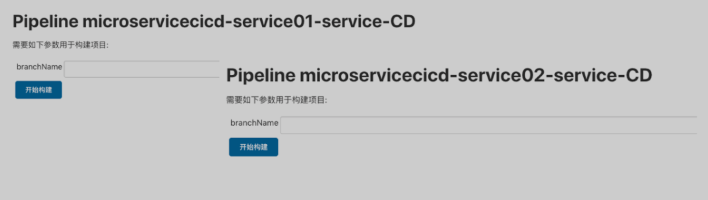
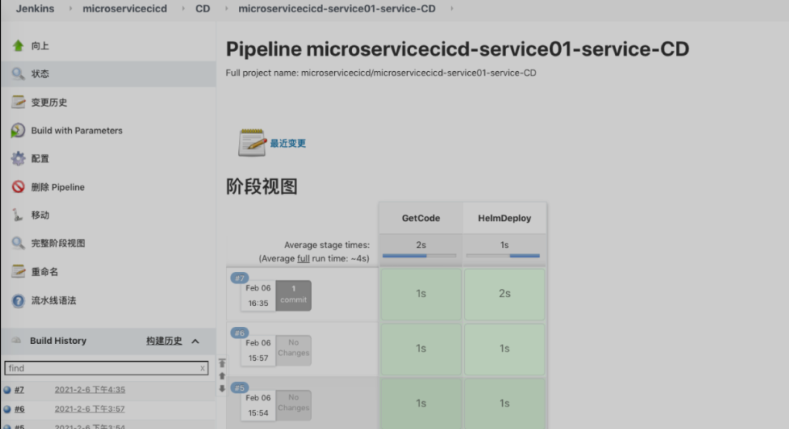

# **​第四节 GitOps模式下微服务CI/CD实践**

单应用与环境流程设计：



多应用与环境流程设计：



## CI持续集成

首先准备一个代码库：https://github.com/DevOpsCICDCourse/microservicescicd/blob/main/microservice-demo-service-master.zip
 
我们来梳理一下CI流水线的步骤：



* 由于此次实现的代码仓库类型为单一存储库，即一个存储库存放多个服务模块代码，每个子目录为一个服务模块。
* 首先，我们的持续集成流水线需要能够正确获取，当前的commit是哪个服务的代码。
* 确定好服务，然后下载该服务的代码，进行编译打包、单元测试、代码扫描和构建镜像等步骤。


如何获取commit的服务信息？这里我们使用GitLab WebHook功能和Jenkins 的job 构建触发器对接来实现。



工作流程是：

当我在Gitlab提交了代码，会通过GitLab webhook 触发Jenkins Scheduler 作业， 会将此次提交代码所产生的hook data数据信息以POST的方式传给Jenkins Job。

**此时Jenkins job可以编写使用Generic Hook插件获取此次POST请求传输过来的请求体Body信息**。

**是一段JSON数据， 该job运行后编写Pipeline 解析JSON中的数据拿到所变更的服务模块信息。最后触发对应服务的CI作业进行构建**。

### CI-Scheduler 作业

此作业只需要开启webhook， 配置触发token（唯一性）。生成hookurl：http://jenkins.idevops.site/generic-webhook-trigger/invoke?token=microservicecicd-scheduler-CI


Jenkinsfile

```
pipeline {
 agent any 

 stages{

  stage("GetData"){
   steps{
    script {
     echo "${webHookData}"

     data = readJSON  text: "${webHookData}"

     println(data)

     env.branchName = data.ref - "refs/heads/"
     env.commitId = data.checkout_sha
     env.projectId = data.project_id
     commits = data["commits"]

     println("${env.branchName}")
     println("${env.commitID}")
     println("${env.projectId}")

     //env.moduleName = "service01"
     changeServices = []
                    for(commit in commits) {
                        println(commit.id)

                        //added
                        for (add in commit.added) {
                            s = add.split("/") as List
                            if (s.size() > 1){
                                if (changeServices.indexOf(s[0]) == -1){
                                    changeServices.add(s[0])
                                }
                            }
                        }

                        //modified
                        for (m in commit.modified) {
                            s = m.split("/") as List
                            // println s
                            // println s.size()
                            // println s[0]
                            if (s.size() > 1){
                                // println changeServices.indexOf(s[0])
                                if (changeServices.indexOf(s[0]) == -1){
                                    changeServices.add(s[0])
                                }
                            }
                        }

                        //removed
                        for (r in commit.removed) {
                            s = r.split("/") as List
                            println s
                            if (s.size() > 1){
                                if (changeServices.indexOf(s[0]) == -1){
                                    changeServices.add(s[0])
                                }
                            }
                        }
                    }

                    println(changeServices)
                    //currentBuild.description = " Trigger by  ${eventType} ${changeServices} 
    }
   }
  }

  stage('DefineService') {
            steps {
                script{
                    println(changeServices)
                    //服务构建顺序控制
                    services = ['service02', 'service01']
                    for (service in services){
                        if (changeServices.indexOf(service) != -1){
                            jobName = 'microservicecicd-'+service+'-service-CI'
                            build job: jobName, wait: false,  parameters: [string(name: 'branchName', value: "${env.branchName}" ),
                                                                           string(name: 'commitId',   value: "${env.commitId}" ), 
                                                                           string(name: 'projectId',  value: "${env.projectId}" )]
                        }
                    }
                }
            }
        }
 }
}
```

**GitLab 配置WebHook**

开启webhook，配置hookurl：http://jenkins.idevops.site/generic-webhook-trigger/invoke?token=microservicecicd-scheduler-CI



CI流水线-CI作业

每个微服务创建一个CI作业，具有三个字符串参数：分支名称、commitID、项目ID。


Jenkinsfile

```
String branchName = "${env.branchName}"
String moduleName = "${JOB_NAME}".split("/")[1].split("-")[1]
String srcUrl = "http://gitlab.idevops.site/microservicecicd/microservicecicd-demo-service.git"
String commitId = "${env.commitId}"
String projectId = "${env.projectId}"

pipeline {
    agent { node { label "build" } }

    stages {
        stage('GetCode') {
            steps {
                script {
                    checkout([$class: 'GitSCM', 
                            branches: [[name: "${branchName}"]], 
                            doGenerateSubmoduleConfigurations: false,
                            extensions: [[$class: 'SparseCheckoutPaths', 
                                        sparseCheckoutPaths: [[path: "${moduleName}"],[path: 'Dockerfile']]]], 
                            submoduleCfg: [], 
                            userRemoteConfigs: [[credentialsId: 'gitlab-admin-user',
                                                url: "${srcUrl}"]]])
                }
                
            }
        }

        stage("Build&Test"){
            steps{
                script{
                    echo "Build..........."

                    sh """
                    cd ${moduleName} 
                    mvn clean package

                    """
                }
            }
            post {
                always {
                    junit "${moduleName}/target/surefire-reports/*.xml"
                }
            }
        }

        stage("SonarScan"){
            steps{
                script{

                    def sonarDate = sh returnStdout: true, script: 'date  +%Y%m%d%H%M%S'
                    sonarDate = sonarDate - "\n"

                    withCredentials([string(credentialsId: 'sonar-admin-user', variable: 'sonartoken'),
                                    string(credentialsId: 'gitlab-user-token', variable: 'gitlabtoken')]) {
                        // some block
                        sh """
                        cd ${moduleName} 
                        sonar-scanner \
                        -Dsonar.projectKey=${JOB_NAME} \
                        -Dsonar.projectName=${JOB_NAME} \
                        -Dsonar.projectVersion=${sonarDate} \
                        -Dsonar.ws.timeout=30 \
                        -Dsonar.projectDescription="xxxxxxx" \
                        -Dsonar.links.homepage=http://www.baidu.com \
                        -Dsonar.sources=src \
                        -Dsonar.sourceEncoding=UTF-8 \
                        -Dsonar.java.binaries=target/classes \
                        -Dsonar.java.test.binaries=target/test-classes \
                        -Dsonar.java.surefire.report=target/surefire-reports \
                        -Dsonar.host.url="http://sonar.idevops.site" \
                        -Dsonar.login=${sonartoken} \
                        -Dsonar.gitlab.commit_sha=${commitId} \
                        -Dsonar.gitlab.ref_name=${branchName} \
                        -Dsonar.gitlab.project_id=${projectId} \
                        -Dsonar.dynamicAnalysis=reuseReports \
                        -Dsonar.gitlab.failure_notification_mode=commit-status \
                        -Dsonar.gitlab.url=http://gitlab.idevops.site \
                        -Dsonar.gitlab.user_token=${gitlabtoken} \
                        -Dsonar.gitlab.api_version=v4

                        """

                    }
 
                }
            }
        }

        stage("BuildImage"){
            steps{
                script{

                     withCredentials([usernamePassword(credentialsId: 'aliyun-registry-admin', passwordVariable: 'password', usernameVariable: 'username')]) {
                
                         env.nowDate = sh  returnStdout: true, script: 'date  +%Y%m%d%H%M%S'
                         env.nowDate = env.nowDate - "\n"

                         env.releaseVersion = "${env.branchName}"
                         env.imageTag = "${releaseVersion}-${nowDate}-${commitId}"
                         env.dockerImage = "registry.cn-beijing.aliyuncs.com/microservicecicd/microservicecicd-${moduleName}-service:${env.imageTag}"
                         env.jarName = "${moduleName}-${branchName}-${commitId}"
                         sh """
                             docker login -u ${username} -p ${password}  registry.cn-beijing.aliyuncs.com
                             cd ${moduleName} && docker build -t ${dockerImage} -f ../Dockerfile --build-arg SERVICE_NAME=${jarName} .
                             sleep 1
                             docker push ${dockerImage}
                             sleep 1
                             docker rmi ${dockerImage}
                          """
                    }


                }
            }
        }

        
    }
}
```

## GitOps-CI扩展部分

在原始CI作业的步骤基础上，增加了一个更新环境的步骤。GitOps实践会将当前的基础环境部署文件存放到一个Git仓库中。

我们的CI作业在完成镜像上传后，同时更新环境部署文件中的镜像标签信息。（所以我们需要先获取该环境文件并更新上传）



```
stage("PushFile"){
          // when {
          //   expression { "${env.branchName}".contains("RELEASE-") }
          // }
          steps{
            script{
              if ("${env.branchName}".contains("RELEASE-")){
                println("branchName = branchName")
                env.branchName = "master"

              } else {
                env.branchName = "feature"
              }

                for (i = 0; i < 3; i++) {
                    //下载版本库文件 
                    response = GetRepoFile(40,"${moduleName}%2fvalues.yaml", "${env.branchName}")
                    //println(response)
                    
                    //替换文件中内容
                    yamlData = readYaml text: """${response}"""

                    println(yamlData.image.version)
                    println(yamlData.image.commit)
                    yamlData.image.version = "${releaseVersion}-${env.nowDate}"
                    yamlData.image.commit  = "${commitId}"

                    println(yamlData.toString())

                    sh "rm -fr test.yaml"
                    writeYaml charset: 'UTF-8', data: yamlData, file: 'test.yaml'
                    newYaml = sh returnStdout: true, script: 'cat test.yaml'
                    
                    println(newYaml)
                    //更新gitlab文件内容
                    base64Content = newYaml.bytes.encodeBase64().toString()

                    // 会有并行问题，同时更新报错
                    try {
                      UpdateRepoFile(40,"${moduleName}%2fvalues.yaml",base64Content, "${env.branchName}")
                      break;
                    } catch(e){
                      sh "sleep 2"
                      continue;
                    }
                }
            }
          }
        }
        
 //封装HTTP请求
def HttpReq(reqType,reqUrl,reqBody){
    def gitServer = "http://gitlab.idevops.site/api/v4"
    withCredentials([string(credentialsId: 'gitlab-token', variable: 'gitlabToken')]) {
      result = httpRequest customHeaders: [[maskValue: true, name: 'PRIVATE-TOKEN', value: "${gitlabToken}"]], 
                httpMode: reqType, 
                contentType: "APPLICATION_JSON",
                consoleLogResponseBody: true,
                ignoreSslErrors: true, 
                requestBody: reqBody,
                url: "${gitServer}/${reqUrl}"
                //quiet: true
    }
    return result
}


//获取文件内容
def GetRepoFile(projectId,filePath,branchName){
    apiUrl = "projects/${projectId}/repository/files/${filePath}/raw?ref=${branchName}"
    response = HttpReq('GET',apiUrl,'')
    return response.content
}

//更新文件内容
def UpdateRepoFile(projectId,filePath,fileContent, branchName){
    apiUrl = "projects/${projectId}/repository/files/${filePath}"
    reqBody = """{"branch": "${branchName}","encoding":"base64", "content": "${fileContent}", "commit_message": "update a new file"}"""
    response = HttpReq('PUT',apiUrl,reqBody)
    println(response)

}
```




### GitOps-CD部分


**CD-Scheduler作业**

此作业其实也是接收GitLab的webhook请求， 与CI-scheduler作业类似。不同的是这个CD-scheduler作业是用来接收环境仓库的代码变更。开启webhook， 配置触发token。


生成hookurl：**http://jenkins.idevops.site/generic-webhook-trigger/invoke?token=microservicecicd-scheduler-CD**


**Jenkinsfile**

```
pipeline {
    agent any

    stages {
        stage('GetCommitService') {
            steps {
                script{
                    echo 'Hello World'
                    echo "${WebHookData}"
                    
                    // Git Info
                    webhookdata = readJSON text: """${WebHookData}"""
                    eventType = webhookdata["object_kind"]
                    commits = webhookdata["commits"]
                    branchName = webhookdata["ref"] - "refs/heads/"
                    projectID = webhookdata["project_id"]
                    commitID = webhookdata["checkout_sha"]


                    changeServices = []
                    for(commit in commits) {
                        println(commit.id)

                        //added
                        for (add in commit.added) {
                            s = add.split("/") as List
                            if (s.size() > 1){
                                if (changeServices.indexOf(s[0]) == -1){
                                    changeServices.add(s[0])
                                }
                            }
                        }

                        //modified
                        for (m in commit.modified) {
                            s = m.split("/") as List
                            // println s
                            // println s.size()
                            // println s[0]
                            if (s.size() > 1){
                                // println changeServices.indexOf(s[0])
                                if (changeServices.indexOf(s[0]) == -1){
                                    changeServices.add(s[0])
                                }
                            }
                        }

                        //removed
                        for (r in commit.removed) {
                            s = r.split("/") as List
                            println s
                            if (s.size() > 1){
                                if (changeServices.indexOf(s[0]) == -1){
                                    changeServices.add(s[0])
                                }
                            }
                        }
                    }

                    println(changeServices)
                    currentBuild.description = " Trigger by  ${eventType} ${changeServices} "
                }
            }
        }

        stage('DefineService') {
            steps {
                script{
                    println(changeServices)
                    //服务构建顺序控制
                    services = ['service02', 'service01']
                    for (service in services){
                        if (changeServices.indexOf(service) != -1){
                            jobName = 'microservicecicd-'+service+'-service-CD'
                            build job: jobName, wait: false,  parameters: [string(name: 'branchName', value: "${branchName}" )]
                        }
                    }
                }
            }
        }
    }
}
```

**环境库配置webhook**

开启webhook，配置hookurl：[http://jenkins.idevops.site/generic-webhook-trigger/invoke?token=microservicecicd-scheduler-CD](http://jenkins.idevops.site/generic-webhook-trigger/invoke?token=microservicecicd-scheduler-CD)



CD流水线-CD作业



Jenkinsfile

```
String serviceName ="${JOB_NAME}".split("-")[1]
String nameSpace = "${JOB_NAME}".split("-")[0].split("/")[-1]


//pipeline
pipeline{
    agent { node { label "k8s"}}
    
    stages{

       stage("GetCode"){
            steps{
                script{
                    println("${branchName}")
                    println("${env.branchName}".contains("RELEASE-"))
                    println "获取代码"
                    checkout([$class: 'GitSCM', branches: [[name: "${env.branchName}"]], 
                                      doGenerateSubmoduleConfigurations: false, 
                                      extensions: [[$class: 'SparseCheckoutPaths', 
                                                    sparseCheckoutPaths: [[path: "${serviceName}"]]]], 
                                      submoduleCfg: [], 
                                      userRemoteConfigs: [[credentialsId: 'gitlab-admin-user', url: "http://gitlab.idevops.site/microservicecicd/microservicecicd-env.git"]]])
                }
            }
        }

        stage("HelmDeploy"){
            steps{
                script{
                  sh """
                      kubectl create ns "${nameSpace}-uat"  || echo false

                      helm install "${serviceName}" --namespace "${nameSpace}-uat" ./"${serviceName}" ||  helm upgrade "${serviceName}" --namespace "${nameSpace}-uat" ./"${serviceName}"

                      helm list --namespace "${nameSpace}-uat"
                      helm history "${serviceName}" --namespace "${nameSpace}-uat"

                  """
                }
            }
        }
    }
}
```


