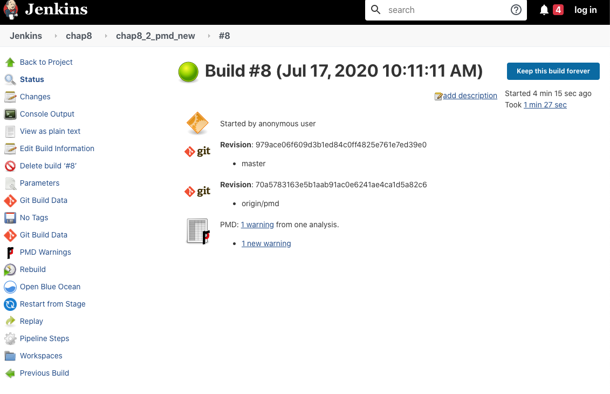
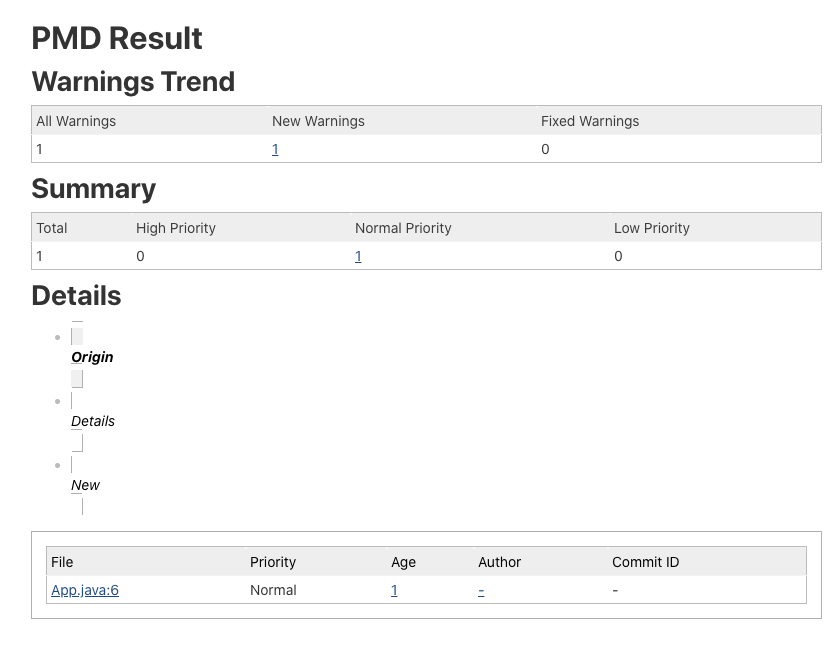
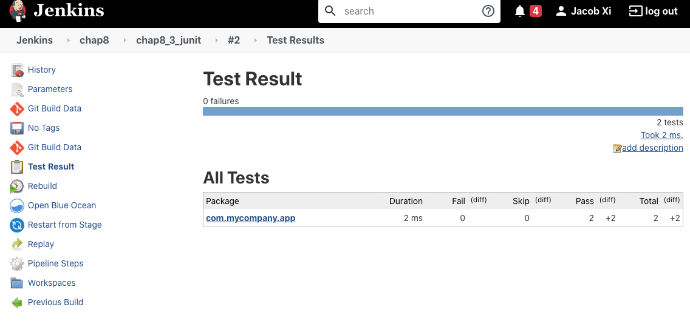
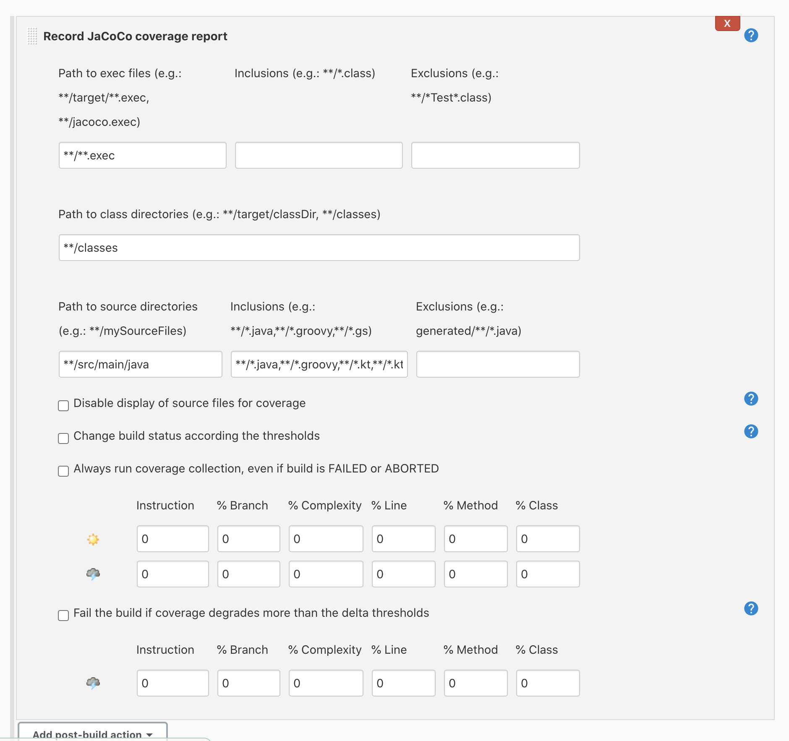
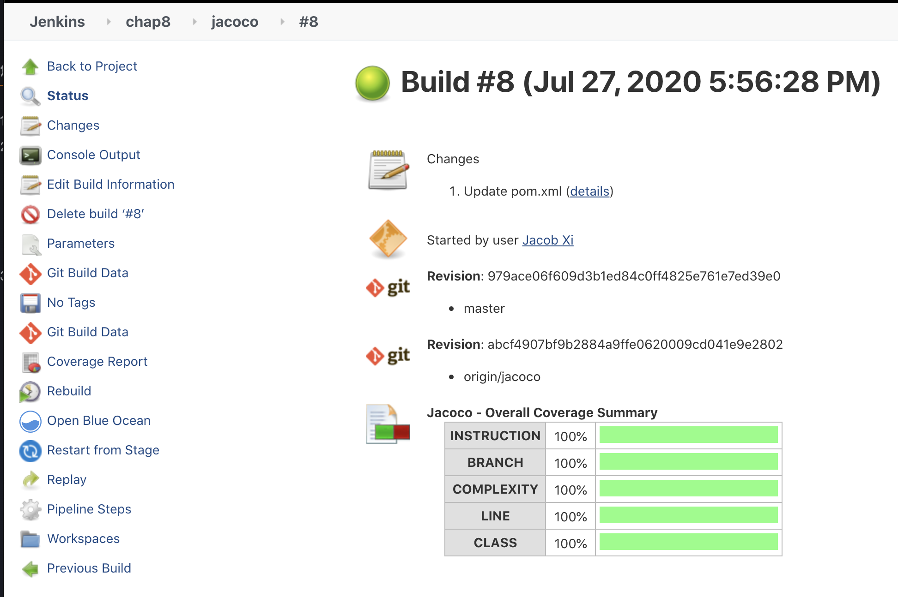

# 第一节 代码质量 

## 1、静态代码分析


静态代码分析是指在不运行程序的前提下，对源代码进行分析或检查，范围包括代码风格可能出现的空指针、代码块大小、重复的代码。 

没有通过编译，静态代码分析就没有意义。 所以在整个`pipeline`中，静态代码分析通常被编排编译阶段之后，非编译型语言就另当别论了。 


### 1-1 代码规范检查

* [阿里巴巴Java开发手册 ](https://github.com/alibaba/p3c)
* [pom.xml](https://github.com/alibaba/p3c/blob/master/p3c-pmd/pom.xml)

### 1-2 使用PMD进行代码规范检查 


PMD(`https://pmd.github.io/`) 是一款可扩展的静态代码分析器，它不仅可以对代码风格进行检查，还可以检查设计、 多线程、 性能等方面的问题。 

Maven的`PMD`插件 (`https://pmd.github.io/`）使我们能在`Maven`上使用`PMD`. 

使用步骤如下： 

* (1)在`Maven`项目的`pom.xml`中加入`PMD`插件。 

```
      <plugin>
        <groupId>org.apache.maven.plugins</groupId>
        <artifactId>maven-pmd-plugin</artifactId>
        <version>3.11.0</version>
        <configuration>
          <sourceEncoding>${project.build.sourceEncoding}</sourceEncoding>
          <targetJdk>${maven.compiler.target}</targetJdk>
          <printFailingErrors>true</printFailingErrors>
          <rulesets>
            <ruleset>rulesets/java/ali-comment.xml</ruleset>
            <ruleset>rulesets/java/ali-concurrent.xml</ruleset>
            <ruleset>rulesets/java/ali-constant.xml</ruleset>
            <ruleset>rulesets/java/ali-exception.xml</ruleset>
            <ruleset>rulesets/java/ali-flowcontrol.xml</ruleset>
            <ruleset>rulesets/java/ali-naming.xml</ruleset>
            <ruleset>rulesets/java/ali-oop.xml</ruleset>
            <ruleset>rulesets/java/ali-orm.xml</ruleset>
            <ruleset>rulesets/java/ali-other.xml</ruleset>
            <ruleset>rulesets/java/ali-set.xml</ruleset>
          </rulesets>
          <excludes>
            <exclude>**/FixClassTypeResolver.java</exclude>
          </excludes>
        </configuration>
        <executions>
          <execution>
            <phase>verify</phase>
            <goals>
              <goal>check</goal>
            </goals>
          </execution>
        </executions>
        <dependencies>
          <dependency>
            <groupId>com.alibaba.p3c</groupId>
            <artifactId>p3c-pmd</artifactId>
            <version>2.0.1</version>
          </dependency>
        </dependencies>
      </plugin>
```

`maven-pmd-plugin`插件并不会自动使用`p3c-pmd`需要在引入`dependencies`
`p3c-pmd`依赖然后在`rulesets`属性中引入`p3c`的规则 

* (2)安装`Jenkins PMD`插件

`Jenkins PMD`插件的作用是将`PMD`报告呈现在任务详清页中・ 

* (3）在`Jenkinsfile`加人pmd步骤 

```
pipeline { 
    agent { node { label "hostmachine" }}
    stages { 
        stage('pmd') { 
            steps { 
                script{
                mvnHome = tool "m2"
                sh "${mvnHome}/bin/mvn pmd:pmd"
                }
            } 
        } 
    } 
    post { 
        always{ 
            pmd(canRunOnFailed: true, pattern: '**/target/pmd.xml') 
        } 
    } 
} 
```

* (3）在实际项目中加入`Jenkinsfile`加人pmd步骤 

```
#!groovy
@Library('jenkinslib@master') _

def build = new org.devops.buildtools()

pipeline {
 	agent { node { label "hostmachine" }}
 	parameters {
        string(name: 'srcUrl', defaultValue: 'http://192.168.33.1:30088/root/demo-maven-service.git', description: '') 
        choice(name: 'branchName', choices: 'pmd\nmaster\ndev\nstage', description: 'Please chose your branch')
        choice(name: 'buildType', choices: 'mvn', description: 'build tool')
        choice(name: 'buildShell', choices: 'clean package -DskipTest\n--version', description: 'build tool')
	}

 	stages{
        stage('Checkout') {
	        steps {
	        	script {
	            	checkout([$class: 'GitSCM', branches: [[name: "${branchName}"]], doGenerateSubmoduleConfigurations: false, extensions: [], submoduleCfg: [], userRemoteConfigs: [[credentialsId: 'gitlab-admin-user', url: "${srcUrl}"]]])
	            } 
	        }
	    }
        
		stage('Build') {
	        steps {
	        	script {
	            	build.Build(buildType,buildShell)
	            } 
	        }
	    }

        stage('pmd') { 
            steps { 
                script{
                mvnHome = tool "m2"
                sh "${mvnHome}/bin/mvn pmd:pmd"
                }
            } 
        }  
    }
    post { 
        always{ 
            pmd(canRunOnFailed: true, pattern: '**/target/pmd.xml') 
        } 
    } 
 }
```

执行完成后，可以在任务详情页看到PMD报告的链接 



单击链接进入报告页面，可以看到更详细的信息，




## 1-3 各静态代码分析器之间的区别 

目前每种语言基本上都有自己的静态代码分析器，比如Java语言，除`PMD`外，还有`Checkstyle`、 `FindBugs`等。但是没有一款能“大一统”，实现对所有语言、所有场景的支持。 

另外，同一种语言下的不同分析器，它们在功能上既有区别，又有重叠，读者需要根据自己 团队的情况进行选择。但是不论选择哪款分析器，所有进行静态代码分析的地方都必须统一分析规则。比如我们决定使用阿里巴巴的开发规范，那么`Maven`插件、 `IDE`插件以及后面说到的` SonarQube`都必须使用；否则，分析结果可能会不一致，进而影响分析结果的可信度。 


## 2、单元测试 
每种编程语言都有自己的单元测试框架。执行单元测试的工作一般由构建工具来完成。`Jenkins`做的只不过是执行这些构建工具的单元测试命令，然后对测试报告进行收集，并呈现。 Jenkins并不会自动帮我们写单元测试，写单元测试还是要靠人。为什么要这样说呢？因为笔 者发现，不少人认为Jenkins的自动化测试是指Jenkins代替人自动写测试。 

## 2-1 JUnit单元测一试报告 

JUnit是一个Java语言的单元测试框架，由`Kent Beck`和`Erich Gamma`创建。当执行`maven test` 
命令时，`Maven`会执行测试阶段（包括单元测试），然后生成测试报告。 

收集并展示JUnit测试报告的步骤如下： 


* (1）安装`Jenkins JUnit`插件（https://plugins.jenkins.io/junit）
* (2）在`Jenkins`中加入junit步骤：通常将`junit`步骤放在`post always`中，因为当测试不 
通过时，我们依然可以收集到测试报告。写法如下： 

```
post { 
	always{ 
		junit testResults: "**/target/surefire-reports/*.xml" 
	} 
} 
```

```
#!groovy
@Library('jenkinslib@master') _

def build = new org.devops.buildtools()

pipeline {
 	agent { node { label "hostmachine" }}
 	parameters {
        string(name: 'srcUrl', defaultValue: 'http://192.168.33.1:30088/root/demo-maven-service.git', description: '') 
        choice(name: 'branchName', choices: 'master\npmd\nstage', description: 'Please chose your branch')
        choice(name: 'buildType', choices: 'mvn', description: 'build tool')
        choice(name: 'buildShell', choices: 'clean package -DskipTest\n--version', description: 'build tool')
	}

 	stages{
        stage('Checkout') {
	        steps {
	        	script {
	            	checkout([$class: 'GitSCM', branches: [[name: "${branchName}"]], doGenerateSubmoduleConfigurations: false, extensions: [], submoduleCfg: [], userRemoteConfigs: [[credentialsId: 'gitlab-admin-user', url: "${srcUrl}"]]])
	            } 
	        }
	    }
        
		stage('Build') {
	        steps {
	        	script {
	            	build.Build(buildType,buildShell)
	            } 
	        }
	    }
    }
    post { 
       always{ 
		junit testResults: "**/target/surefire-reports/*.xml" 
	    } 
    } 
 }
```

当pipeline运行结束后，在构建页的左边菜单栏及右边详情下都会多出一个链接：Test Result 



`junit`步骤的`test Results`参数支持`Ant`风格路径表达式。`**/target/surefire-reports/*.xml`表示只要是`/target/surefire-reports/`目录下的`XML`文件就会被当作`JUnit`测试报告处理，而不论`target`在哪个层级的日录下。 

### 2-2 JaCoCo 实现代码覆盖率 

JUnit只是方便我们写单元测试的一个框架，但是并没有告诉我们有多少代码被测试覆盖到 了。而JaCoCo填补了这一空白。JaCoCo 是一个免费的Java代码覆盖率的库，能帮助我们检测出代码覆盖率，并输出搜盖率报告。 

JaCoCo 提供了以下几个维度的覆盖率分析。

* 指令覆盖率（Instruction Coverage) 
* 分支覆盖率（Branch Coverage) 
* 圈复杂度覆盖率（Cyclomatic Complexity Coverage) 
* 行覆盖率（Line Coverage) 
* 方法覆盖率（Method Coverage) 
* 类覆盖率（Class Coverage) 

以下是JaCoCo插件的使用步骤。 

* (1）安装JaCoCo插件（https://plugins.jenkins.io/jacoco）
* (2）在Maven项目中引人JaCoCo插件，执行maven jacoco生成代码覆盖率报告。 

```
<plugin>
        <groupId>org.jacoco</groupId>
        <artifactId>jacoco-maven-plugin</artifactId>
        <version>0.82</version>
        <executions>
            <execution>
                <goals>
                    <goal>prepare-agent</goal>
                </goals>
            </execution>
            <execution>
                <id>report</id>
                <phase>prepare-pakcage</phase>
                <goals>
                    <goal>report</goal>
                </goals>
            </execution>
            <execution>
                <id>post-unit-test</id>
                <phase>test</phase>
                <goals>
                    <goal>report</goal>
                </goals>
                <configuration>
                <!-- jacoco 执行数据的文件路径 -->
                <dataFile>target/jacoco.exec</dataFile>
                <!-- 输出报告的路径 -->
                <outputDirectory>target/jacoco-ut</outputDirectory>
                </configuration>
            </execution>
        </executions>
        <configuration>
          <systemPropertyVariables>
            <jacoco-agent.destfile>target/jacoco.exec</jacoco-agent.destfile>
          </systemPropertyVariables>
        </configuration>
        </plugin>

```


* (3）使用`jacoco`,`jacoco`步骤在`mvn`命令之后执行，写法如下

```
steps {
    sh "mvn clean install"
    jacoco(
        // 代码覆盖率统计文件位置，Ant 风格路径表达式
        execPattern: 'target/**/*.exec',
        // classes 文件位置，Ant 风格路径表达式
        classPattern: 'target/classes',
        //源码文件位置，Ant 风格路径表达式
        sourcePattern: 'src/main/java',
        //排除分析的位置，Ant 风格路径表达式
        exclusionPattern: 'src/test*',
        //是否禁用每行覆盖率的源文件显示
        skipCopyOfSrcFiles: false,
        // 如果为 true，则对各维度的覆盖率进行比较。如果任何一个维度的当前覆盖率小于最小覆盖率阈值，则构建状态为失败;
        // 如果当前覆盖率在最大阈值和最小阈值之间，则当前构建状态为不稳定；
        // 如果当前覆盖率大于最大阈值，则构建成功；
        changeBuildStatus: true,
        // 字节码指令覆盖率
        minimumInstructionCoverage: '30', maximumInstructionCoverage: '70',
        // 行覆盖率
        minimumLineCoverage: '30', maximumLineCoverage: '70',
        // 圈复杂度覆盖率
        minimumComplexityCoverage: '30', maximumComplexityCoverage: '70',
        // 方法覆盖率
        minimumMethodCoverage: '30', maximumMethodCoverage: '70',
        // 类覆盖率
        minimumClassCoverage: '30', maximumClassCoverage: '70',
        // 分支覆盖率
        minimumBranchCoverage: '30', maximumBranchCoverage: '70',
        // 如果为 true, 则只有所有维度的覆盖率变化量的绝对值小于相应的变化量阈值时，构建结果才为成功
        buildOverBuild: true,
        // 以下是各个维度覆盖率的变化量阈值
        deltaInstructionCoverage: '80', deltaLineCoverage: '80',
        deltaMethodCoverage: '80', deltaClassCoverage: '80',
        deltaComplexityCoverage: '80', deltaBranchCoverage: '80'
    )
}
```

pipeline 运行完成后，我们可以在任务详情页的下方看到报告；

`buildOverBuild` 和 `changeBuildStatus` 参数都能影响 `Jenkins` 任务的结果状态，那么当这两个参数的值都为 true 时，结果是什么呢？由其共同决定。以下是它们的判断逻辑。

为了更好地理解`jacoco`步骤的参数，我们看看`JaCoCo`插件在自由风格项目中的UI



```
#!groovy
@Library('jenkinslib@master') _

def build = new org.devops.buildtools()

pipeline {
 	agent { node { label "hostmachine" }}
 	parameters {
        string(name: 'srcUrl', defaultValue: 'http://192.168.33.1:30088/root/demo-maven-service.git', description: '') 
        choice(name: 'branchName', choices: 'jacoco\nmaster\ndev\npmd', description: 'Please chose your branch')
        choice(name: 'buildType', choices: 'mvn', description: 'build tool')
        choice(name: 'buildShell', choices: 'clean package -DskipTest\n--version', description: 'build tool')
	}

 	stages{
        stage('Checkout') {
	        steps {
	        	script {
	            	checkout([$class: 'GitSCM', branches: [[name: "${branchName}"]], doGenerateSubmoduleConfigurations: false, extensions: [], submoduleCfg: [], userRemoteConfigs: [[credentialsId: 'gitlab-admin-user', url: "${srcUrl}"]]])
	            } 
	        }
	    }
        
		stage('Build') {
	        steps {
                sh "/opt/maven/bin/mvn ${buildShell}"
                jacoco(
                    // 代码覆盖率统计文件位置，Ant 风格路径表达式
                    execPattern: 'target/**/*.exec',
                    // classes 文件位置，Ant 风格路径表达式
                    classPattern: 'target/classes',
                    //源码文件位置，Ant 风格路径表达式
                    sourcePattern: 'src/main/java',
                    //排除分析的位置，Ant 风格路径表达式
                    exclusionPattern: 'src/test*',
                    //是否禁用每行覆盖率的源文件显示
                    skipCopyOfSrcFiles: false,
                    // 如果为 true，则对各维度的覆盖率进行比较。如果任何一个维度的当前覆盖率小于最小覆盖率阈值，则构建状态为失败;
                    // 如果当前覆盖率在最大阈值和最小阈值之间，则当前构建状态为不稳定；
                    // 如果当前覆盖率大于最大阈值，则构建成功；
                    changeBuildStatus: true,
                    // 字节码指令覆盖率
                    minimumInstructionCoverage: '30', maximumInstructionCoverage: '70',
                    // 行覆盖率
                    minimumLineCoverage: '30', maximumLineCoverage: '70',
                    // 圈复杂度覆盖率
                    minimumComplexityCoverage: '30', maximumComplexityCoverage: '70',
                    // 方法覆盖率
                    minimumMethodCoverage: '30', maximumMethodCoverage: '70',
                    // 类覆盖率
                    minimumClassCoverage: '30', maximumClassCoverage: '70',
                    // 分支覆盖率
                    minimumBranchCoverage: '30', maximumBranchCoverage: '70',
                    // 如果为 true, 则只有所有维度的覆盖率变化量的绝对值小于相应的变化量阈值时，构建结果才为成功
                    buildOverBuild: true,
                    // 以下是各个维度覆盖率的变化量阈值
                    deltaInstructionCoverage: '80', deltaLineCoverage: '80',
                    deltaMethodCoverage: '80', deltaClassCoverage: '80',
                    deltaComplexityCoverage: '80', deltaBranchCoverage: '80'
                )
            }
	    }
    }
 }
```

`pipeline`运行完成后，我们可以在任务详情页的下方看到报告，

`buildOverBuild`和`changeBuildStatus`参数都能影响`Jenkins`任务的结果状态，那么当这两个参数的值都为`true`时，结果是什么呢？由其共同决定。以下是它们的判断逻辑。 


```
*   Success AND Success = Success
*   Unstable AND Unstable = Unstable
*   Failure AND Failure = Failure
*   X AND Failure = Failure, Failure AND X = Failure,   X = Success/Unstable/Failure
*   Y AND Unstable = Unstable, Unstable AND Y = Unstable, Y = Success/Unstable
```



最后，各个维度的覆盖率应该设置多少呢？没有标准的答案。

笔者的经验是先要确定项目是遗留的还是新建的。遗留的旧以当前覆盖率为基线，新建的则设置相对高一些的要求。再看项目的紧急程度，如果非常紧急的话，则可以考虑放低要求。最后看项目的重要程度。如果整个项目在整个架构中起着非常重要的作用，那么覆盖率要求会高一些。

### 2-3  代码覆盖率越高，软件的质量就越高吗？

代码覆盖率越高，软件的质量就越高吗？我们来看看《软件之道：软件开发争议问题剖析》中是怎么说的：

> 为了找到两者之间的关系，把 Windows Visa（4000 多万行代码，几千个二进制文件，数千名工程师）的分支覆盖率（Branch Coverage）与块覆盖率（Block Coverage） 和其发布六个月内的现场缺陷对应起来。我们观察到覆盖率和质量之间有弱正相关性，预测查准率和查全率较差（查准率为 83.8%，查全率为 54.8%）


书中最终给出的答案是：

> 代码覆盖率最好不要单独使用，而是需要与其它指标，如代码变动率，复杂度等一并考虑。

所以，如果考虑将代码覆盖率作为团队开发人员的 KPI，请慎重。

## 3、性能测试

Taurus 是一个开源的自动化框架用于运行各种开源负载测试工具和功能测试工具。其支持最流行的开源负载测试工具 Apache JMeter，Selenium，Gatling, The Grinder 等。Taurus 的关键特性有：

* 我们可以使用 YAML 或 JSON 来描述性能测试。这也正是我们想要的 test as code。
* 它会根据我们选择的性能测试类型自动下载相应的工具。比如在下例中会使用 `JMeter`，那么 `Taurus` 会自动下载 `JMeter`并安装。

Jenkins 的 Performance 插件就是使用 Taurus 来进行性能测试的。在进行性能测试之前，首先需要准备环境。


### 3-1 准备性能测试环境

* 在运行性能测试环境的机器上，准备 Python 环境。
* 安装 Performance 插件（https://plugins.jenkins.io/performance）.
* 安装 Taurus？不需要自行安装，Performance 插件如果发现机器上没有安装 Taurus，它会自动运行 pip install bzt 命令进行安装。


### 3-2 运行 JMeter 测试

假设你平时都是手动执行 JMeter 测试的，现在希望将它自动化。着很简单，只需要两步。

在现有的项目中加入 Jenkinsfile。

```
pipeline {
    agent any
    stages {
        stage('performance test') {
            steps {
                bzt params: 'blaze_exist_jmeter_config.yml'
            }
        }
    }
}
```


在项目中加入 `blaz_exist_jmeter_config.yml` 文件

```
execution:
    - scenario: simple

ecenarios:
    simple:
        script: SimpleTestPlan.jmx

modules:
    jmeter:
        # 注意，下载文件必须使用 .zip 后缀
        download-link: https://mirrors.tuna.tsinghua.edu.cn/apache/jmeter/binaries/apache-jmeter-{version}.zip
        version: 5.2
```

`blaz_exist_jmeter_config.yml`是 `Taurus` 的配置文件，用于描述如何进行性能测试。以上配置很简单，就是执行一个名为 simple 的场景（scenario），这个场景就是执行现有的 JMeter 脚本。modules 配置了 JMeter 的下载地址以及版本。上例中我们指定了国内的下载链接，避免从国外下载。

* `params`:字符串类型，Taurus 配置文件的路径。
* `alwaysUseVirtualenv`: 布尔类型，如果为 false，则不使用 virtualenv 进行环境隔离。默认值为 true。
* `bztVersion`: 字符串类型，bzt 的版本
* `generatePerformanceTrend`：布尔类型，是否在 Jenkins 项目详情页生成性能趋势图。默认值为 true。
* `useBztExitCode`: 布尔类型，是否使用 bzt 步骤的退出码作为 Jenkins 项目的构建结果。默认值为 true。
* `useSystemSitePackages`: 布尔类型，是否为 virtualenv 加上 ”–system-site-packages“ 参数。默认值为 true。
* `workingDirectory`: 字符串类型，指定 bzt 的工作目录。
* `workspace:` 字符串类型，已经废弃们请使用 workingDirectory。


只有 params 参数是必须的，其他参数都是可选。

至此，以上用法可以满足大部分人在 `Jenkins` 上使用 `JMeter` 的需求。关于 `Taurus` 配置文件的更多语法，可以前往 Taurus 官网学习

```
#!groovy
@Library('jenkinslib@master') _

def build = new org.devops.buildtools()

pipeline {
 	agent { node { label "hostmachine" }}
 	parameters {
        string(name: 'srcUrl', defaultValue: 'http://192.168.33.1:30088/root/demo-maven-service.git', description: '') 
        choice(name: 'branchName', choices: 'jmeter\njacoco\nmaster\npmd', description: 'Please chose your branch')
        choice(name: 'buildType', choices: 'mvn', description: 'build tool')
        choice(name: 'buildShell', choices: 'clean package -DskipTest\n--version', description: 'build tool')
	}

 	stages{
        stage('Checkout') {
	        steps {
	        	script {
	            	checkout([$class: 'GitSCM', branches: [[name: "${branchName}"]], doGenerateSubmoduleConfigurations: false, extensions: [], submoduleCfg: [], userRemoteConfigs: [[credentialsId: 'gitlab-admin-user', url: "${srcUrl}"]]])
	            } 
	        }
	    }

        stage('performance test') {
            steps {
                bzt params: 'blaze_exist_jmeter_config.yml'
            }
        }
    }
}
```


