# 第二节 SonarQube：持续代码质量检查 

`SonarQube`是一个代码质量管理工具，能对20多种编程语言源码进行代码味道（Code Smells)、Bugs 、安全漏洞方面的静态分析。SonarQube有4个版本：开源版、开发者版、企业版、数据中心版（Data Center Edition）。  

https://www.sonarsource.com/plans-and-pricing/


## 1、安装`sonarqube` (helm)

* https://hub.helm.sh/charts/oteemo/sonarqube

```
$ kuebctl create ns sonarqube

$ helm repo add oteemocharts https://oteemo.github.io/charts
"oteemocharts" has been added to your repositories


$ helm install sonarqube  oteemocharts/sonarqube -n sonarqube -f values.yaml
NAME: sonarqube
LAST DEPLOYED: Thu Jul 30 13:33:06 2020
NAMESPACE: sonarqube
STATUS: deployed
REVISION: 1
NOTES:
1. Get the application URL by running these commands:
  export POD_NAME=$(kubectl get pods --namespace sonarqube -l "app=sonarqube,release=sonarqube" -o jsonpath="{.items[0].metadata.name}")
  echo "Visit http://127.0.0.1:8080 to use your application"
  kubectl port-forward $POD_NAME 8080:9000


$ kubectl port-forward svc/sonarqube-sonarqube 9000:9000 -n sonarqube 
Forwarding from 127.0.0.1:9000 -> 9000
Forwarding from [::1]:9000 -> 9000
Handling connection for 9000


admin
admin
```

**values.yaml**

* https://github.com/helm/charts/blob/master/stable/sonarqube/values.yaml

```
service:
  type: NodePort
```

```
$ helm upgrade sonarqube  oteemocharts/sonarqube -n sonarqube -f values.yaml
Release "sonarqube" has been upgraded. Happy Helming!
NAME: sonarqube
LAST DEPLOYED: Fri Jul 31 14:09:20 2020
NAMESPACE: sonarqube
STATUS: deployed
REVISION: 4
NOTES:
1. Get the application URL by running these commands:
  export NODE_PORT=$(kubectl get --namespace sonarqube -o jsonpath="{.spec.ports[0].nodePort}" services sonarqube-sonarqube)
  export NODE_IP=$(kubectl get nodes --namespace sonarqube -o jsonpath="{.items[0].status.addresses[0].address}")
  echo http://$NODE_IP:$NODE_PORT
```

```
$ kubectl get svc -n sonarqube 
NAME                            TYPE        CLUSTER-IP       EXTERNAL-IP   PORT(S)          AGE
sonarqube-postgresql            ClusterIP   10.106.235.197   <none>        5432/TCP         22h
sonarqube-postgresql-headless   ClusterIP   None             <none>        5432/TCP         22h
sonarqube-sonarqube             NodePort    10.101.144.173   <none>        9000:32314/TCP   22h
```


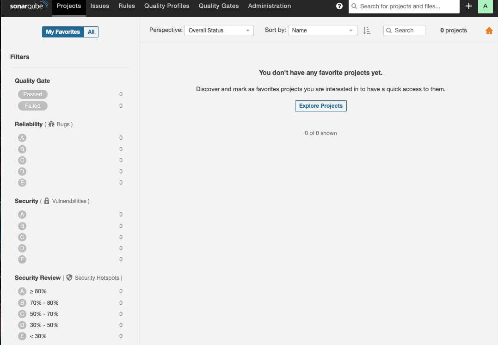

## 2、Maven与SonarQube集成 

### 2-1 Maven与SonarQube集成

```
<plugin> 
      <groupId>org.codehaus.mojo</groupId> 
      <artifactId>sonar—maven—plugin</artifactId> 
      <version>3.4.1.1168</version> 
 </plugin> 
```

执行命令

```
mvn clean org.sonarsource.scanner.maven:sonar-maven-plugin:3.4.1.1168:sonar -Dsonar.host.url=http://192.168.33.1:32324
```

```
#!groovy
@Library('jenkinslib@master') _

def build = new org.devops.buildtools()

pipeline {
 	agent { node { label "hostmachine" }}
 	parameters {
        string(name: 'srcUrl', defaultValue: 'http://192.168.33.1:30088/root/demo-maven-service.git', description: '') 
        choice(name: 'branchName', choices: 'sonarqube\nmaster', description: 'Please chose your branch')
        choice(name: 'buildType', choices: 'mvn', description: 'build tool')
        choice(name: 'buildShell', choices: 'clean package -DskipTest\n--version', description: 'build tool')
	}

 	stages{
        stage('Checkout') {
	        steps {
	        	script {
	            	checkout([$class: 'GitSCM', branches: [[name: "${branchName}"]], doGenerateSubmoduleConfigurations: false, extensions: [], submoduleCfg: [], userRemoteConfigs: [[credentialsId: 'gitlab-admin-user', url: "${srcUrl}"]]])
	            } 
	        }
	    }

        stage('sonarqube test') {
            steps {
                script{
                mvnHome = tool "m2"
                sh "${mvnHome}/bin/mvn clean org.sonarsource.scanner.maven:sonar-maven-plugin:3.4.1.1168:sonar -Dsonar.host.url=http://192.168.33.1:32314"
                }
            }
        }
    }
}
```

`sonar.host.ur`参数用于指定`SonarQube`服务的地址这时，就可以在`SonarQube`的`Projects`中看到结果

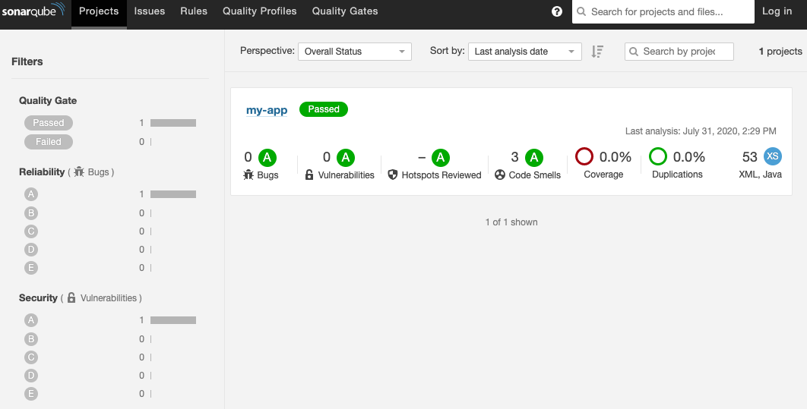

```
+ /opt/maven/bin/mvn clean org.sonarsource.scanner.maven:sonar-maven-plugin:3.4.1.1168:sonar -Dsonar.host.url=http://192.168.33.1:32314
[INFO] Scanning for projects...
Downloading from central: 
...
[INFO] User cache: /home/vagrant/.sonar/cache
[INFO] SonarQube version: 8.2.0
[INFO] Default locale: "en_US", source code encoding: "UTF-8" (analysis is platform dependent)
[WARNING] SonarScanner will require Java 11 to run starting in SonarQube 8.x
[INFO] Load global settings
[INFO] Load global settings (done) | time=165ms
[INFO] Server id: EA8D9556-AXOeledPvj9r7r4MIG91
[INFO] User cache: /home/vagrant/.sonar/cache
[INFO] Load/download plugins
[INFO] Load plugins index
[INFO] Load plugins index (done) | time=62ms
...
```

`SonarQube`服务默认允许任何人执行源码分析，因此在生产环境中使用会有安全隐患。以下几步可以提高其安全性： 

* (1）设置SonarQube禁止非登录用户使用

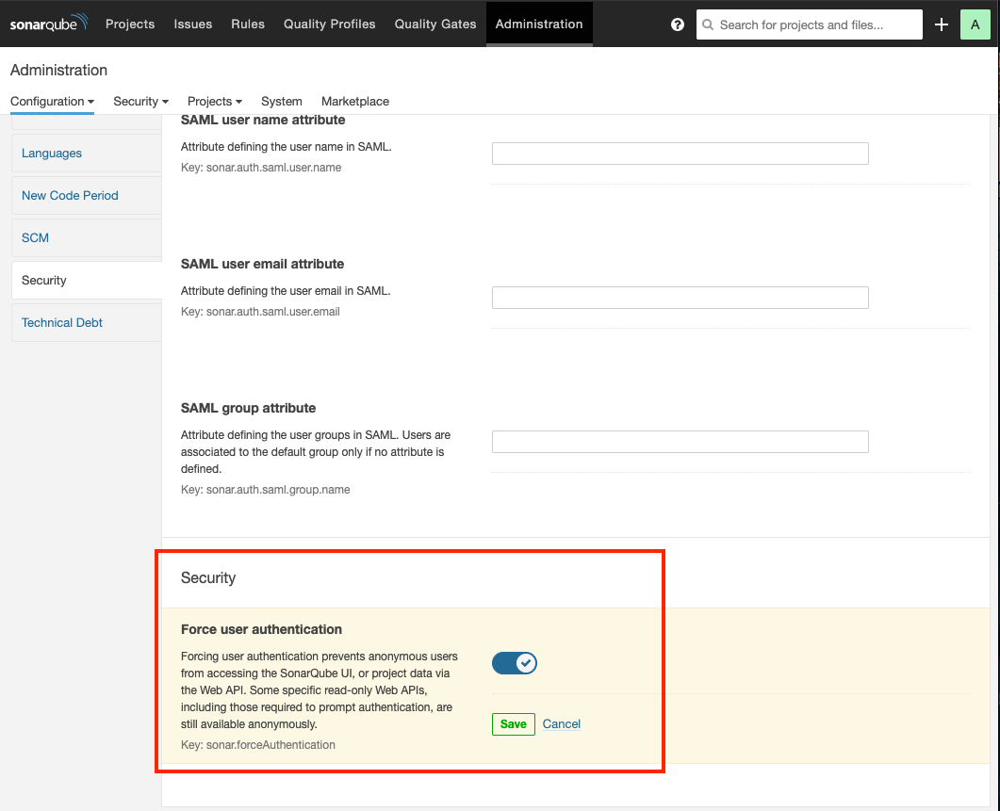

* (2）为用户生成`Token`, `Jenkins`只能通过`Token`与`SonarQube`集成。登录`SonarQube`，进入个人设置页而中的`Security tab`页  `/account/security/`

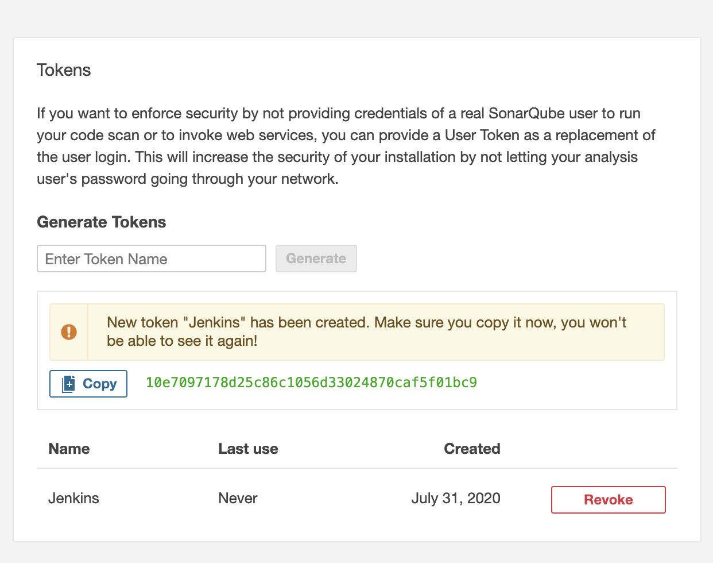

* `10e7097178d25c86c1056d33024870caf5f01bc9`

* (3）在执行mvn命令时加入相应的`sonar.login`参数。 

```
mvn clean org.sonarsource.scanner.maven:sonar-maven-plugin:3.4.1.1168:sonar -Dsonar.host.url=http://192.168.33.1:32314 -Dsonar.login=10e7097178d25c86c1056d33024870caf5f01bc9
```

### 2.2 Jenkins与SonarQube集成 

我们将`Maven`与`SonarQube`集成。这时，`SonarQube`对于`Jenkins`来说还是很明确的，`Jenkins`并不知道代码质量如何。本节我们将集成`Jenkins`与`SonarQube`,以实现当代码 量不合格时，`Jenkins pipeline`失败。

具体步骤如下：

* (1)`Jenkins`：安装SonarQube Scanner插件（https://plugins.jenkins.io/sonar)

*  (2)`Jenkins`：配置`SonarQube Scanner`插件，

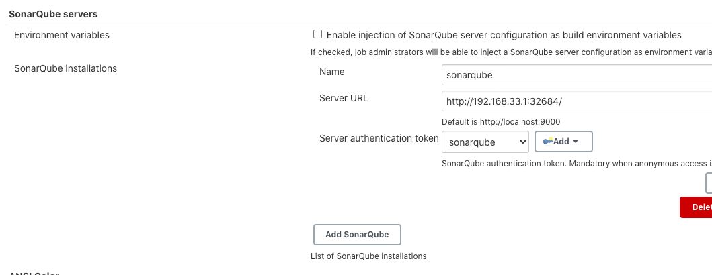


*  (3)`SonarQube`：设置`Webhooks`。不同代码规模的源妈分析过程的耗时是不一样的。所以 当分析完成11寸由`SonarQube`主动通知`Jenkins`设置方法就是进人`SonarQube`的`Adminstration -> Configuration -> Webhooks`页加人`＜Jenkins的地址＞/sonarqube-webhook`


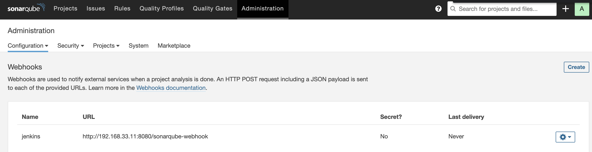


* `https://192.168.33.11:8080/sonarqube-webhook`

`<Jenkins的地址＞/sonarqube-webhook/接口由 Jenkiins SonaQube`插件提供

*  (4）在`JerkrnsfiIe`中加入`SonarQube`的`stage`

```
stage('sonarqube test') {
            steps {
                withSonarQubeEnv('sonarqube') {
                script{
                    mvnHome = tool "m2"
                    sh "${mvnHome}/bin/mvn clean org.sonarsource.scanner.maven:sonar-maven-plugin:3.4.1.1168:sonar -Dsonar.host.url=http://192.168.33.1:32314" 
                    }
                }  
            }
        }

        stage('Quality Gate') {
            steps {
                timeout(time: 1, unit: 'HOURS') {
                    waitForQualityGate abortPipeline: true
                }
            }
        }
```

* `withSonarQubeEnv`是一个环境变量包装器，读取的是我们在所配置的变量。在它的闭包内，我们可以使用以下变量。

* `SONAR_HOST_URL`:` SonarQube`服务的地址。 
* `SONAR_AUTH_TOKEN`: `SonarQube`认证所需要的`Token` 

 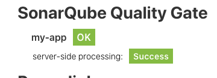

`waitForQualityGate`步骤告诉`Jenkins`等待`SonarQube`返回的分析结果。当它的 `abortPipeline`参数为`true`时，代表当质量不合格时，将`pipeline的`状态设置为`UNSTABLE` 

我们同时使用了`timeout`包装器来设置`waitForQualityGate`步骤的超时时间，避免当网络出问题时，`Jenkins`任务一直处于等待状态。

* (5）设置`Quality Gates（质量阈值）`。在`SonarQube`的`“Quality Gates”`下，我们可以看到系统自带的质量，阈值。可以看出它是针对新代码的。所以，在初次及没有新代码加入的情况下，执行代码分析是不会报出构建失败的。 


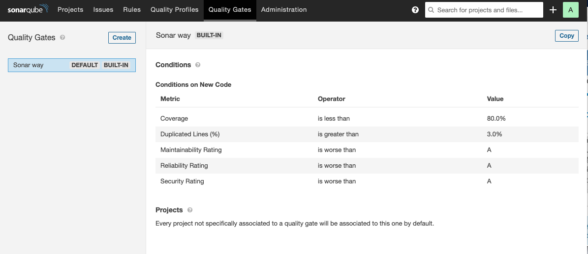


## 3 使用`SonarQube Scanner`实现代码扫描 

上文中，我们是使用`Maven`插件实现代码扫描的，也就是利用构建工具本身提供的插件来实现。在构建工具本身不支持的情况下，我们使用`SonarQube`本身提供的扫描工具（`Scanner`）进行代码扫描。 

具体步骤如下： 

* (1)在安装`SonarQube Scanner`：插件后，设置扫描工具自动下载并安装（推荐)。`configureTools -> SonarQube Scanner`)

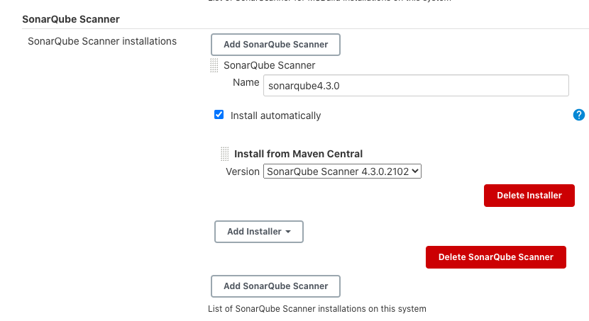


请注意，这里的`Name`值与所设置的值是两码事。此处设置的是`SonarScanner`工具本身的名称与路径 

* (2）在代码项目根目录下放人`sonar-project.properties`文件`sonar-scanner`会读取其配置内容如下： 


```
# must be unique in a given SonarQube instance 
sonar.projectKey=my:project
# this is the name and version displayed in the SonarQube UI. Was mandatory prior to SonarQube 6.1. 
sonar.projectName=My project
sonar.projectVersion=1.0

# This property is optional if Sonar.modules is set. 
sonar.sources=.

# Encoding of the source code. Default is default system encoding 
# sonar.sourceEncoding=UTE—8 
```


* (3)`pipeline`部分代码如下 

```
script{ 
    def sonarHome = tool name: 'sonarqube4.2.0', type: 'hudson.plusinS.sonar.SonarRunnerInstallation' 
    withSomarQubeEnv('sonar') { 
        sh "${sonarHome}/bin/sonar—scanner —Dsonar.host.url=${SONAR_HOST_URL} —Dsonar.login=${SONAR_AUTH_TOKEN}"
    }
}
```

## 4 将分析报告推送到GitLab 

如果希望对每一次代码的`commit`都进行分析，并将分析结果与该`commit`关联起来，那么`SonarQube`的`GitLab`插件就是一个不错的选择。`SonarQube GitLab`插件的功能就是将`SonarQube` 的分析结果推送到GitLab

* (1）在`SonarQube`上安装`GitLab`插件 

https://github.com/helm/charts/blob/master/stable/sonarqube/values.yaml

```
image:
  repository: sonarqube
  tag: 8.4.1-community
service:
  type: NodePort
plugins:
  intsalls:
    - https://github.com/gabrie-allaigre/sonar-gitlab-plugin/releases/download/4.1.0-SNAPSHOT/sonar-gitlab-plugin-4.1.0-SNAPSHOT.jar
```

```
$ helm upgrade sonarqube  oteemocharts/sonarqube -n sonarqube -f values.yaml
```

`admin/settings?category=almintegration`

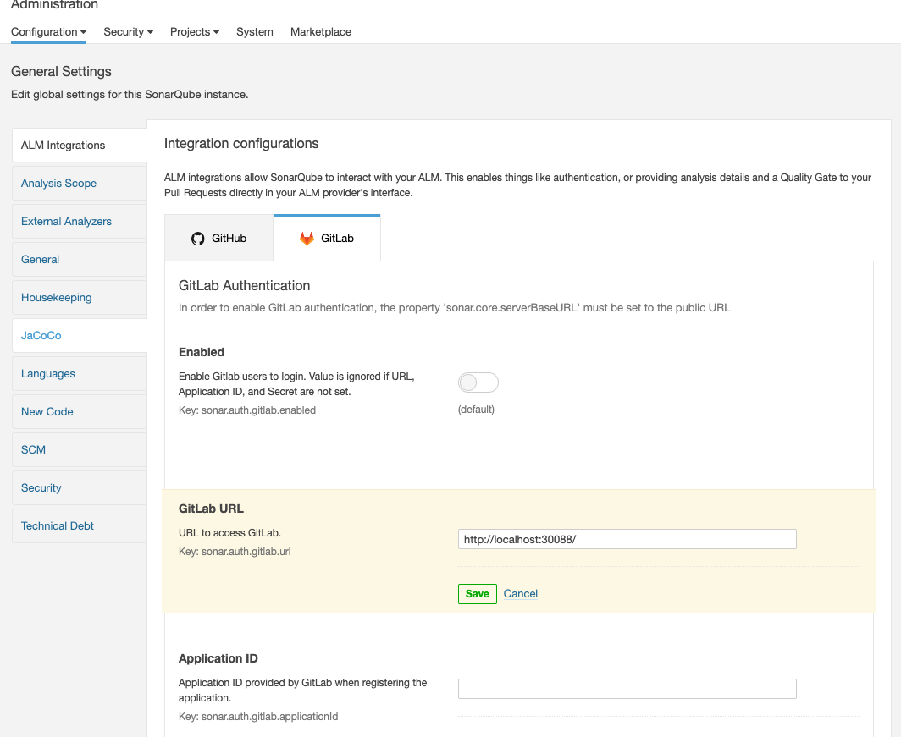

**gitlab part**

admin/applications

* http://localhost:32314/oauth2/callback/gitlab
* Application ID: 706e48d74eabfb7330beaf747732182833ceb79fa43ac180e248a4b77f55cfed
* Secret: 646b3c54b4244d0fc5ccf8cf906728c2818a60e285675186dd731b21a189c0c8

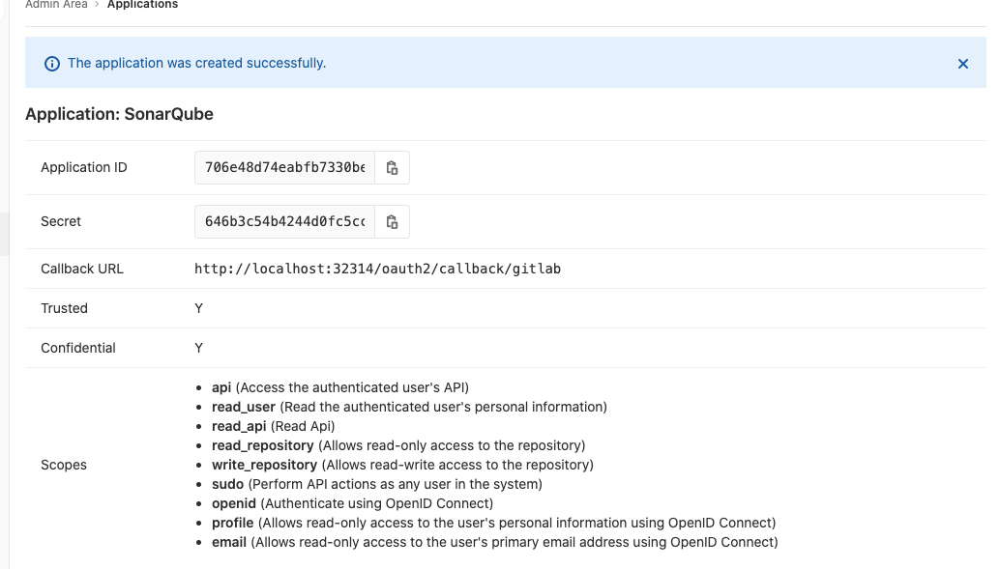

配置好`sonarQube GitLab`插件后，需要为`sonar-scanner`添加几个参数，以告诉`SonarQube` 
将分析结果关联`GitLab`的相应`commit`上。 

```
script{ 

	def sonarHome = tool name: 'sonarqube3.2.0', type: 'hudson.plugins.sonar.SonarRunnerInstallation' 
	def GIT_COMMIT_ID = sh( 
		script: "git rev—parse ——short=10 HEAD", 
		returnStdout: true 
)

sh "${sonarHome}/bin/sonar—scanner —Dsonar.host.url=${SONAR_HOST_URL} —Dsonar.analysis.mode=preview —Dsonar.gitlab.ref_name=master-Dsonar.gitlab.project_id=jenkins—book/sonarqube —Dsonar.projectName=jenkins—book—Dsonar.gitlab.commit_sha=${GIT_COMMIT_ID} —Dsonar.login=${SONAR_AUTH_TOKEN}" 
} 
```

首先通过`sh`步骤获取代码的`commitID`，然后在执行扫描时加人如下参数.
 
* `-Dsonar.analysis.mode`：分析报告模式，值为`preview`，代表将结果推送到`GitLab`。此参数虽 然官方标注`SonarQube 6.6后`被废弃. 
* `-Dsonar.gitlab.ref_name`：分支名称。 
* `-Dsonar.gitlab.project_id`: `GitLab`对一应的项目路径。 
* `Dsonar.projectName`：对应`SonarQube`上的项目名称。 
* `-Dsonar.gitlab.comit_sha`：代码的commitID 

当`SonarQube`分析完成后，我们就可以在`GitLab`的相应`Commit`页面上的代码行内或`commit`评论区看到分析结果了


