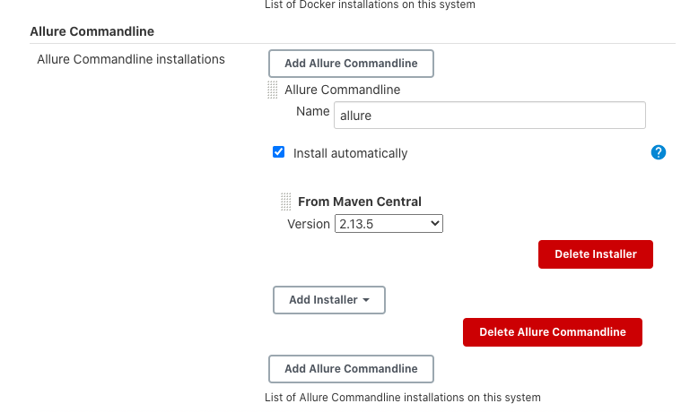
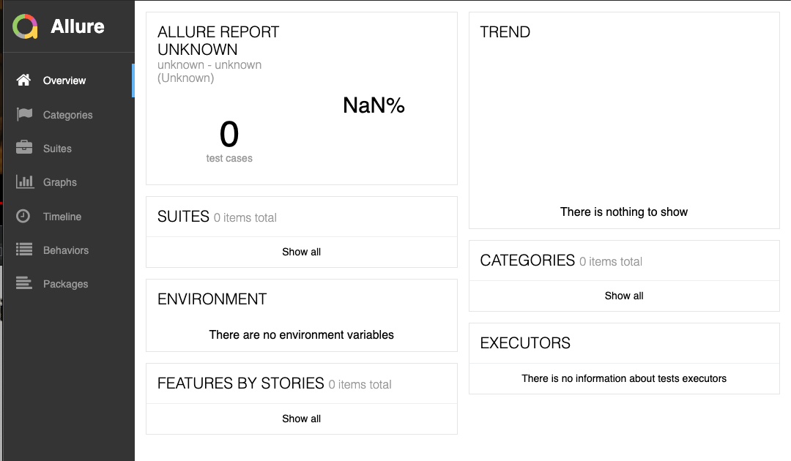

# 第三节 Allure测试报告：更美观的测试报告 

## 1. Allure测试报告介绍 

是不是觉得`JUnit`输出的测试报告不美观。 不只是`JUnit`很多其他编程语言的测试框架的测试报告也差不多。`Allure`测试报告是一个框架, 能将各种测试报告更美观地呈现出来。 

## 2. 集成Allure、Maven、Jenkins 


接下来，我们将`Allure`、 `Mavens` `Jenkins`集成。`Allure`与其他编程语言及构建工具的集成与 此类似。 具体步骤如下：

* (1）安装`Allure Jenkin`s插件，进人Jenkins的`Manage Jenkins -> Global Tool Configuration - Allure Commandline`页，配置` Allure`自动下载并 装的版本



* (2)在`pom.xml`文件中加入依赖。 

* (3）在`pom.xml`文件中加入`Allure`插件（`https://github.com/allure-framework/allure-maven` )。 

```	
<dependency>
		<groupId>io.qameta.allure</groupId>
		<artifactId>allure-junit4</artifactId>
		<version>2.6.0</version>
</dependency>
```

```
<plugin> 
        <groupId>org.apache.maven.plugins</groupId>
        <artifactId>maven-surefire-plugin</artifactId> 
        <version>2.19.1</version> 
        <configuration> 
        <argLine> 
             - javaagent:" ${settings.localRepository}/org/aspectj/aspectjweaver/${aspectj.version}/aspectjweaver-${aspectj.version}.jar"
        </argLine>
        <properties> 
        <property> 
        <name>listener</name> 
        <value>io.qameta.allure.junit4/AllureJunit4</value> 
      </property> 
    </properties> 
    <systemProperties> 
      <property> 
        <name>allure.results.directory</name> 
        <value>${project.build.directory}/allure-results</value> 
      </property> 
      <property>  
        <name>allure.link.issue.pattern</name> 
        <value>https://example.org/issue/{}</value> 
      </property> 
    </systemProperties> 
    </configuration> 
    <dependencies>
      <dependency> 
      <groupId>org.aspectj</groupId> 
      <artifactId>aspectjweaver</artifactId>
      <version>${aspectj.version}</version> 
      </dependency>
    </dependencies> 
  </plugin>
  <plugin>
    <groupId>io.qameta.allure</groupId> 
    <artifactId>allure-maven</artifactId> 
    <version>2.8</version> 
  </plugin>
```

(4）在`Jenkinsfile`中的`post` 阶段加入`allure`步骤。 

```
script { 
	allure([ 
		includeProperties: false, 
		jdk: '', 
		properties: [], 
		reportBuildPolicy: 'ALWAYS', 
		results: [[path: 'target/allure-results']]
	]) 
} 
```



