# 第四季 代码质量平台集成(SonarQube Final Edition)

## 1、 SonarQube 平台简介与配置


1. 一台SonarQube Server启动3个主要过程： 
	1. Web服务器，供开发人员，管理人员浏览高质量的快照并配置SonarQube实例 
	2. 基于`Elasticsearch`的`Search Server`从`UI`进行后退搜索 
	3. `Compute Engine`服务器，负责处理代码分析报告并将其保存在`SonarQube`数据库中 

2. 一个SonarQube数据库要存储： 
	1. SonarQube实例的配置（安全性，插件设置等） 
	2. 项目，视图等的质量诀照。 
3. 服务器上安装了多个`SonarQube`插件，可能包括语言，SCM，集成，身份验证和管理插件 
4. 在构建／持续集成服务器上运行一个或多个`SonarScanner`，以分析项目 

**组件组成**

 1. sonarqube server ： 他有三个程序分别是 `webserver`（配置和管理sonar） `searchserver`（搜索结果返回给`sonarUI`）  `ComplateEngineserver`（计算服务 将分析结果入库）。
 2. `sonarqube db` : 数据库 存放配置。
 3. `sonarqube plugins`： 插件增加功能。
 4. `sonar-scanner` ： 代码扫描工具可以有多个。

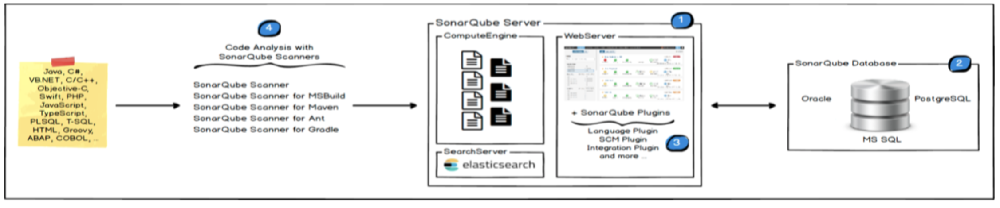

### 1-1 工作流程

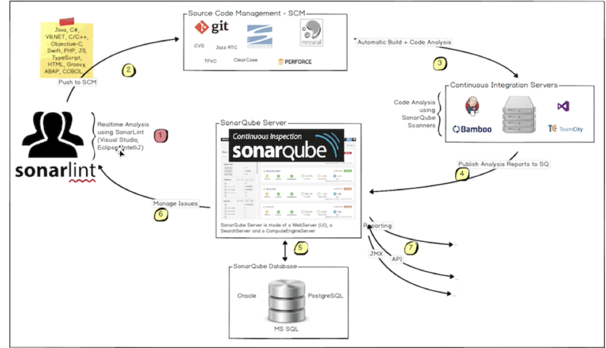

下面的模式展示了SonarQube如何与其他ALM工具集成，以及使用SONARQUE的各种组件。

* 开发人员在IDE中编写代码，并使用SONARLILT来运行本地分析
* 开发人员将他们的代码推到他们最喜欢的SCM：Git，Svn，TFVC，…
* 连续集成服务器触发自动构建，执行SONARQUE扫描器需要运行SONARQUE分析。
* 分析报告被发送到SONARQUE服务器进行处理。
* SONARQUE服务器在SONARQUE数据库中处理和存储分析报告结果，并将结果显示在UI中。
* 开发人员审查、评论、挑战他们的问题，通过SONARQUE UI管理和减少他们的技术债务。
* 管理者从分析中得到报告。
* `OPS`使用API来自动配置并从`SONARQUE`中提取数据。
* `OPS`使用JMX监控SONARQUBE服务器

### 1-2 SonarQube安装

**On server**

* 运行`SonarQube`的唯一前提条件是在计算机上安装Java (Oracle JRE 11或OpenJDK 11) 
* 实例至少需要`2GB`的`RAM`才能有效运行，而`OS`则需要`1GB`的可用`RAM` 
* 每个节点分配`50Gb`的驱动器空间 
* 安装在具有出色读写性能的硬盘驱动器上（“数据”文件夹中包含`Elasticsearch`索引，当服务器启动并运行时，将在该索引上进行大量的I/O) 
* `SonarQube`在服务器端不支持`32`位系统。但是，`SonarQube`确实在扫描仪侧支持`32`位系统。 

**支持平台**

* 运行`SonarQube`的唯一前提条件是在计算机上安装`Java (Oracle JRE 11`或`Open.JDK 11`) 

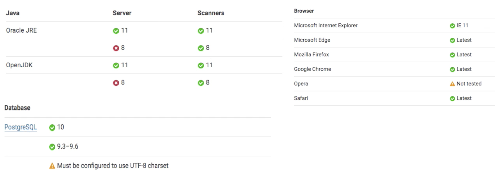

```
sysctl -w vm.max_ma_count=262144 
sysctl -w fs.file-max=65536
ulimit -n 65536 
ulimit -u 4096 
```

**Install For Docker**

```
docker run --rm -d --name sonarqube \ 
-p 9000:9000 \ 
-v ${LOCALDIR}/sonar/sonarqube_conf:/opt/sonarqube/conf \
-v ${LOCALDIR}/sonar/sonarqube_extensions:/opt/sonarqube/extensions \ 
-v ${LOCALDIR}/sonar/sonarqube_logs:/opt/sonarqube/logs \ 
-v ${LOCALDIR}/sonar/sonarqube data:/opt/sonarqube/data \ 
sonarqube:8.4.1-community 
```

### 1-3 服务集成

**LDAPS**

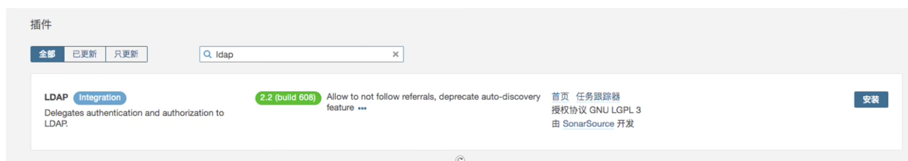

```
vim sonarqube_conf/sonar.properties


#LDAP sesttings 
#admin 

sonar.security.realm=LDAP 
ldap.url=ldap://192.168.1.200:389 
ldap.bindDn=cn=admin,dc=devops,dc=com 
ldap.bindPassword=ldap123 

# users
ldap.user.baseDn=ou=jenkins,dc=devops,dc=com 
ldap.user.request= (&(objectClass=inetOrgPerson)(cn={login})) 
ldap.user.realNameAttribute=cn 
ldap.user.emailAttribute=mail
```

**gitlab integration**

* gitlab part

`admin/applications`

* http://localhost:32314/oauth2/callback/gitlab
* Application ID: 706e48d74eabfb7330beaf747732182833ceb79fa43ac180e248a4b77f55cfed
* Secret: 646b3c54b4244d0fc5ccf8cf906728c2818a60e285675186dd731b21a189c0c8

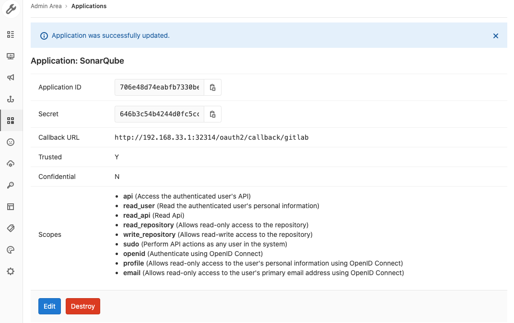

* `admin/settings?category=almintegration`

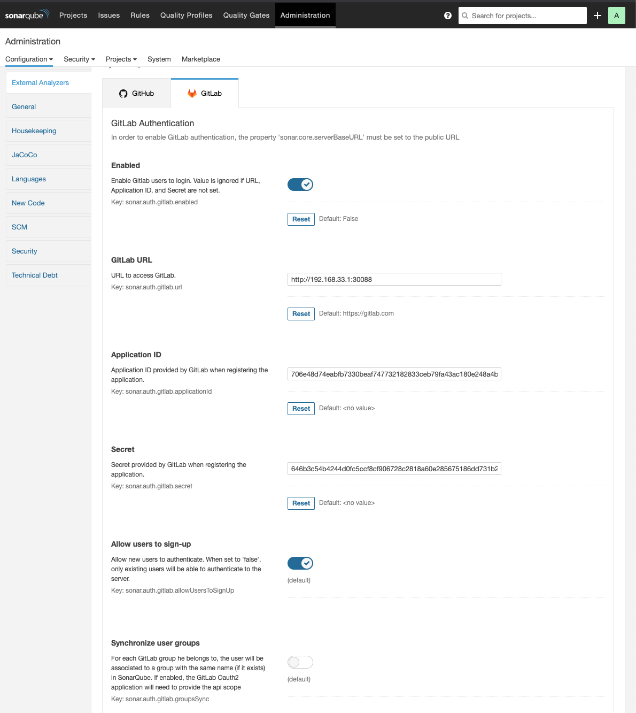


## 2、`SonarQube` 扫描仪配置

https://docs.sonarqube.org/display/SCAN/Analyzing+with+SonarQube+Scanner  

## 3、`SonarQube` 本地使用扫描仪项目分析配置

### 3-1 下载一个简单的`maven`项目到本地

```
$ git clone https://github.com/zeyangli/simple-java-maven-app
$ cd simple-java-maven-app
$ mv simple-java-maven-app demo-maven-service
$ mvn clean package

[INFO] Scanning for projects...
[INFO] 
[INFO] ----------------------< com.mycompany.app:my-app >----------------------
[INFO] Building my-app 1.1-SNAPSHOT
[INFO] --------------------------------[ jar ]---------------------------------
[INFO] 
[INFO] --- maven-clean-plugin:2.5:clean (default-clean) @ my-app ---
[INFO] 
[INFO] --- maven-resources-plugin:2.6:resources (default-resources) @ my-app ---
[WARNING] Using platform encoding (UTF-8 actually) to copy filtered resources, i.e. build is platform dependent!
[INFO] skip non existing resourceDirectory /home/vagrant/test/simple-java-maven-app/src/main/resources
[INFO] 
[INFO] --- maven-compiler-plugin:3.1:compile (default-compile) @ my-app ---
[INFO] Changes detected - recompiling the module!
[WARNING] File encoding has not been set, using platform encoding UTF-8, i.e. build is platform dependent!
[INFO] Compiling 1 source file to /home/vagrant/test/simple-java-maven-app/target/classes
[INFO] 
[INFO] --- maven-resources-plugin:2.6:testResources (default-testResources) @ my-app ---
[WARNING] Using platform encoding (UTF-8 actually) to copy filtered resources, i.e. build is platform dependent!
[INFO] skip non existing resourceDirectory /home/vagrant/test/simple-java-maven-app/src/test/resources
[INFO] 
[INFO] --- maven-compiler-plugin:3.1:testCompile (default-testCompile) @ my-app ---
[INFO] Changes detected - recompiling the module!
[WARNING] File encoding has not been set, using platform encoding UTF-8, i.e. build is platform dependent!
[INFO] Compiling 1 source file to /home/vagrant/test/simple-java-maven-app/target/test-classes
[INFO] 
[INFO] --- maven-surefire-plugin:2.12.4:test (default-test) @ my-app ---
[INFO] Surefire report directory: /home/vagrant/test/simple-java-maven-app/target/surefire-reports

-------------------------------------------------------
 T E S T S
-------------------------------------------------------
Running com.mycompany.app.AppTest
Tests run: 2, Failures: 0, Errors: 0, Skipped: 0, Time elapsed: 0.075 sec

Results :

Tests run: 2, Failures: 0, Errors: 0, Skipped: 0

[INFO] 
[INFO] --- maven-jar-plugin:3.0.2:jar (default-jar) @ my-app ---
[INFO] Building jar: /home/vagrant/test/simple-java-maven-app/target/my-app-1.1-SNAPSHOT.jar
[INFO] ------------------------------------------------------------------------
[INFO] BUILD SUCCESS
[INFO] ------------------------------------------------------------------------
[INFO] Total time:  5.512 s
[INFO] Finished at: 2020-08-01T06:10:01Z
[INFO] ------------------------------------------------------------------------
```

```
$ tree target/
target/
├── classes
│   └── com
│       └── mycompany
│           └── app
│               └── App.class
├── maven-archiver
│   └── pom.properties
├── maven-status
│   └── maven-compiler-plugin
│       ├── compile
│       │   └── default-compile
│       │       ├── createdFiles.lst
│       │       └── inputFiles.lst
│       └── testCompile
│           └── default-testCompile
│               ├── createdFiles.lst
│               └── inputFiles.lst
├── my-app-1.1-SNAPSHOT.jar
├── surefire-reports
│   ├── com.mycompany.app.AppTest.txt
│   └── TEST-com.mycompany.app.AppTest.xml
└── test-classes
    └── com
        └── mycompany
            └── app
                └── AppTest.class

16 directories, 10 files
```


### 3-2  Run SonarScanner from the Docker image

```
docker run \
    --rm \
    -e SONAR_HOST_URL="http://192.168.33.1:32314" \
    -e SONAR_LOGIN="admin" \
    -e SONAR_PASSWORD="admin" \
    -v "/home/vagrant/tools/sonar:/usr/src" \
    sonarsource/sonar-scanner-cli -Dsonar.projectKey=demo-maven-service
```

```
docker run \
    --rm \
    -e SONAR_HOST_URL="http://${SONARQUBE_URL}" \
    -v "${YOUR_REPO}:/usr/src" \
    sonarsource/sonar-scanner-cli
```

```
$ docker run \
>     --rm \
>     -e SONAR_HOST_URL="http://192.168.33.1:32314" \
>     -e SONAR_LOGIN="admin" \
>     -e SONAR_PASSWORD="admin" \
>     -v "/home/vagrant/tools/sonar:/usr/src" \
>     sonarsource/sonar-scanner-cli -Dsonar.projectKey=demo-maven-service
INFO: Scanner configuration file: /opt/sonar-scanner/conf/sonar-scanner.properties
INFO: Project root configuration file: NONE
INFO: SonarScanner 4.4.0.2170
INFO: Java 11.0.6 AdoptOpenJDK (64-bit)
INFO: Linux 3.10.0-957.12.2.el7.x86_64 amd64
INFO: User cache: /opt/sonar-scanner/.sonar/cache
INFO: Scanner configuration file: /opt/sonar-scanner/conf/sonar-scanner.properties
INFO: Project root configuration file: NONE
INFO: Analyzing on SonarQube server 8.4.1
INFO: Default locale: "en_US", source code encoding: "UTF-8" (analysis is platform dependent)
INFO: Load global settings
INFO: Load global settings (done) | time=376ms
INFO: Server id: EA8D9556-AXOeledPvj9r7r4MIG91
INFO: User cache: /opt/sonar-scanner/.sonar/cache
INFO: Load/download plugins
INFO: Load plugins index
INFO: Load plugins index (done) | time=341ms
INFO: Load/download plugins (done) | time=8919ms
INFO: Process project properties
INFO: Process project properties (done) | time=1ms
INFO: Execute project builders
INFO: Execute project builders (done) | time=7ms
INFO: Project key: demo-maven-service
INFO: Base dir: /usr/src
INFO: Working dir: /usr/src/.scannerwork
INFO: Load project settings for component key: 'demo-maven-service'
INFO: Load quality profiles
INFO: Load quality profiles (done) | time=754ms
INFO: Load active rules
INFO: Load active rules (done) | time=6033ms
WARN: SCM provider autodetection failed. Please use "sonar.scm.provider" to define SCM of your project, or disable the SCM Sensor in the project settings.
INFO: Indexing files...
INFO: Project configuration:
INFO: 1 file indexed
INFO: ------------- Run sensors on module demo-maven-service
INFO: Load metrics repository
INFO: Load metrics repository (done) | time=365ms
WARNING: An illegal reflective access operation has occurred
WARNING: Illegal reflective access by net.sf.cglib.core.ReflectUtils$1 (file:/opt/sonar-scanner/.sonar/cache/52f5340dd05620cd162e2b9a45a57124/sonar-javascript-plugin.jar) to method java.lang.ClassLoader.defineClass(java.lang.String,byte[],int,int,java.security.ProtectionDomain)
WARNING: Please consider reporting this to the maintainers of net.sf.cglib.core.ReflectUtils$1
WARNING: Use --illegal-access=warn to enable warnings of further illegal reflective access operations
WARNING: All illegal access operations will be denied in a future release
INFO: Sensor SonarCSS Rules [cssfamily]
INFO: No CSS, PHP, HTML or VueJS files are found in the project. CSS analysis is skipped.
INFO: Sensor SonarCSS Rules [cssfamily] (done) | time=1ms
INFO: Sensor JaCoCo XML Report Importer [jacoco]
INFO: 'sonar.coverage.jacoco.xmlReportPaths' is not defined. Using default locations: target/site/jacoco/jacoco.xml,target/site/jacoco-it/jacoco.xml,build/reports/jacoco/test/jacocoTestReport.xml
INFO: No report imported, no coverage information will be imported by JaCoCo XML Report Importer
INFO: Sensor JaCoCo XML Report Importer [jacoco] (done) | time=2ms
INFO: Sensor JavaXmlSensor [java]
INFO: Sensor JavaXmlSensor [java] (done) | time=0ms
INFO: Sensor HTML [web]
INFO: Sensor HTML [web] (done) | time=8ms
INFO: ------------- Run sensors on project
INFO: Sensor Zero Coverage Sensor
INFO: Sensor Zero Coverage Sensor (done) | time=9ms
INFO: SCM Publisher No SCM system was detected. You can use the 'sonar.scm.provider' property to explicitly specify it.
INFO: CPD Executor Calculating CPD for 0 files
INFO: CPD Executor CPD calculation finished (done) | time=0ms
INFO: Analysis report generated in 202ms, dir size=79 KB
INFO: Analysis report compressed in 39ms, zip size=10 KB
INFO: Analysis report uploaded in 623ms
INFO: ANALYSIS SUCCESSFUL, you can browse http://192.168.33.1:32314/dashboard?id=demo-maven-service
INFO: Note that you will be able to access the updated dashboard once the server has processed the submitted analysis report
INFO: More about the report processing at http://192.168.33.1:32314/api/ce/task?id=AXOztIcYdI8p8GdhXo8N
INFO: Analysis total time: 13.094 s
INFO: ------------------------------------------------------------------------
INFO: EXECUTION SUCCESS
INFO: ------------------------------------------------------------------------
INFO: Total time: 25.064s
INFO: Final Memory: 6M/37M
INFO: ------------------------------------------------------------------------
```

### 3-3  Run SonarScanner on Linux server

```
cd /usr/local/
sudo wget https://binaries.sonarsource.com/Distribution/sonar-scanner-cli/sonar-scanner-cli-4.4.0.2170-linux.zip
unzip sonar-scanner-cli-4.4.0.2170-linux.zip
mv sonar-scanner-cli-4.4.0.2170-linux sonar-scanner

cd /usr/local/sonar-scanner
$ tree bin/
bin/
├── sonar-scanner
└── sonar-scanner-debug

0 directories, 2 files

$ tree conf/
conf/
└── sonar-scanner.properties

0 directories, 1 file

sudo vim /usr/local/sonar-scanner/conf/sonar-scanner.properties

...
sonar.host.url=http://192.168.33.1:32314
```


sudo vim /etc/profile.d/scanner.sh


export SONAR_HOME=/usr/local/sonar-scanner/
export PATH=$PATH:$SONAR_HOME/bin

```
cd demo-maven-service
vim sonarqube.sh

# can run the command in script
sonar-scanner -Dsonar.host.url=http://192.168.33.1:32314 \
-Dsonar.projectKey=demomavenservice \
-Dsonar.projectName=demomavenservice \
--define sonar.login=admin \
--define sonar.password=admin \
--define sonar.projectVersion=1.0 \
--define sonar.ws.timeout=30 \
--define sonar.projectDescription="my first project" \
--define sonar.links.homepage=http://www.baidu.com  \
--define sonar.sources=src \
--define sonar.sourceEncoding=UTF-8 \
--define sonar.java.binaries=target/classes \
--define sonar.java.test.binaries=target/test—classes \
--define sonar.java.surefire.report=target/surefire—reports
```

**Run the script**

```
source sonarqube.sh
INFO: Scanner configuration file: /usr/local/sonar-scanner/conf/sonar-scanner.properties
INFO: Project root configuration file: NONE
INFO: SonarScanner 4.4.0.2170
INFO: Java 11.0.3 AdoptOpenJDK (64-bit)
INFO: Linux 3.10.0-957.12.2.el7.x86_64 amd64
INFO: User cache: /home/vagrant/.sonar/cache
INFO: Scanner configuration file: /usr/local/sonar-scanner/conf/sonar-scanner.properties
INFO: Project root configuration file: NONE
INFO: Analyzing on SonarQube server 8.4.1
INFO: Default locale: "en_US", source code encoding: "UTF-8"
INFO: Load global settings
INFO: Load global settings (done) | time=377ms
INFO: Server id: EA8D9556-AXOeledPvj9r7r4MIG91
INFO: User cache: /home/vagrant/.sonar/cache
...
INFO: Analysis report compressed in 71ms, zip size=14 KB
INFO: Analysis report uploaded in 378ms
INFO: ANALYSIS SUCCESSFUL, you can browse http://192.168.33.1:32314/dashboard?id=demomavenservice
INFO: Note that you will be able to access the updated dashboard once the server has processed the submitted analysis report
INFO: More about the report processing at http://192.168.33.1:32314/api/ce/task?id=AXO4OmSidI8p8GdhXo8b
INFO: Analysis total time: 14.196 s
INFO: ------------------------------------------------------------------------
INFO: EXECUTION SUCCESS
INFO: ------------------------------------------------------------------------
INFO: Total time: 16.430s
INFO: Final Memory: 16M/61M
INFO: ------------------------------------------------------------------------
```

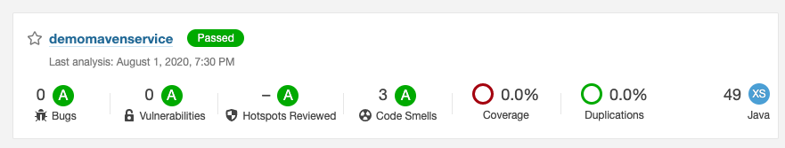

## 4、使用流水线进行自动化代码扫描

### 4-1 填写`sonarqube scanner`到 `sharedlibrary `

**`JenkinslibTest/src/org/devops/sonarqube.groovy`**

```
package org.devops

//scan
def SonarScan(projectName,projectDesc,projectPath){
    def scannerHome = "/usr/local/sonar-scanner/"
    //定义服务器列表
    def sonarServers = "http://192.168.33.1:32314"
    def sonarDate = sh  returnStdout: true, script: 'date  +%Y%m%d%H%M%S'
    sonarDate = sonarDate - "\n"
    
    sh """ 
         ${scannerHome}/bin/sonar-scanner -Dsonar.host.url=${sonarServers} \
        -Dsonar.projectKey=${projectName} \
        -Dsonar.projectName=${projectName} \
        --define sonar.login=admin \
        --define sonar.password=admin \
        --define sonar.projectVersion=${sonarDate} \
        --define sonar.ws.timeout=30 \
        --define sonar.projectDescription=${projectDesc} \
        --define sonar.links.homepage=http://www.baidu.com  \
        --define sonar.sources=${projectPath} \
        --define sonar.sourceEncoding=UTF-8 \
        --define sonar.java.binaries=target/classes \
        --define sonar.java.test.binaries=target/test—classes \
        --define sonar.java.surefire.report=target/surefire—reports
    """
}
```

### 4-2 `Pipeline`调用 `sharedlibrary`

```
#!groovy
@Library('jenkinslib@master') _

def build = new org.devops.buildtools()
def sonar = new org.devops.sonarqube()

pipeline {
 	agent { node { label "hostmachine" }}
 	parameters {
        string(name: 'srcUrl', defaultValue: 'http://192.168.33.1:30088/root/demo-maven-service.git', description: '') 
        choice(name: 'branchName', choices: 'master\nstage\ndev', description: 'Please chose your branch')
        choice(name: 'buildType', choices: 'mvn', description: 'build tool')
        choice(name: 'buildShell', choices: 'clean package -DskipTest\n--version', description: 'build tool')
	}
 	stages{
        stage('Checkout') {
	        steps {
	        	script {
	            	checkout([$class: 'GitSCM', branches: [[name: "${branchName}"]], doGenerateSubmoduleConfigurations: false, extensions: [], submoduleCfg: [], userRemoteConfigs: [[credentialsId: 'gitlab-admin-user', url: "${srcUrl}"]]])
	            } 
	        }
	    }
        
		stage('Build') {
	        steps {
	        	script {
	            	build.Build(buildType,buildShell)
	            } 
	        }
	    }

        stage('Qa') {
	        steps {
	        	script {
	            	sonar.SonarScan("${JOB_NAME}","${JOB_NAME}","src" )
	            } 
	        }
	    }    
    }
 }
```


```
stage('Qa') {
    steps {
    	script {
        	sonar.SonarScan("${JOB_NAME}","${JOB_NAME}","src" )
        } 
    }
}
```

### 4-3 Console Output

```
...
[Pipeline] sh
+ date +%Y%m%d%H%M%S
[Pipeline] sh
+ /usr/local/sonar-scanner//bin/sonar-scanner -Dsonar.host.url=http://192.168.33.1:32314 -Dsonar.projectKey=sq4scanner -Dsonar.projectName=sq4scanner --define sonar.login=admin --define sonar.password=admin --define sonar.projectVersion=20200801135329 --define sonar.ws.timeout=30 --define sonar.projectDescription=sq4scanner --define sonar.links.homepage=http://www.baidu.com --define sonar.sources=src --define sonar.sourceEncoding=UTF-8 --define sonar.java.binaries=target/classes --define sonar.java.test.binaries=target/test—classes --define sonar.java.surefire.report=target/surefire—reports
INFO: Scanner configuration file: /usr/local/sonar-scanner/conf/sonar-scanner.properties
INFO: Project root configuration file: NONE
INFO: SonarScanner 4.4.0.2170
...
INFO: ANALYSIS SUCCESSFUL, you can browse http://192.168.33.1:32314/dashboard?id=sq4scanner
INFO: Note that you will be able to access the updated dashboard once the server has processed the submitted analysis report
INFO: More about the report processing at http://192.168.33.1:32314/api/ce/task?id=AXO4zE_WdI8p8GdhXo8n
INFO: Analysis total time: 17.732 s
INFO: ------------------------------------------------------------------------
INFO: EXECUTION SUCCESS
INFO: ------------------------------------------------------------------------
INFO: Total time: 20.804s
INFO: Final Memory: 16M/62M
```

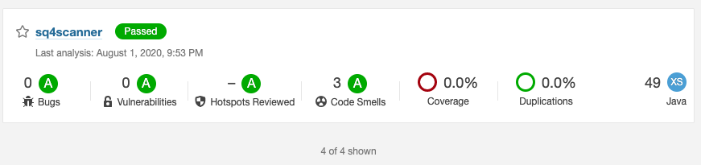

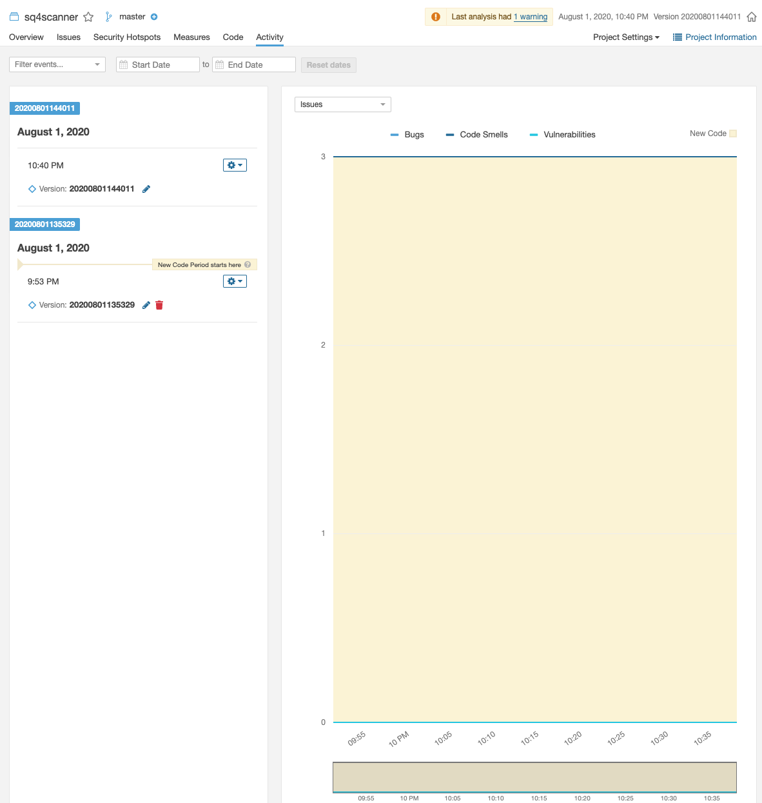

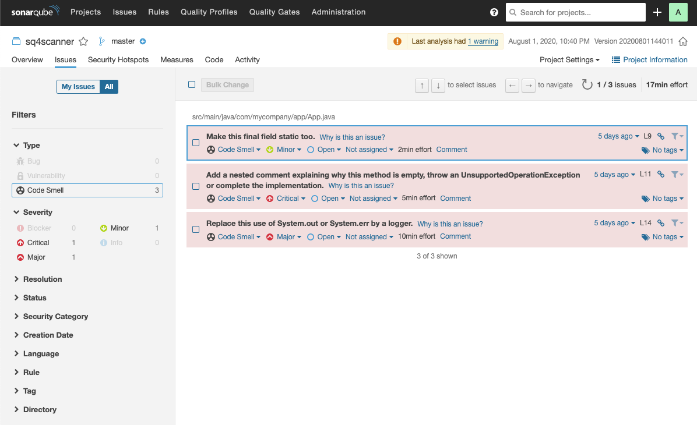

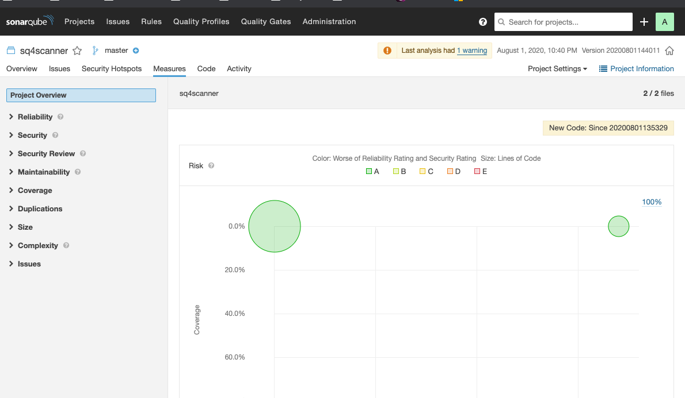

## 5、使用 Sonar 插件完成代码扫描

**[SonarScanner for Jenkins](https://docs.sonarqube.org/latest/analysis/scan/sonarscanner-for-jenkins/)**


[Jenkins与SonarQube集成](./2chap8_code_quality_sonarqube.md)


**`JenkinslibTest/src/org/devops/sonarqubeadv.groovy`**

```
package org.devops


//scan
def SonarScan(projectName,projectDesc,projectPath){
        
    withSonarQubeEnv("sonarqube"){
        def scannerHome = "/usr/local/sonar-scanner/"
        def sonarServers = "http://192.168.33.1:32314"
        def sonarDate = sh  returnStdout: true, script: 'date  +%Y%m%d%H%M%S'
        sonarDate = sonarDate - "\n"
    

        sh """ 
            ${scannerHome}/bin/sonar-scanner -Dsonar.projectKey=${projectName} \
            -Dsonar.projectName=${projectName} \
            --define sonar.projectVersion=${sonarDate} \
            --define sonar.ws.timeout=30 \
            --define sonar.projectDescription=${projectDesc} \
            --define sonar.links.homepage=http://www.baidu.com \
            --define sonar.sources=${projectPath} \
            --define sonar.sourceEncoding=UTF-8 \
            --define sonar.java.binaries=target/classes \
            --define sonar.java.test.binaries=target/test-classes \
            --define sonar.java.surefire.report=target/surefire-reports
        """
    }
}

```

```
 withSonarQubeEnv("sonarqube"){
 
 }
```

* ` withSonarQubeEnv("sonarqube")` 配置在Jenkins中


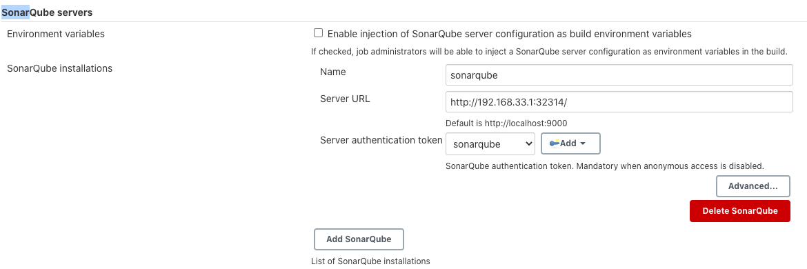

**`pipeline.groovy`**

 
```
#!groovy
@Library('jenkinslib@master') _

def build = new org.devops.buildtools()
def sonar = new org.devops.sonarqube()
def sonaradv = new org.devops.sonarqubeadv()

pipeline {
 	agent { node { label "hostmachine" }}
 	parameters {
        string(name: 'srcUrl', defaultValue: 'http://192.168.33.1:30088/root/demo-maven-service.git', description: '') 
        choice(name: 'branchName', choices: 'master\nstage\ndev', description: 'Please chose your branch')
        choice(name: 'buildType', choices: 'mvn', description: 'build tool')
        choice(name: 'buildShell', choices: 'clean package -DskipTest\n--version', description: 'build tool')
	}
 	stages{
        stage('Checkout') {
	        steps {
	        	script {
	            	checkout([$class: 'GitSCM', branches: [[name: "${branchName}"]], doGenerateSubmoduleConfigurations: false, extensions: [], submoduleCfg: [], userRemoteConfigs: [[credentialsId: 'gitlab-admin-user', url: "${srcUrl}"]]])
	            } 
	        }
	    }
        
		stage('Build') {
	        steps {
	        	script {
	            	build.Build(buildType,buildShell)
	            } 
	        }
	    }

        stage('Qa') {
	        steps {
	        	script {
	            	sonaradv.SonarScan("${JOB_NAME}","${JOB_NAME}","src" )
	            } 
	        }
	    }    
    }
 }
```

* `def sonaradv = new org.devops.sonarqubeadv()`


```
stage('Qa') {
	        steps {
	        	script {
	            	sonaradv.SonarScan("${JOB_NAME}","${JOB_NAME}","src" )
	            } 
	        }
	    }
```

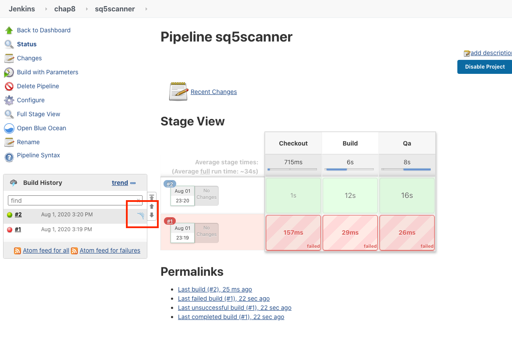

* 点击`sonarqube tab`


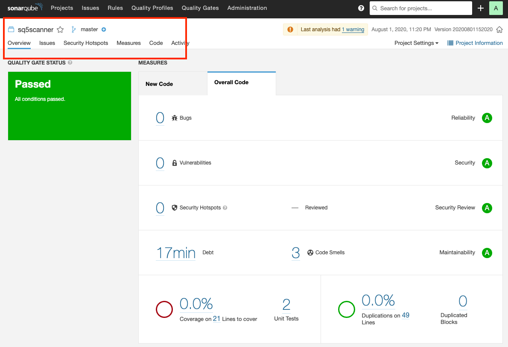

## 5、SonarQube 项目管理

### 5-1 SonarQube - 创建新的`Quality Profiles`

* Name: demo
* Language: java

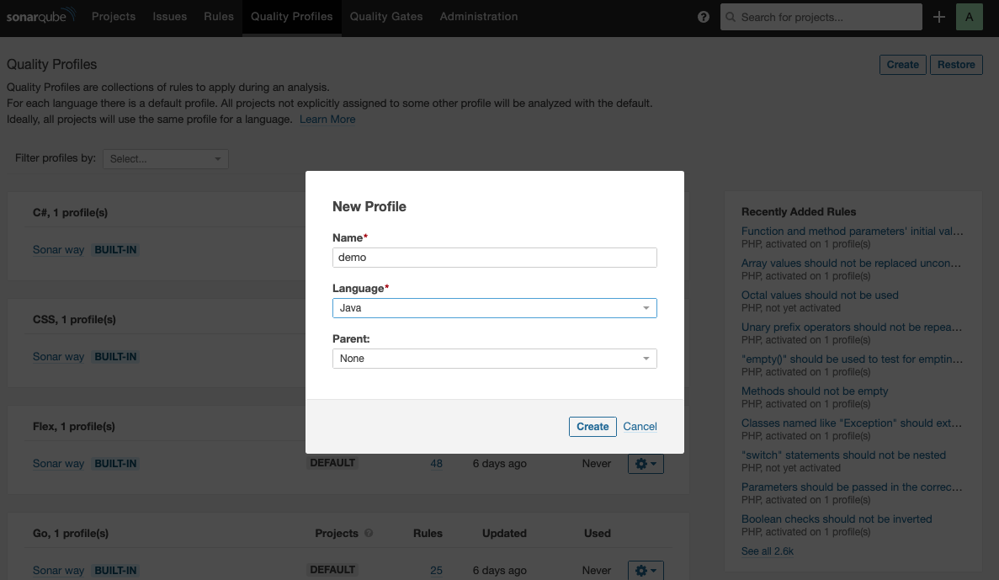

#### 5-1-1 Activate more rules for `demo` Profiles

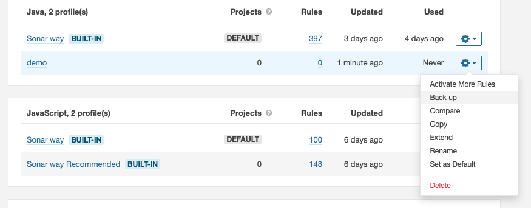

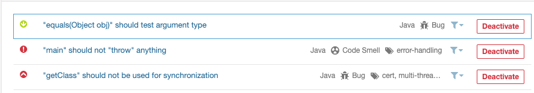

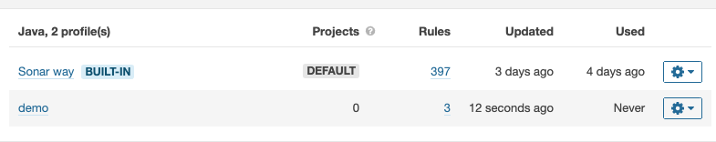


#### 5-1-2 Add `demo` Profiles to the projects

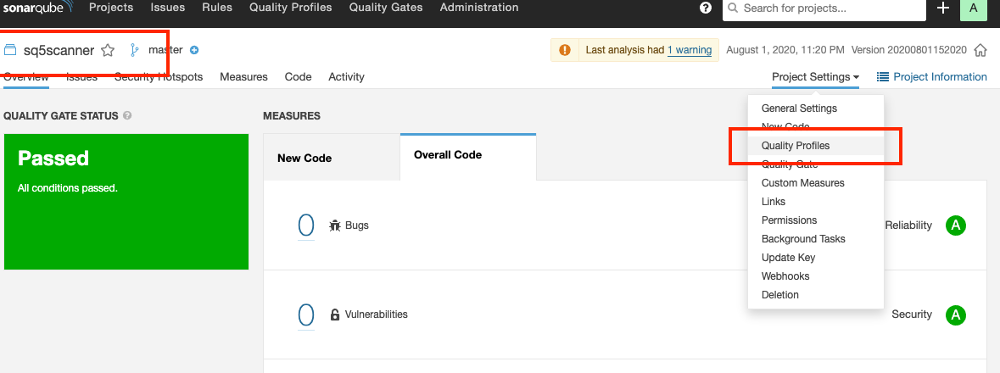

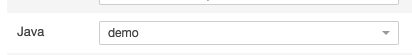

### 5-2 SonarQube - 创建新的`Quality Gates`

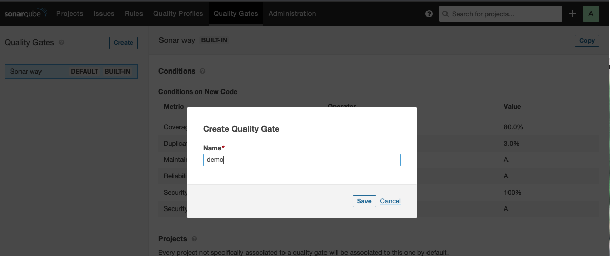

#### 5-2-1 Add condition to the Quality Gates for projects

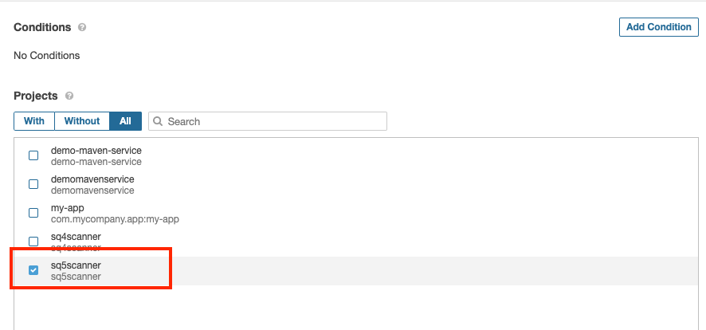

**Add more condition**

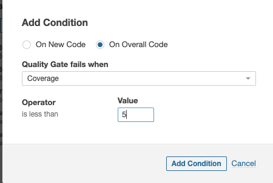

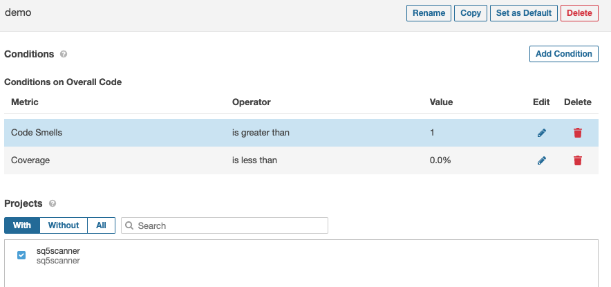

#### 5-2-2 Run failed becuase of condition

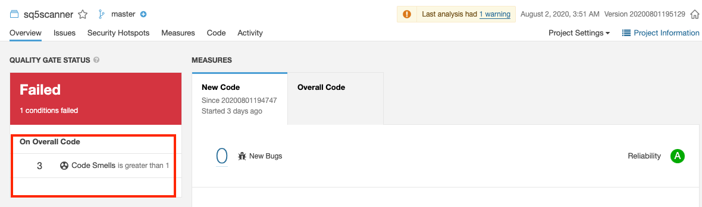

### 5-3 在`jenkins pipeline`获取 `SonarQube` 检测结果 (SonarQube plugin function）

**`JenkinslibTest/src/org/devops/sonarqubeadv.groovy`**

```
package org.devops


//scan
def SonarScan(projectName,projectDesc,projectPath){
        
    withSonarQubeEnv("sonarqube"){
        def scannerHome = "/usr/local/sonar-scanner/"
        def sonarServers = "http://192.168.33.1:32314"
        def sonarDate = sh  returnStdout: true, script: 'date  +%Y%m%d%H%M%S'
        sonarDate = sonarDate - "\n"
    

        sh """ 
            ${scannerHome}/bin/sonar-scanner -Dsonar.projectKey=${projectName} \
            -Dsonar.projectName=${projectName} \
            --define sonar.projectVersion=${sonarDate} \
            --define sonar.ws.timeout=30 \
            --define sonar.projectDescription=${projectDesc} \
            --define sonar.links.homepage=http://www.baidu.com \
            --define sonar.sources=${projectPath} \
            --define sonar.sourceEncoding=UTF-8 \
            --define sonar.java.binaries=target/classes \
            --define sonar.java.test.binaries=target/test-classes \
            --define sonar.java.surefire.report=target/surefire-reports
        """
    }
    
    def qg = waitForQualityGate()
    if (qg.status != 'OK') {
        error "Pipeline aborted due to quality gate failure: ${qg.status}"
    }
}
```

```
def qg = waitForQualityGate()
    if (qg.status != 'OK') {
        error "Pipeline aborted due to quality gate failure: ${qg.status}"
    }
```

* [waitForQualityGate](https://www.jenkins.io/doc/pipeline/steps/sonar/)
* **waitForQualityGate**: Wait for SonarQube analysis to be completed and return quality gate status

**Pipeline script**

```
#!groovy
@Library('jenkinslib@master') _

def build = new org.devops.buildtools()
def sonar = new org.devops.sonarqube()
def sonaradv = new org.devops.sonarqubeadv()

pipeline {
 	agent { node { label "hostmachine" }}
 	parameters {
        string(name: 'srcUrl', defaultValue: 'http://192.168.33.1:30088/root/demo-maven-service.git', description: '') 
        choice(name: 'branchName', choices: 'master\nstage\ndev', description: 'Please chose your branch')
        choice(name: 'buildType', choices: 'mvn', description: 'build tool')
        choice(name: 'buildShell', choices: 'clean package -DskipTest\n--version', description: 'build tool')
	}
 	stages{
        stage('Checkout') {
	        steps {
	        	script {
	            	checkout([$class: 'GitSCM', branches: [[name: "${branchName}"]], doGenerateSubmoduleConfigurations: false, extensions: [], submoduleCfg: [], userRemoteConfigs: [[credentialsId: 'gitlab-admin-user', url: "${srcUrl}"]]])
	            } 
	        }
	    }
        
		stage('Build') {
	        steps {
	        	script {
	            	build.Build(buildType,buildShell)
	            } 
	        }
	    }

        stage('Qa') {
	        steps {
	        	script {
	            	sonaradv.SonarScan("${JOB_NAME}","${JOB_NAME}","src" )
	            } 
	        }
	    }    
    }
 }
```

**Console output**

```
...
[Pipeline] // withSonarQubeEnv
[Pipeline] waitForQualityGate
Checking status of SonarQube task 'AXO9Z_O3dI8p8GdhXo9M' on server 'sonarqube'
SonarQube task 'AXO9Z_O3dI8p8GdhXo9M' status is 'PENDING'
SonarQube task 'AXO9Z_O3dI8p8GdhXo9M' status is 'SUCCESS'
SonarQube task 'AXO9Z_O3dI8p8GdhXo9M' completed. Quality gate is 'ERROR'
[Pipeline] error
```

`SonarQube` 的 `error` 会导致 `pipeline` 的失败

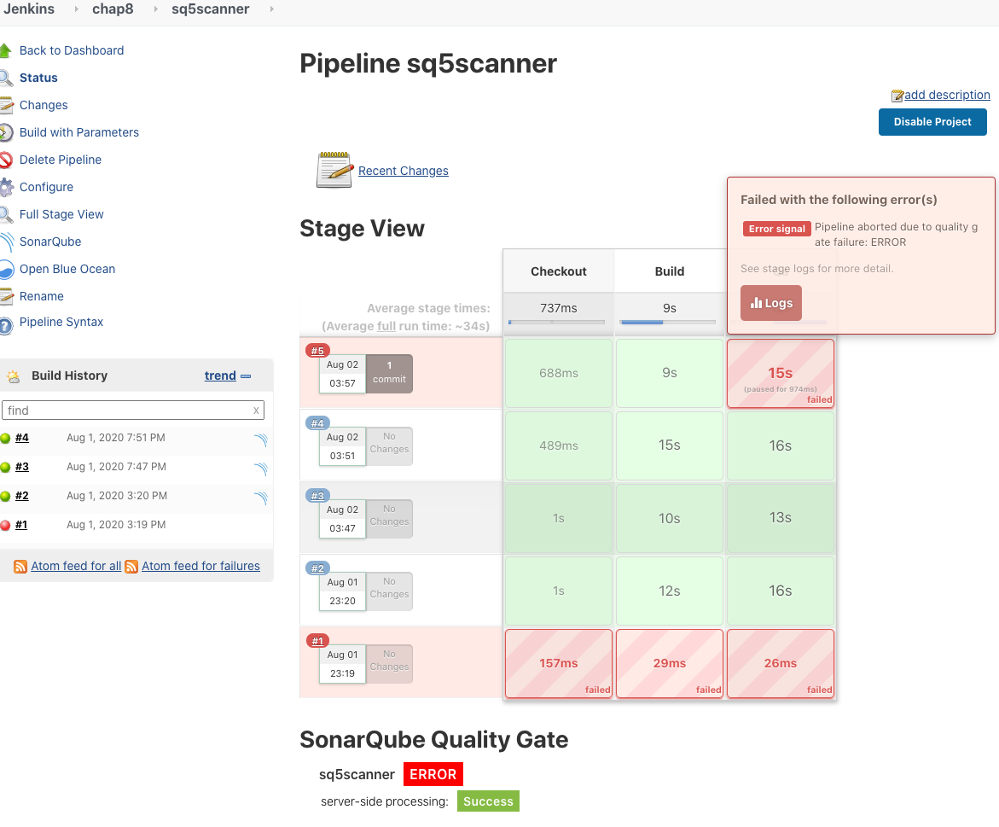


### 5-4 在`jenkins pipeline`获取 `SonarQube` 检测结果 (SonarQube API）

#### 5-4-1 添加 `SonarQube credentials`到	`Jenkins`中

* `sonar-admin-user`

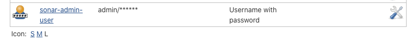
 
* 查看 `SonarQube API`的返回

```
 http://192.168.33.1:32314/api/qualitygates/project_status?projectKey=sq5scanner

{
   "projectStatus":{
      "status":"ERROR",
      "conditions":[
         {
            "status":"OK",
            "metricKey":"coverage",
            "comparator":"LT",
            "errorThreshold":"0",
            "actualValue":"0.0"
         },
         {
            "status":"ERROR",
            "metricKey":"code_smells",
            "comparator":"GT",
            "errorThreshold":"1",
            "actualValue":"3"
         }
      ],
      "periods":[
         {
            "index":1,
            "mode":"PREVIOUS_VERSION",
            "date":"2020-08-01T19:51:35+0000",
            "parameter":"20200801195129"
         }
      ],
      "ignoredConditions":false
   }
}
```
 
#### 5-4-2 `JenkinslibTest/src/org/devops/sonarapi.groovy`


```
package org.devops


//封装HTTP

def HttpReq(reqType,reqUrl,reqBody){
    def sonarServer = "http://192.168.33.1:32314/api"
   
    result = httpRequest authentication: 'sonar-admin-user',
            httpMode: reqType, 
            contentType: "APPLICATION_JSON",
            consoleLogResponseBody: true,
            ignoreSslErrors: true, 
            requestBody: reqBody,
            url: "${sonarServer}/${reqUrl}"
            //quiet: true
    
    return result
}

//获取Sonar质量阈状态
def GetProjectStatus(projectName){
    apiUrl = "project_branches/list?project=${projectName}"
    response = HttpReq("GET",apiUrl,'')
    
    response = readJSON text: """${response.content}"""
    result = response["branches"][0]["status"]["qualityGateStatus"]
    
    //println(response)
    
   return result
}
```

#### 5-4-4  `Pipeline` 调用`sonar api` 

```
#!groovy
@Library('jenkinslib@master') _

def build = new org.devops.buildtools()
def sonar = new org.devops.sonarqube()
def sonaradv = new org.devops.sonarqubeadv()
def sonarapi = new org.devops.sonarapi()

pipeline {
 	agent { node { label "hostmachine" }}
 	parameters {
        string(name: 'srcUrl', defaultValue: 'http://192.168.33.1:30088/root/demo-maven-service.git', description: '') 
        choice(name: 'branchName', choices: 'master\nstage\ndev', description: 'Please chose your branch')
        choice(name: 'buildType', choices: 'mvn', description: 'build tool')
        choice(name: 'buildShell', choices: 'clean package -DskipTest\n--version', description: 'build tool')
	}
 	stages{
        stage('Checkout') {
	        steps {
	        	script {
	            	checkout([$class: 'GitSCM', branches: [[name: "${branchName}"]], doGenerateSubmoduleConfigurations: false, extensions: [], submoduleCfg: [], userRemoteConfigs: [[credentialsId: 'gitlab-admin-user', url: "${srcUrl}"]]])
	            } 
	        }
	    }
        
		stage('Build') {
	        steps {
	        	script {
	            	build.Build(buildType,buildShell)
	            } 
	        }
	    }

        stage('Qa') {
	        steps {
	        	script {
	            	sonaradv.SonarScan("${JOB_NAME}","${JOB_NAME}","src" )

                    result = sonarapi.GetProjectStatus("${JOB_NAME}")
                        println(result)
                    if(result.toString().contains("ERROR")){
                        error "Qaulit gate failed, please re-check ur code!"
                    }else{
                        println(result)
                    }
	            } 
	        }
	    }    
    }
 }
 ```
 
 ```
script {
    	sonaradv.SonarScan("${JOB_NAME}","${JOB_NAME}","src" )

        result = sonarapi.GetProjectStatus("${JOB_NAME}")
            println(result)
        if(result.toString().contains("ERROR")){
            error "Qaulit gate failed, please re-check ur code!"
        }else{
            println(result)
        }
 } 
```

**Console Output**

```
...
[Pipeline] httpRequest
HttpMethod: GET
URL: http://192.168.33.1:32314/api/project_branches/list?project=sq6scanner
Content-Type: application/json
Using authentication: sonar-admin-user
Sending request to url: http://192.168.33.1:32314/api/project_branches/list?project=sq6scanner
Response Code: HTTP/1.1 200 
Response: 
{"branches":[{"name":"master","isMain":true,"type":"BRANCH","status":{"qualityGateStatus":"OK"},"analysisDate":"2020-08-01T21:28:00+0000","excludedFromPurge":true}]}
Success code from [100‥399]
[Pipeline] readJSON
[Pipeline] echo
OK
[Pipeline] echo
OK
...
```


## 6、 SonarQube 搜索与新建项目(API WAY)


**http://192.168.33.1:32314/web_api/api**

### 6-1 查找项目

```
api/projects/search?projects=${projectName}" 
```

```
//搜索Sonar项目
def SerarchProject(projectName){
    apiUrl = "projects/search?projects=${projectName}"
    response = HttpReq("GET",apiUrl,'')

    response = readJSON text: """${response.content}"""
    result = response["paging"]["total"]

    if(result.toString() == "0"){
       return "false"
    } else {
       return "true"
    }
}
```

### 6-2 创建新项目

```
api/projects/create?name=${projectName} &project=$ {projectName} " 
```

```
//创建Sonar项目
def CreateProject(projectName){
    apiUrl =  "projects/create?name=${projectName}&project=${projectName}"
    response = HttpReq("POST",apiUrl,'')
    println(response)
}
```

### 6-2  搜索与新建项目在`Pipeline`

```
stage('Qa') {
	        steps {
	        	script {
                    
                    result = sonarapi.SearchProject("${JOB_NAME}")
                    println(result)

                    if(result == "false"){
                       println("${JOB_NAME} ---- The project doesn't exist ----- ${JOB_NAME}!") 
                       sonarapi.CreateProject("${JOB_NAME}")
                    } else {
                       println("${JOB_NAME} ---- The project already exist!")
                    }
                    
	            	sonaradv.SonarScan("${JOB_NAME}","${JOB_NAME}","src" )

                    result = sonarapi.GetProjectStatus("${JOB_NAME}")
                    println(result)

                    if(result.toString().contains("ERROR")){
                        error "Quality gate failed, please re-check ur code!"
                    }else{
                        println(result)
                    }
	            } 
	        }
	    } 
```

```
 result = sonarapi.SearchProject("${JOB_NAME}")
                    println(result)

                    if(result == "false"){
                       println("${JOB_NAME} ---- The project doesn't exist ----- ${JOB_NAME}!") 
                       sonarapi.CreateProject("${JOB_NAME}")
                    } else {
                       println("${JOB_NAME} ---- The project already exist!")
                    }
```


**Console output**

```
...
[Pipeline] { (Qa)
[Pipeline] script
[Pipeline] {
[Pipeline] httpRequest
HttpMethod: GET
URL: http://192.168.33.1:32314/api/projects/search?projects=sq7scanner
Content-Type: application/json
Using authentication: sonar-admin-user
Sending request to url: http://192.168.33.1:32314/api/projects/search?projects=sq7scanner
Response Code: HTTP/1.1 200 
Response: 
{"paging":{"pageIndex":1,"pageSize":100,"total":0},"components":[]}
Success code from [100‥399]
[Pipeline] readJSON
[Pipeline] echo
false
[Pipeline] echo
sq7scanner ---- The project doesn't exist ----- sq7scanner!
[Pipeline] httpRequest
HttpMethod: POST
URL: http://192.168.33.1:32314/api/projects/create?name=sq7scanner&project=sq7scanner
Content-Type: application/json
Using authentication: sonar-admin-user
Sending request to url: http://192.168.33.1:32314/api/projects/create?name=sq7scanner&project=sq7scanner
Response Code: HTTP/1.1 200 
Response: 
{"project":{"key":"sq7scanner","name":"sq7scanner","qualifier":"TRK","visibility":"public"}}
Success code from [100‥399]
[Pipeline] echo
Status: 200
[Pipeline] withSonarQubeEnv
Injecting SonarQube environment variables using the configuration: sonarqube
[Pipeline] {
[Pipeline] sh
+ date +%Y%m%d%H%M%S
...
```

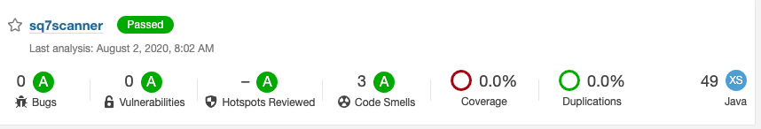

## 7 配置质量规则与质量阈

### 7-1 配置项目质量规则

**确保质量阈已经被创建： java -> demo**


```
api/qualityprofiles/add_project?language=${language}&qualityProfile=${qualityProfile}&project=${projectName}"
```

```
//配置项目质量规则

def ConfigQualityProfiles(projectName,lang,qpname){
    apiUrl = "qualityprofiles/add_project?language=${lang}&project=${projectName}&qualityProfile=${qpname}"
    response = HttpReq("POST",apiUrl,'')
    println(response)
}
```

```
stage('Qa') {
	        steps {
	        	script {
                    
                    result = sonarapi.SearchProject("${JOB_NAME}")
                    println(result)

                    if(result == "false"){
                       println("${JOB_NAME} ---- The project doesn't exist ----- ${JOB_NAME}!") 
                       sonarapi.CreateProject("${JOB_NAME}")
                    } else {
                       println("${JOB_NAME} ---- The project already exist!")
                    }

                    qpName = "${JOB_NAME}".split("-")[0]
                    sonarapi.ConfigQualityProfiles("${JOB_NAME}","java",qpName)
                    
	            	sonaradv.SonarScan("${JOB_NAME}","${JOB_NAME}","src" )

                    result = sonarapi.GetProjectStatus("${JOB_NAME}")
                    println(result)

                    if(result.toString().contains("ERROR")){
                        error "Quality gate failed, please re-check ur code!"
                    }else{
                        println(result)
                    }
	            } 
	        }
	    }
```

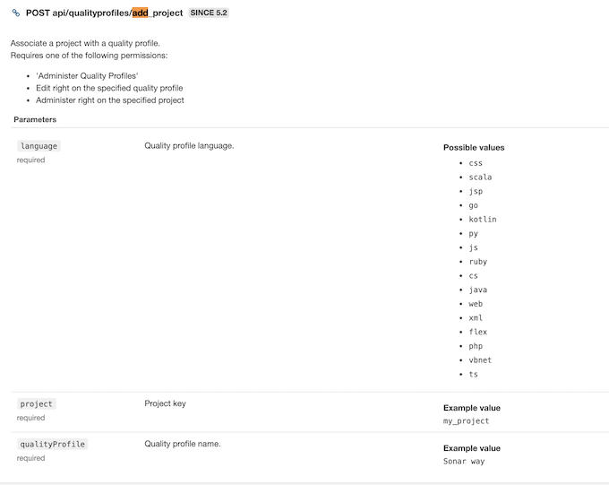

```
qpName = "${JOB_NAME}".split("-")[0]
sonarapi.ConfigQualityProfiles("${JOB_NAME}","java",qpName)
```

* job name: `demo-sq8-scanner`

**console output**

```
[Pipeline] httpRequest
HttpMethod: POST
URL: http://192.168.33.1:32314/api/qualityprofiles/add_project?language=java&project=demo-sq8-scanner&qualityProfile=demo
Content-Type: application/json
Using authentication: sonar-admin-user
Sending request to url: http://192.168.33.1:32314/api/qualityprofiles/add_project?language=java&project=demo-sq8-scanner&qualityProfile=demo
Response Code: HTTP/1.1 204 
Response: 
null
Success code from [100‥399]
[Pipeline] echo
Status: 204
```

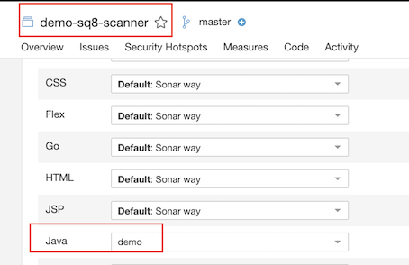

### 7-2 配置项目质量阈

```
//项目授权
api/permissions/apply_template?projectKey=${projecttKey}&templateName=${templateName}" 

//获取质量阈ID
api/qualitygates/show?name=${gateName}

//更新质量阈值
api/qualitygates/select?projectKey=${projectKey}&gateId=${gateId}" 
```

**`JenkinslibTest/src/org/devops/sonarqube.groovy`**

```
//获取质量阈ID
def GetQualtyGateId(gateName){
    apiUrl= "qualitygates/show?name=${gateName}"
    response = HttpReq("GET",apiUrl,'')
    response = readJSON text: """${response.content}"""
    result = response["id"]
    
    return result
}

//配置项目质量阈

def ConfigQualityGates(projectName,gateName){
    gateId = GetQualtyGateId(gateName)
    apiUrl = "qualitygates/select?gateId=${gateId}&projectKey=${projectName}"
    response = HttpReq("POST",apiUrl,'')
    println(response)println(response)
}
```

```
sonarapi.ConfigQualityGates("${JOB_NAME}",qpName)
```

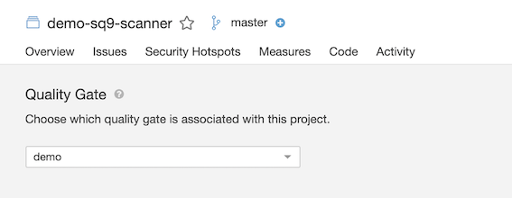


### 7-3 使用`default QualityGates`或者`default Qualityfiles`

```
sonarapi.ConfigQualityProfiles("${JOB_NAME}","java","Sonar%20way")
```

### 7-4 最终版本(sharedlib and pipeline)

**`JenkinslibTest/src/org/devops/sonarapi.groovy`**

```
package org.devops


//封装HTTP

def HttpReq(reqType,reqUrl,reqBody){
    def sonarServer = "http://192.168.33.1:32314/api"
   
    result = httpRequest authentication: 'sonar-admin-user',
            httpMode: reqType, 
            contentType: "APPLICATION_JSON",
            consoleLogResponseBody: true,
            ignoreSslErrors: true, 
            requestBody: reqBody,
            url: "${sonarServer}/${reqUrl}"
            //quiet: true
    
    return result
}


//获取Sonar质量阈状态
def GetProjectStatus(projectName){
    apiUrl = "project_branches/list?project=${projectName}"
    response = HttpReq("GET",apiUrl,'')
    
    response = readJSON text: """${response.content}"""
    result = response["branches"][0]["status"]["qualityGateStatus"]
    
    //println(response)
    
   return result
}

//获取Sonar质量阈状态(多分支)
def GetProjectStatus(projectName,branchName){
    apiUrl = "qualitygates/project_status?projectKey=${projectName}&branch=${branchName}"
    response = HttpReq("GET",apiUrl,'')
    
    response = readJSON text: """${response.content}"""
    result = response["projectStatus"]["status"]
    
    //println(response)
    
   return result
}

//搜索Sonar项目
def SearchProject(projectName){
    apiUrl = "projects/search?projects=${projectName}"
    response = HttpReq("GET",apiUrl,'')

    response = readJSON text: """${response.content}"""
    result = response["paging"]["total"]

    if(result.toString() == "0"){
       return "false"
    } else {
       return "true"
    }
}

//创建Sonar项目
def CreateProject(projectName){
    apiUrl =  "projects/create?name=${projectName}&project=${projectName}"
    response = HttpReq("POST",apiUrl,'')
    println(response)
}

//配置项目质量规则

def ConfigQualityProfiles(projectName,lang,qpname){
    apiUrl = "qualityprofiles/add_project?language=${lang}&project=${projectName}&qualityProfile=${qpname}"
    response = HttpReq("POST",apiUrl,'')
    println(response)
}


//获取质量阈ID
def GetQualtyGateId(gateName){
    apiUrl= "qualitygates/show?name=${gateName}"
    response = HttpReq("GET",apiUrl,'')
    response = readJSON text: """${response.content}"""
    result = response["id"]
    
    return result
}

//配置项目质量阈

def ConfigQualityGates(projectName,gateName){
    gateId = GetQualtyGateId(gateName)
    apiUrl = "qualitygates/select?gateId=${gateId}&projectKey=${projectName}"
    response = HttpReq("POST",apiUrl,'')
    println(response)println(response)
}
```

**pipeline**

```
#!groovy
@Library('jenkinslib@master') _

def build = new org.devops.buildtools()
def sonar = new org.devops.sonarqube()
def sonaradv = new org.devops.sonarqubeadv()
def sonarapi = new org.devops.sonarapi()

pipeline {
 	agent { node { label "hostmachine" }}
 	parameters {
        string(name: 'srcUrl', defaultValue: 'http://192.168.33.1:30088/root/demo-maven-service.git', description: '') 
        choice(name: 'branchName', choices: 'master\nstage\ndev', description: 'Please chose your branch')
        choice(name: 'buildType', choices: 'mvn', description: 'build tool')
        choice(name: 'buildShell', choices: 'clean package -DskipTest\n--version', description: 'build tool')
	}
 	stages{
        stage('Checkout') {
	        steps {
	        	script {
	            	checkout([$class: 'GitSCM', branches: [[name: "${branchName}"]], doGenerateSubmoduleConfigurations: false, extensions: [], submoduleCfg: [], userRemoteConfigs: [[credentialsId: 'gitlab-admin-user', url: "${srcUrl}"]]])
	            } 
	        }
	    }
        
		stage('Build') {
	        steps {
	        	script {
	            	build.Build(buildType,buildShell)
	            } 
	        }
	    }

        stage('Qa') {
	        steps {
	        	script {
                    
                    result = sonarapi.SearchProject("${JOB_NAME}")
                    println(result)

                    if(result == "false"){
                       println("${JOB_NAME} ---- The project doesn't exist ----- ${JOB_NAME}!") 
                       sonarapi.CreateProject("${JOB_NAME}")
                    } else {
                       println("${JOB_NAME} ---- The project already exist!")
                    }

                    qpName = "${JOB_NAME}".split("-")[0]
                    sonarapi.ConfigQualityProfiles("${JOB_NAME}","java",qpName)

                    sonarapi.ConfigQualityGates("${JOB_NAME}",qpName)
                    
	            	sonaradv.SonarScan("${JOB_NAME}","${JOB_NAME}","src" )

                    result = sonarapi.GetProjectStatus("${JOB_NAME}")
                    println(result)

                    if(result.toString().contains("ERROR")){
                        error "Quality gate failed, please re-check ur code!"
                    }else{
                        println(result)
                    }
	            } 
	        }
	    }    
    }
 }
```


 
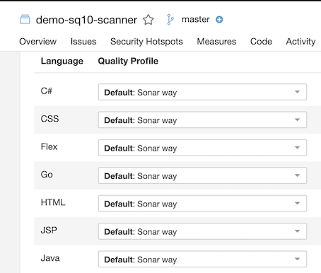

## 8 Sonar 配置项目多分支模式

https://github.com/mc1arke/sonarqube-community-branch-plugin

* 将插件放到两个目录中，然后重启sonar

	* `/opt/sonarqube/extensions/plugins`
	* `/opt/sonarqube/lib/common`

* 扫描添加 `--define sonar.branch.name=${branchName}-X`

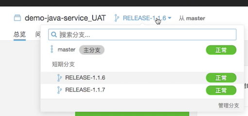


