# 第一节 Sonatype Nexus 基本介绍与安装


## 1、Nexus 基本概念与仓库管理

### 1-1 Nexus工能介绍

* 私服仓库：本地maven私服加快构建速度 
* 代理仓库：将公网等第三方提供的仓库代理到本地 

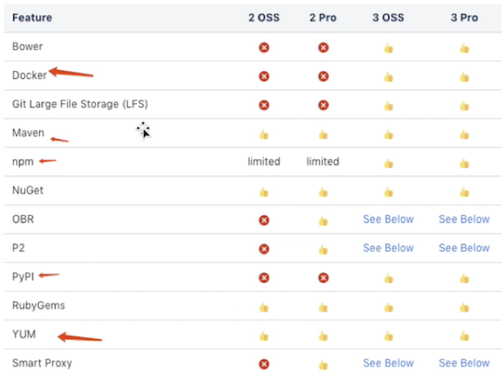

### 1-2 Components - 组件

* 组件是一种资源，在构建过程中需要依赖。它可以是整 个应用程序，也可以是静态资源（例如图片）。 
* 通常，这些组件是各种文件的存档，包括： 
	* 类文件中的Java字节码 
	* C对象文件
	* 文本文件，例如属性文件，XML文件，JavaScript代码，HTML, CSS 
	* 二进制文件，例如图像，PDF文件，声音文件 
* 组件的多种格式，例如 
	* Java JAR, WAR, EAR格式 
	* 普通ZIP或．tar. gz文件 
	* 其他软件包格式，例如NuGet软件包，Ruby gems, NPM软件包 
	* 可执行文件格式，例如`.exe`或`.sh`文件，`Android APK`文件，各种安装程序格式 

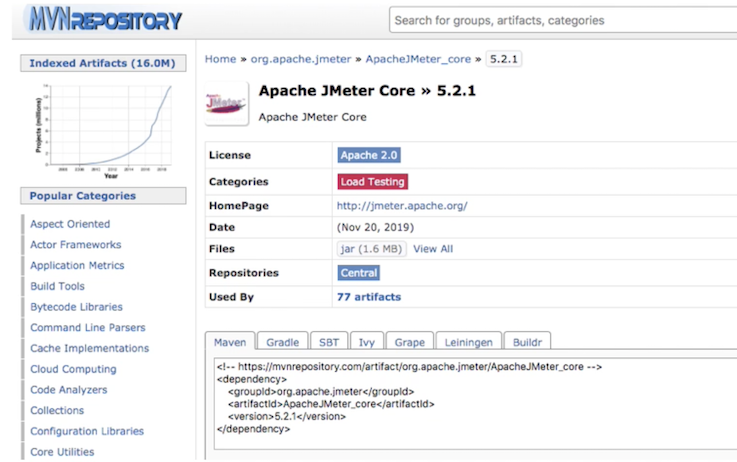


* 组件可以由多个嵌套组件本身组成。 
* 组件提供了所有构建块和功能。 
	* 可以通过组装并添加自己的业务相关组件来创建功能强大的完整应用程序。 
* 在不同的工具链中，组件称为工件，程序包，捆绑包，归档和其他术语。
* 概念和想法保持不变，组件用作通用术语。 组件由一组特定值（坐标）标识。这些坐标的通用集是组，名称和版本的用法。这些坐标的名称和用法随所使用的工具链而变化。组件也可以成为其他 元数据的基础。

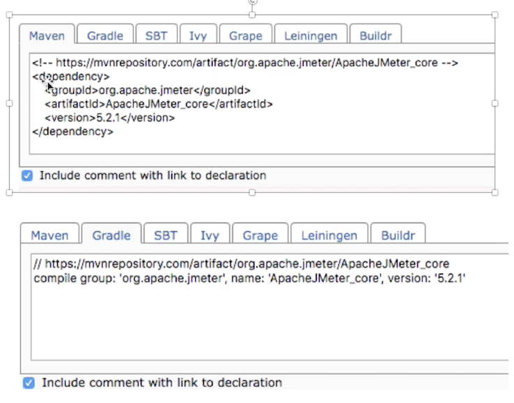
 
### 1-3 Components - 组件


* 例如`Maven`项目中的`pom`文件算是资产一部分，包含元数据的重要字补充。 
* 实际的存档文件（`pom. xml`）是与组件（`jar/war`包）关联 约资产。 
* 但是，更复杂的格式具有与组件（jar包）关联的众多资产 (`pom`)。例如，`Maven`存储库中的典型`JAR`组件至少由`POM `和`JAR`文件定义一两者均构成属示同一组件的单独资产。其他文件（例如`JavaDoc`或`Sources JAR`文件）是属于同一组件的资产。 
* 另一方面，`Docker`格式为资产提供唯一的标识符，并将其称为`Docker`层。这些资产可用于不同的组件一`Docker`映像。 例如，一个`Docker`层可以是多个`Docker`映像引用约特定操作系统。 

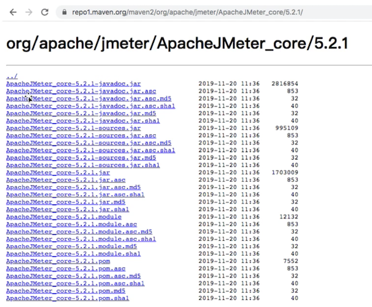

### 1-4 仓库格式

* `Maven`格式存储库中二进制组件的主要类型是包含`Java`字节码的`JAR`文件。 
* 每个软件组件均由称为项目对象模型（`POM`）的`XML`文档描述。 
* 该`POM`包含描述项目的信息，并列出项目的依赖项一二进制软件组件，给定组件成功进行编译或执行所依赖的组件。 

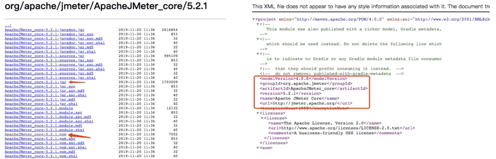

### 1-5 下载机制

* 当`Maven`从存储库下载组件（如依赖项或插件） 时，它也会下载该组件的`POM` 
* 给定组件的`POM`, `Maven`然后河以下载该组件所 需的任何其他组件。 
* `Maven`和其他工具（例如`Ivy`或`Gradle`）与` Maven`存储库进行交互以搜索二进制软件组件， 对它们管理的项目进行建模，并从存储库按需检索软件组件。 

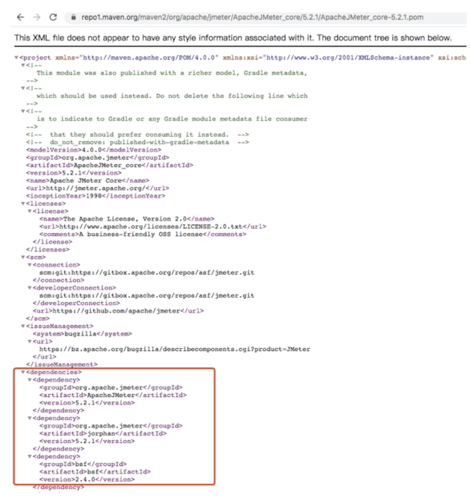

### 1-6 中央仓库

* 当您下载并安装Maven而没有进行任何自定义时，它将从中央存储库中检索组件。 
* 中央存储库是用于Java的组件的最大存储库。也可以从其他构建工具轻松使用它。 
* 以下是发行存储库（例如中央存储库）的一些属性： 
* **组件元数据**：添加到中头存储库的所有软件组件都需要适当的元数据，包括每个组件的项目对象模型（POM)，这些对 象描述组件本身以及该软件组件可能具有的任何依赖关系。 
* **释放稳定性**：一旦发布到中央存储库，组件和描述该组件的元数据就永远不会改变。发行版存储库（例如中央存储库） 的此属性可确保依赖发行版的项目随着时间的推移将可重复且稳定。在每天发布新软件组件的过程中，一旦在中央存储 库中为组件分配了发行号，就有严格的政策禁止在发行后修改软件组件的内容。 
* **组件安全**：中央存储库包含加密哈希和PGI，签名，可用于验证所提供软件组件的真实性和完整性，并通过HTTPS以安全方 式支持连接。 
* **性能**：中央存储库通过服务器的高性能内容交付网络向全球用户开放。 除了中央存储库外，还有许多主要组织，例如`Red Hat`,`Oracle`或`Apache Software Foundation`，它们维护着单独的其他存储库。 

### 1-7 组件坐标

* 制品坐标为每个制品创建唯一的标识符
*  `Maven`坐标使用以下值：`groupId`, `artifactId`, `version`和`packaging`。这组坐标通常称为`GAV`坐标，它是“组”,“工件”,“版本”坐标的缩写。 
*  `GAV`坐标标准是`Maven`管理依赖关系的基础。下面描述了此坐标系的四个元索：
	* **groupld**：组标识符将一组组件分为一个逻辑组。 
	* 通常将组设计为反映生产特定软件组件所依据的组织。 
	* 例如，由`Apache Software Foundation`的`Maven`项目生产的软件组件可在`groupId`下获得`org. apache. maven`
	* **artifactId**：artifactId是软件组件的标识符，应为描述性名称。 
	* **`groupId`和`artifactId`的组合对于特定项目必须是唯一的**。 
	* **`version`**:项目的版本理想地应该遵循已建立的**语义版本工作管理**惯例。 
	* 例如，如果您的简亘库组件具有的主发行版1，次发行版2和发行版3，则您的版本将是`1.2.3`。
	* 版本也可以具有字母数字限定符，通常用于表示发行状态。
	*  这种限定符的一个示例是类似`“1.2.3-BETA”`的版本，其中`BETA`表示对软件组件的使用者有意义的测试阶段。 
	*  **packaging**: Maven最初是为了处理`JAR`文件而创建的，但是`Maven`存储库完全不了解其管理的组件类型。 
	*  packaging可以是描述任何二进制软件格式的任何内容，包括：zip,nar,war,ear,sa和aar


* 与`Maven`存储库进行交互的工具将组件坐标转换为与Maven存储库中的位置相对应的URL
* 如果诸如`Maven`之类的工具正在该组中寻找`JAR`版本`1.2.0`，则此请求将转换为：`commons-langorg.apache.commons`

```
<repoURL> /org/apache/commons/commons-lang/1.2.0/commons-lang-1.2.0.jar 
<repoURL> /org/apache/commons/commons-lang/1.2.0/commons-lang-1.2.0.pom 
```


### 1-8 Release 与 Snapshot


* Maven存储库存储两种类型的组件：版本和快照。 
	* 发布存储库用于稳定的静态发布组务 
	* 快照存储库是经常更新的存储库，用于存储不断开发的项目中的二进制软件组件。 

* 虽然可以创建一个同时服务于发布和快照组件的存储库，但通常将存储库分为多个发布库或快照存储库，这些发布库或快照存储库服务于不同的使用者并维护用于部署组件的不同标准和过程。就像网络之间的差异一样，发布存储库被视为生产网络，快照存储库被视为开发或测试网络。尽管存在与部署到发布存储库 相关联的更高级别的过程和仪式，但决照组件可以被须繁部署和更改，而无需考虑稳定性和可重复性。 
* 存储库管理一器管理的两种类型的组件是： 
	* **发布**：发布组件是由特定版本的发布创建的组件。 
	* 例如，考虑`1.2.0`释放`commons-lang`存储在中央存储库中的库。 
	* 此发行组件`commons-lang-1.2.0.pom`和相关的`POM commons-lang-1.2.0.pom`是静态态对象，它们在中央存储库中永远不会更改。 
	* 释放的组件被认为是坚固，稳定和永久的，以确保依赖于它们的构建随着时句的推移可重复。
	* 已发布的`JAR`组件与`PGP`签名，`MD5`和`SHA`校验和相关联，可用于验证二进制软件组件的真实性和完整性。
	* **快照**：快照组件是在软件项目的开发过程中生成的组件。 
	* `Snapsho`t组件的名称中既带有版本号（例如`1.3.0`或）,`1.3`又带有时间戳。 
	* 例如，快照组件`commons-lang 1.3.0`的名称可能`commons-lang-1.3.0.-20090314.182342-1.jar`与关联的`POM` `MD5`和`SHA`哈希值也具有相似的名称。 
	* 为了在软件组件的开发过程中促进协作，`Maven`和其他知道如何从存储库使用快照组件的．客户端也知道如何查询与`Snapshot`组件关联的元数据，以从存储库检索快照依赖关系的最新版本。 
* 处于活从开发中的项目会生成随时间变化的快照组件。一个发行版包含一些组件，这些组件将随着时间的推移保持不变。 

 

## 2、安装 Nexus OSS On Kubernetes

```
apiVersion: apps/v1
kind: Deployment
metadata:
  name: nexus
  namespace: nexus
spec:
  selector:
    matchLabels: 
      app: nexus-server
  replicas: 1
  template:
    metadata:
      labels:
        app: nexus-server
    spec:
      containers:
        - name: nexus
          image: sonatype/nexus3:latest
          resources:
            limits:
              memory: "2Gi"
              cpu: "500m"
            requests:
              memory: "2Gi"
              cpu: "500m"
          ports:
            - containerPort: 8081
            - containerPort: 5000
          volumeMounts:
            - name: nexus-data
              mountPath: /nexus-data
      volumes:
        - name: nexus-data
          emptyDir: {}
```

## 安装 Nexus OSS SVC 

```
apiVersion: v1
kind: Service
metadata:
  name: nexus-service
  namespace: nexus
spec:
  selector: 
    app: nexus-server
  type: NodePort  
  ports:
    - port: 8081
      targetPort: 8081
      nodePort: 32000
      name: http
    - port: 5000
      targetPort: 5000
      nodePort: 32500
      name: docker

```

```
$ kuebctl create ns nexus

$ kubectl get pod -n nexus 
NAME                     READY   STATUS    RESTARTS   AGE
nexus-54664bd559-hk892   1/1     Running   0          4m56s

$ kubectl get svc -n nexus 
NAME            TYPE       CLUSTER-IP       EXTERNAL-IP   PORT(S)                         AGE
nexus-service   NodePort   10.102.246.235   <none>        8081:32000/TCP,5000:32500/TCP   22h
```


* admin
* password

```
$ kubectl exec -it nexus-84fcd99c46-5d5mk bash -n nexus
$ cd /nexus-data
$ cat admin.password
effb42fe-3c17-459a-b489-e905ea1794d5
```

* admin
* admin

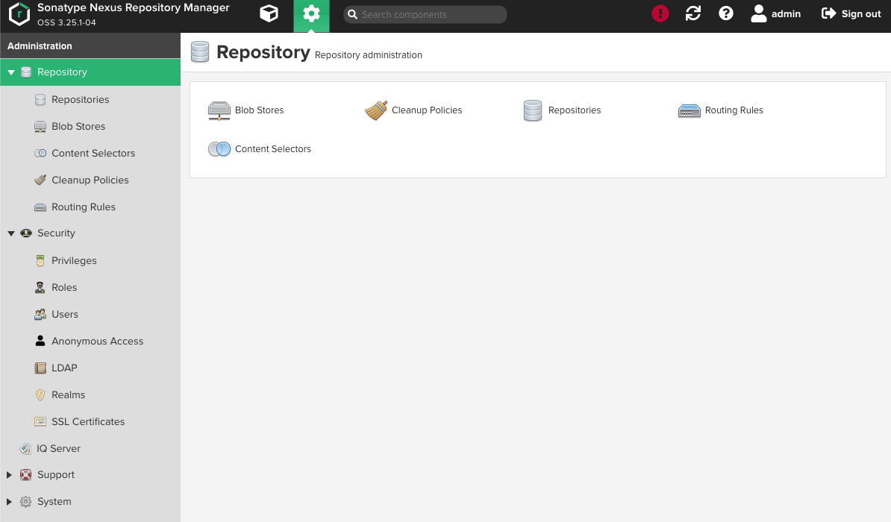

```
http://127.0.0.1:32000/#admin/repository
```


## 3、Nexus 系统配置管理

### 3-1 LDAP认证-链接信息

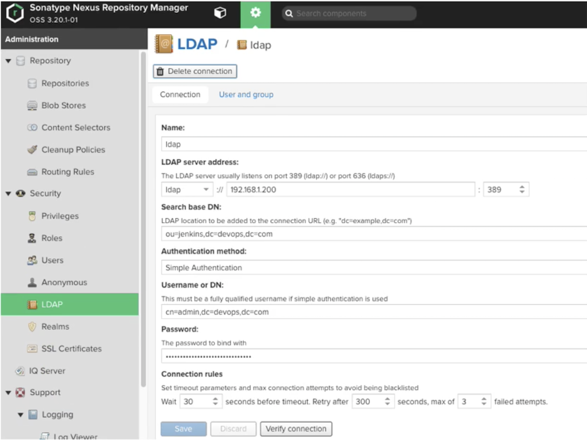

### 3-2 LDAP认证-用户/组信息

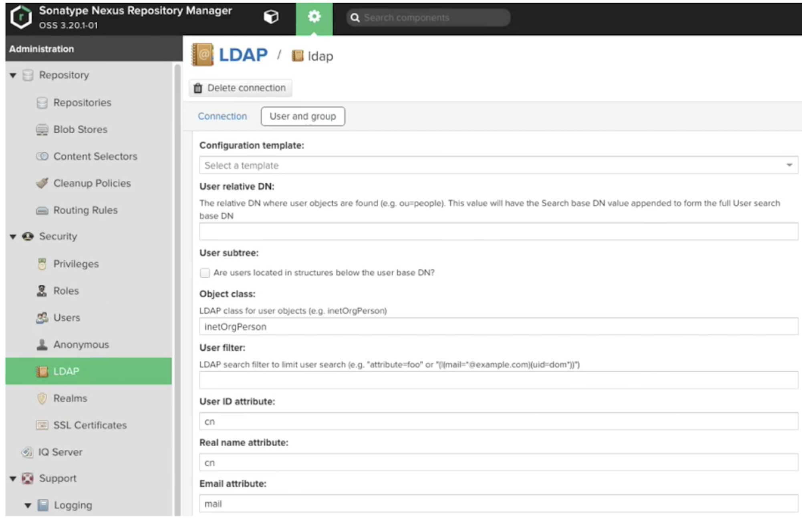

### 3-3 邮件通知

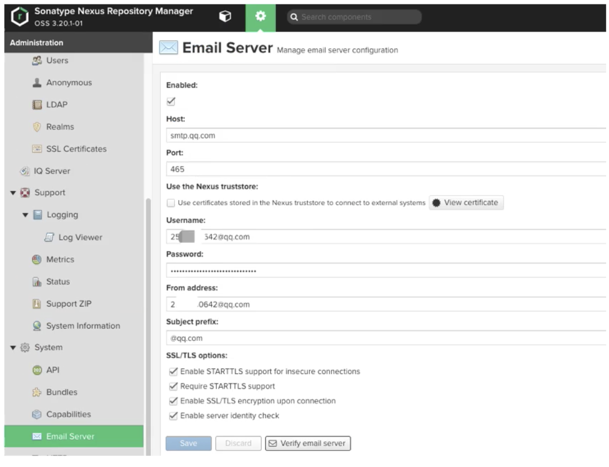

### 3-4 Webhook

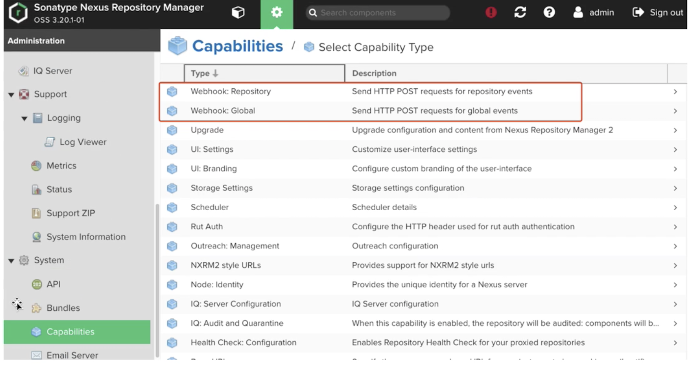


