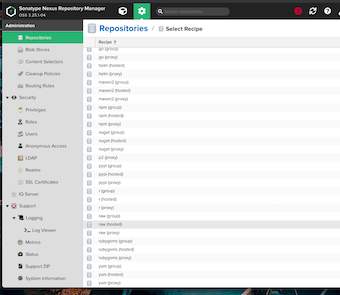

# **第二节 制品管理**

## 1、 制品是什么 

所谓制品，到底是什么呢？

An artifact is one of many kinds of tangible by-products produced during the development

换句话说，制品是软件开发过程中产生的多种有形副产品之一。另外，直译artifact，是人工制品的意思。所以，广义的制品还包括用例、UML图、设计文档等

而狭义的制品就可以简单地理解为二进制包。虽然有些代码是不需要编译就可以执行的，但是我们还是习惯于将这些可执行文件的集合称为二进制包。 

本章讨论的是狭义的制品。行业内有时也将制品称为产出物或工件。 

## 2、制品管理仓库 

最简单的制品管理仓库就是将制品统一放在一个系统目录结构下。但是很少有人这样做，更多的做法是使用现成的制品库。 

制品管理涉及两件事情：

* 一是如何将制品放到制品库中。
* 二是如何从制品库中取出制品。

由于每种制品的使用方式不一样，因此下面我们分别进行介绍。 目前现成眨制品库有：Nexus、Artifactory。


## 3、过渡到制品库 
从手工打包到自动化打包，再将打好的包放到制品库中。这看似简单，但是要在团队中从无 到有地落地其实是一个很漫长的过程，特别是对于存在很多遗留项目的团队。每个团队都应该按 照自己当前情况进行调整，有时统一的解决方案不一定适合你。 

曾经，笔者所在团队已经将部分项目的编译和单元测试放到`Jenkins`上执行，然而并没有人力及能力搭建`Nexus`。但是又期望能将自动打包好的`JAR`包放到各个环境中使用，以马上从持续集成中获益，怎么办？ 这时，`archiveArtifacts`步骤（https://www.jenkins.io/doc/pipeline/steps/core/）就派上用场了。它能对制品进行归档，然后你就可以从`Jenkins`页面上下载制品了

```
#!groovy
@Library('jenkinslib@master') _

def build = new org.devops.buildtools()
def sonar = new org.devops.sonarqube()

pipeline {
    agent { node { label "hostmachine" }}
    parameters {
        string(name: 'srcUrl', defaultValue: 'http://192.168.33.1:30088/root/demo-maven-service.git', description: '') 
        choice(name: 'branchName', choices: 'master\nstage\ndev', description: 'Please chose your branch')
        choice(name: 'buildType', choices: 'mvn', description: 'build tool')
        choice(name: 'buildShell', choices: 'clean package -DskipTest\n--version', description: 'build tool')
    }
    stages{
        stage('Checkout') {
            steps {
                script {
                    checkout([$class: 'GitSCM', branches: [[name: "${branchName}"]], doGenerateSubmoduleConfigurations: false, extensions: [], submoduleCfg: [], userRemoteConfigs: [[credentialsId: 'gitlab-admin-user', url: "${srcUrl}"]]])
                } 
            }
        }

        stage('Build') {
            steps {
                script {
                    build.Build(buildType,buildShell)
                } 
            }
        }
    }
        post{
            always{
                archiveArtifacts artifacts: 'target/**/*.jar', fingerprint: true
            }
        }    
 }
```

```
-------------------------------------------------------
Running com.mycompany.app.AppTest
Tests run: 2, Failures: 0, Errors: 0, Skipped: 0, Time elapsed: 0.094 sec

Results :

Tests run: 2, Failures: 0, Errors: 0, Skipped: 0

[INFO] 
[INFO] --- maven-jar-plugin:3.0.2:jar (default-jar) @ my-app ---
[INFO] Building jar: /home/vagrant/workspace/workspace/chap9_1/target/my-app-1.1-SNAPSHOT.jar
[INFO] ------------------------------------------------------------------------
[INFO] BUILD SUCCESS
[INFO] ------------------------------------------------------------------------
[INFO] Total time:  6.910 s
[INFO] Finished at: 2020-08-02T18:18:44Z
[INFO] ------------------------------------------------------------------------
[Pipeline] }
[Pipeline] // script
[Pipeline] }
[Pipeline] // stage
[Pipeline] stage
[Pipeline] { (Declarative: Post Actions)
[Pipeline] archiveArtifacts
Archiving artifacts
Recording fingerprints
```

接下来，我们详细介绍几个常用的`archiveArtifacts`的参数用法

* `artifacts`（必填）：字符串类型，需要归档的文件路径，使用的是`Ant`风格路径表达式。 
* `fingerprint`(可选）：布尔类型，是否对归档的文件进行签名。 
* `excludes`（可选）：字符串类型，需要排除的文件路径，使用的也是`Ant`风格路径表达式。
* `caseSensitive`（可选）：布尔类型，对路径大小写是否敏感。 
* `ontylfSuccessful`（可选）：布尔类型，只在构建成功时进行归档。 


值得提的是，`archiveArtifacts`。步骤并不只用于归档` JAR`包，事实上，它能归档所有类型的制品 团队初期可以考虑使用这种方式管理简单的制品。 

**console output**


## 4、管理Java栈制品 

目前`Java`栈的构建工具以`Maven`及`Gradle`为主且`Maven`的用户最广泛。接下来我们使 用Maven作为主要工具来讲解制品管理。 

### 4-1 使用Maven发布制品到`Nexus`中 

当`Nexus`搭建好后就可以使用`Maven Dep!oy`插件上传`JAR`或`WAR`包到`Nexus`中了`Deploy` 插件是`Apache Maven`团队提供的官方插件，能将`JAR`包及`POM`文件发布到`Nexus`中口目前该插件的最新版本是`3.25.1`。在`POM`文件中这样定义： 

```
<plugins> 
	<plugin> 
		<groupId>org.apache.maven.plugins</groupId> 
		<artifactId>maven—deploy—plugin</artifactld> 
		<versSon>3.25.1</version> 
	<plugin> 
</plugins> 
```

如果不需要自定义`Deploy`插件配置，则不需要在`POM`文件中定义。 

使用Deploy插件发布需要以下几个步骤 

* (1）配置发布地址。在Maven项目的POM文件中加人： 

```
<distributionManagement> 
	<snapshotRepository> 
		<id>nexus-snapshot</id> 
		<name>nexus snapshot</name> 
		<url>http://<Nexus的地址>/repository/maven—snapshot</url> 
	</snapshotRepository> 
	<repository> 
		<id>nexus-release</id> 
		<name>my nexus relesse</name> 
		<url>http://<Nexus的地址>/repository/maven—releasese</url> 
	</repository> 
</distributionManagement> 
```

完成此步骤后我们就可以通过执行`mvn clean deploy`进行发布了。

`Deploy`插件会根据`Maven`项目中定义的`version`值决定是使用`nexus-seapshot`仓库还是`nexus-release`仓库。

当`version`值是以`-SNAPSHOT`后缀结尾时，则发布到`nexus-seapshot`仓库 


* (2)配置访问`Nexus`的用户名和密码。在`Nexus`中，我们配置了只有授权的用户名和密码才 能发布制品。这时需要在`Maven`的`settings.xml`中加人配置： 

```
<servers> 
	<server> 
		<id>nexus—snapshot</id> 
		<username>admin</username> 
		<password>admin</password> 
	</server> 
	<server> 
		<id>nexus—relesse</id> 
		<username>admin</username> 
		<password>admin</password> 
	</server> 
</servers> 
```

### 4-2 使用`Nexus`插件发布制品

除了可以通过`Maven`发布`JAR`包，还可以使用`Nexus Platform`来插件实现。最新版本的`Nexus Platform`(`3.9.20200722-164144.e3a1be0`）已经同时支持`Nexus 2.x`和`Nexus 3.x`，只是它的文档更新不及时，大家都不知道它支持3.x版本了。 

在安装好`Nexus Platform`插件后，根据以下步骤来使用。 

* (1）进入`Manage Jenkins - Configure System - Sonatype Nexus`页，设置`Nexus 3.x`的服务地址


* neuxs3
* http://192.168.33.1:32000/

需要注意的是: 

* 在`Credentials`选项处增加了一个具有发布制品到`Nexus`中的权限的用户名和密码凭证 
* `Server ID`字段的值设置完成后单击,在`Jenkinsfile`中会引用 

`Test connection`按钮测试设置是否正确 


* (2）在`Jenkinsfile`中加入`nexusPublisher`步骤。 

```
stage('Build') {
            steps {
                script {
                    build.Build(buildType,buildShell)
                } 
                nexusPublisher( 
                        nexusInstanceId: 'nexus3', 
                        nexusRepositoryId: 'maven—releases', 
                        packages: [ 
                            [ 
                            $class: 'MavenPackage',
                            mavenAssetList: [
                                [ classifier: '',
                                    extension: '',
                                    filePath: './target/my-app-1.1-SNAPSHOT.jar' 
                                ]
                            ], //end of mavenAssetList
                        mavenCoordinate: [ 
                            artifactId: 'my-app', 
                            groupId: 'com.mycompany.app', 
                            packaging: 'jar', version: '1.1-SNAPSHOT' ] 
                        ] // end of packages 
                    ])
            }
        }
```


下面简单介绍一下`nexusPublisher`的参数。 

* `nexusInstanceId`：在`Jenkins`中配`置Nexus 3.x`时的`Server ID` 
* `nexusRepositoryId`：发布到`Nexus`服务器的哪个仓库。 
* `mavenCoordinate`: Maven包的坐标，`packaging`值与`Maven`中的`packaging`值一致，可以是 `jar`、`war`、`pom`、`hpi`等。 
* `mavenAssetList`：要发布的文件，如果是`pom.xml`，则`extension`必须填`“xml"`。 

在实际工作中，笔者并不常使用此插件。原因如下： 

* 每个`Maven`项目都可能不同，必须为每个`Maven`项目写`nexusPublisher`方法。 
* 对于多模块的`Maven`项目，`nexusPublisher`的参数写起来十分锣唆。 


但是介绍这个插件还是有必要的，一是大家可以根据实际情况进行选择；二是可以了解`Jenkins`与`Nexus`的集成程度。 


## 5、使用Nexus管理Docker镜像 

本节假设`Jenkins`机器上已经安装了`Docker CE`。检查在`Jenkins`上能否运行`Docker`的方法是：在`Jenkinsfile`中加人`sh "docker PS"`，语句，如果没有报错，就说明可以运行Docker

### 5.1 Nexus：创建`Docker`私有仓库 

首先进人Nexus的仓库列表页：`Administration -> Repository -> Repositories`


单击`“docker(hosted)"`，进人Docker：私有仓库创建页， 


* http://192.168.33.1:32000/repository/dockerrepo/
* dockerrepo

```
pipeline { 
	agent any 
	environment { 
		registry = "http://192.168.33.1:32500" 
		registryCredential = 'dockernexus' 
	} 
	stages { 
		stage('Build') { 
			steps { 
				withDockerRegistry([ 
				credentialsId: "${registryCredential}", 
				url: "${registry}" ]) { 

				sh "docker build . -t ${registry}/hello:v2"
				sh "docker push ${registry}/hello:v2" 
				} 
			} 
		} 
	} 
} 
```

## 6、管理原始制品 

`Nexus` 提供了对`raw`仓库的支持。`raw`仓库可以被理解为一个文件系统，我们可以在该仓库中创建目录。 

### 6-1 创建`raw`仓库 

进入`Administration -> Repository -> Repositories`页。 

单击`“raw(hosted)"`，进人`raw`仓库创建页。 



输入仓库名称`raw-example`，单击`“Create rcpository”`按钮，确认后创建成功。 


该仓库的地址是：`＜你的Nexus地址>/repository/raw-example/`。

### 6-2 上传制品获取制品 

使用`HTTP`客户端就可以将制品上传到raw仓库中。我们使用`Linux curl`命令。几体步骤如下 


* (1)在`Jenkins`上添加`Userame with password`凭证
* (2)在`Jenkinsfile`中加人上传制品的步骤  

```
pipeline { 
	agent { node { label "hostmachine" }}
	environment { 
		nexusRawUsernamePassword = credentials('nexus') 
	} 
	stages { 
		stage('Build') 
		{ 
			steps { 
				sh "curl --user '${nexusRawUsernamePassword}' -T ../../readme.md http://192.168.33.1:32000/repository/raw-example/${BUILD_NUMBER}/readme.md" 
			} 
		} 
	}
} 
```

为简单起见，我们直接使用构建号作为目录名称来区分每次上传的制品。curl命令的格式为： 

```
curl --user '<username:password>' --upload-file <待上传制品的路径> <将制品保存到Nexus上的全路径> 
```


将制品保存到Nexus上的全路径：如果目录不存在，`Nexus`将会自动创建。 

* (3)在Nexus中，我们看到`readme.md`文件已经上传成功， 

在`Jenkins pipeline`中获取原始制品时，我们同样使用`curl`命令。 


```
sh "curl --user '${nexusRawUsernamePassword}' -o readme.md http://192.168.33.1:32000/repository/raw-example/2/readme.md" 
```


## 7、从其他pipeline中拷贝制品 

在某些场景下，我们需要从另一个`pipeline`中拷贝制品。`Copy Artifact`插可以帮助我们实现。具体代码如下： 

```
steps { 
	copyArtifacts( 
		projectName: "core", 
		selector: lastSuccessful(true) 
	) 
} 
```


* 从`core`项目中拿到最后一次构建成功的制品。 

接下来，我们详细介绍`copyArtifacts`步骤的参数。

* `projectname`：字符串类型，`Jenkins job`或`pipeline`名称。 
* `selector`: `BuildSelector`类型，从另一个`pipeline`中拷贝制品的选择器，默认拷贝最后一个制品。 
* `parameters`：字符串类型，使用逗号分隔的键值对字符串（`name1=value1` ,`name2=value2`)，用于过滤从哪些构建中拷贝制 
* `filter`：字符串类型，`Ant`风格路径表达式，用于过滤需要拷贝的文件。 
* `excludes`：字符串类型，`Ant`风格路径表达式，用于排除不需要拷贝的文件。 
* `target`：字符串类型，拷贝制品的目标路径，默认为当前`pipeline`的工作目录。 
* `optional`：布尔类型，如果为`true`，则拷贝失败，但不影响本次构建结果。 
* `fingerprintArtifacts`：布尔类型，是否对制品进行签名，默认值为`true` 
* `resultVariableSuffix`：上例中，无法得知我们到底拿的是core项目的哪次构建的制品。`CopyArtifact`插件的设计是将其构建次数放到一个环境变量中。这个环境变量名就是在 `COPYARTIFACT_BUILD_NUMBER_`后拼上`resultVariabiLeSuffix`，比如`resultVariableSuffix`值为`corejob`，那么就在`pipeline`中通过变量`COPYARTIFACT_BUILD_NUMBER_corejob`拿到源`pipeline`的构建次数了。

除`projectname`参数是必填的外，其他参数都是可选的。 

下而介绍几种常用的获取选择器的方法。 

* `lastSuccesSful`：最后一次构建成功的制品。方法签名为`lastSuccessful(boolean stable`)。`stable`为`true`表示只取构建成功的制品，为`false`表示只要构建结果比`UNSTABLE`好就行。 
* `specific`：指定某一次构建的制品。方法签名为`specific(String bulidNumber)`。 `buildNumber`表示指定取第`n`次构建的制品。 
* `lastCompleted`：最后一次完成构建的制品，不论构建的最终状态如何。方法签名为 `lastCompleted()`。 
* `latestSavedBuild`：最后一次被标记为`keep forever`的构建的制品。方法签名为`latestSavedBuild()`。

## 8、版本号管理 

谈到制品，就必须谈到版本号的管理。版本号的制定并没有所谓的行业标准。比如谷歌浏览 器当前版本号为`70.0.3538.110;` Ubuntu操作系统当前版本号为`18.10;`由美国计算机教授高德纳 (`Donald Ervin Knut`h)编写的功能强大的排版软件TEX系统的版本号不断趋近于`π`，类似于这样：`3.1415926`。 

### 8.1 语义化版本 

GitHub提出了一种具有指导意义、统一的版本号表示规则，称为`Semantic Versioning`（语义化版本表示）。这也被人们称为三段式版本号。有了这套规则，用户一看版本号，就大概能猜到 一个软件两个版本之间的可能变化。 

语义化版本格式为：主版本号、次版本号、修汀号。

版本号递增规则如下：

* 主版本号：当作了不兼容的API修改时。 
* 次版本号：当作了向下兼容的功能性新增时。 
* 修订号：当作了向下兼容的问题修正时。 

先行版本号及版本编译元数据可以加到主版本号、次版本号、修订号”的后面，作为延伸。 以下是常用的修饰词。 
 

* alpha: 内部版本。 
* beta: 测试版本。
* rc: 即将作为正式版本发布。
* lts: 长期维护。 
 
### 8.2 方便生成版本号的`Version Number`插件 
`VersionNumber` (https://plugins.jenkins.io/versionnumber/）是一款用于生成版本号的插件，它 
提供了`VersionNumber`步骤。具体使用方法如下： 

```
script { 
	def version = VersionNumber versionPrefix: ${JOB_NAME}-", versionNumberString: 'v1.1.1.${BUILDS_ALL_TIME}' 
	echo "${version}" 
}
```

注意：`BUILDS_ALL_TIME`只是占位符，并不是`Jenkins`或`Version Number`插件提供的环境变量。 

`VersionNumber`步骤支持以下参数。 

* `versionNumberString`：字符串类型，版本号格式，用于生成版本号。只能使用单引号，以防格式中的占位符被转义。版本号格式支持多种占位符，稍后介绍。 
* `versionPrefix`：字符串类型，版本号的前缀。 
* `projectStartDate`：字符串类型，项目开始时间，格式为`yyyy-MM-dd`，用于计算项目开始后的月数和年数。 
* `worstResultForIncrement`：字符串类型，如果本次构建状态比上一次构建状态更糟糕，则 `BUILDS_TODAY`、`BUILDS_THIS_WEEK`、`BUILDS_THIS_MONTH`、`BUILDS_THIS_YEAR` 占位符的值不会增加。`worstResultForIncrement`可以设置的值有`SUCCESS`、`UNSTABLE`、 `FAILURE`、`ABORTED`、`NOT_BUILT`（默认）。此参数较少使用。 

`versionNumberString`参数使用占位符生成版本号。部分占位符本身支持参数化。接下来分别介绍它们。 

* `BUILD_DATE_FORMATTED`：格式化的构建日期，支持参数化，如`${BUILD_DATE_FORMATTED,"yyyy-MM-dd"}`。
* `BUILD_DAY`：构建日期，支持`x`和`xx`参数。比如是12月2日，`${BUILD_DAY｝`将返回2, `${BUILD_DAY,X}`将返回2,`${BUILD_DAY,XX}`将返回03。 
* `BUILD_WEEK`：今年构建的星期数，支持`x`和`xx`参数。 
* `BUILD_MONTH`：今年构建的月数，支持`x`和`xx`参数。 
* `BUILD_YEAR`：今年构建的年份。

比如构建的时间为`2018-12-02`，那么`BUILD_DAY`的值为`2`, `BUILD_WEEK`的值为`49`,` BUILD_MONTH`的值为`12`, `BUILD_YEAR`的值为`2018`。 

接下来是一组和构建数相关的占位符：`BUILDS_TODAY`、 `BUILDS_THIS_WEEK` 
、`BUILDS_THIS_MONTH`、 `BUILDS_THIS_YEAR`，它们分别表示当天、本星期、本月、本年完成的构建数。`BUILDS_ALL_TIME`表示自从项目开始后完成的总构建数。

`MONTHS_S工NCE_PROJECT_START`和`YEARS_SINCE_PROJECT_START`分别表示自项目开始日期起已过去的日历月数和年数。 


