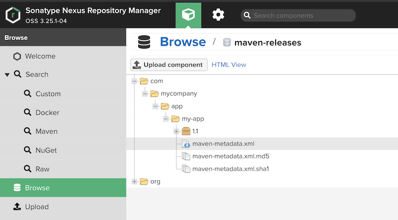
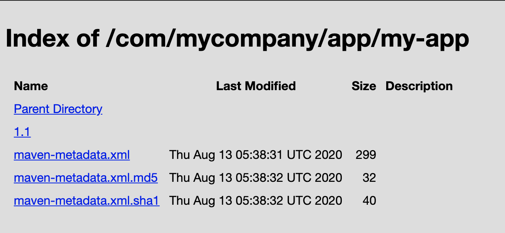
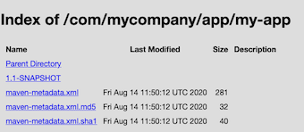
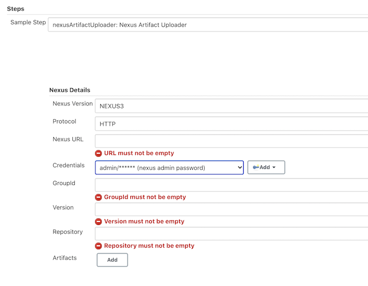
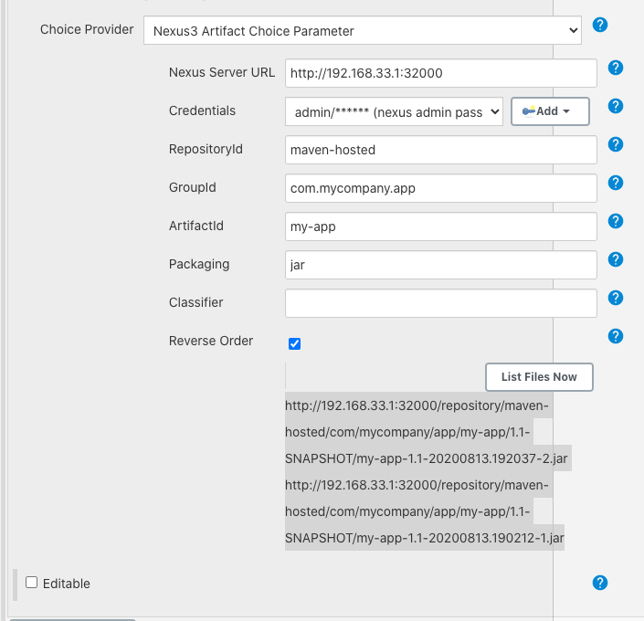
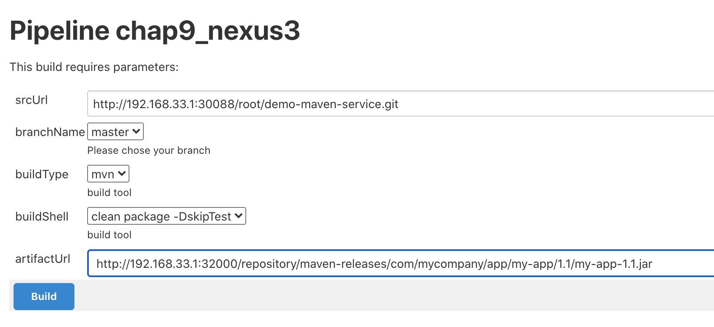
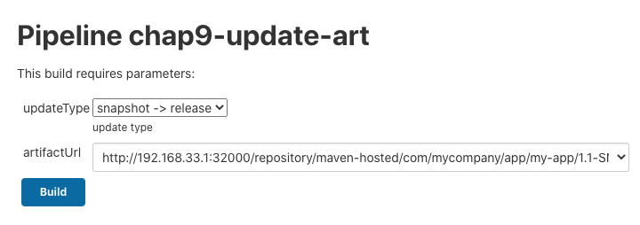
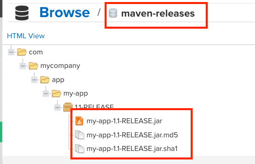
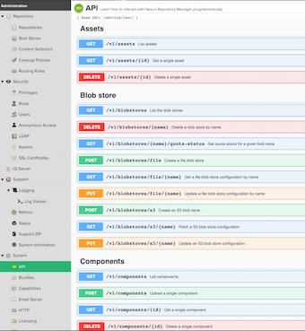
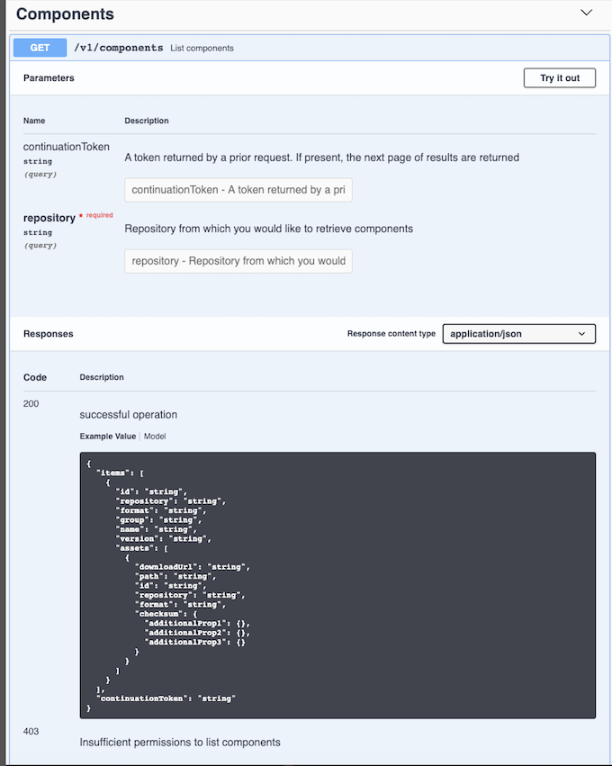

# 第三节 Nexus 制品上传

## 1、使用mvn  deploy上传制品

* 创建仓库`maven-release`(已创建)
* 配置`maven-release`认证
	*  在`settings.xml server`
	*  注意`server.id == respository.id`
* 使用`mvn deploy`发布


### 1-1 配置`maven-release`认证

```
cd /opt/apache-maven-3.6.3/conf
sudo vim settings.xml

<server>
     <id>maven-releases</id>
     <username>admin</username>
     <password>admin</password>
</server>
<server>
	 <id>maven-hosted</id>
	 <username>admin</username>
	 <password>admin</password>
</server>
```

### 1-2 使用`mvn deploy`发布

```
def pom =readMavenPom file: 'pom.xml'
                    pomVersion = "${pom.version}"
                    pomArtifact = "${pom.artifactId}"
                    pomPackaging = "${pom.packaging}"
                    pomGroupId = "${pom.groupId}"

                    println("${pomGroupId}-${pomArtifact}-${pomVersion}-${pomPackaging}")

                    def mvnHome = tool "m2"
                    sh """
                        cd target/
                        ${mvnHome}/bin/mvn deploy:deploy-file -Dmaven.test.skip=true -Dfile=${jarName} -DgroupId=${pomGroupId} -DartifactId=${pomArtifact} -Dversion=${pomVersion} -Dpackaging=${pomPackaging} -DrepositoryId=maven-releases -Durl=http://192.168.33.1:32000/repository/maven-releases/
                    """
```

**Error: 400 repository version policy: release does not allow version**

修改`pom.xml`里面的`version`信息

`<version>1.1-SNAPSHOT</version>` => ``<version>1.1</version>`

```
stage('Build') {
            steps {
                script {
                    build.Build(buildType,buildShell)

                    def jarName = sh returnStdout: true, script: "cd target; ls *.jar"
                    jarName = jarName - "\n"

                    def pom =readMavenPom file: 'pom.xml'
                    pomVersion = "${pom.version}"
                    pomArtifact = "${pom.artifactId}"
                    pomPackaging = "${pom.packaging}"
                    pomGroupId = "${pom.groupId}"

                    println("${pomGroupId}-${pomArtifact}-${pomVersion}-${pomPackaging}")

                    def mvnHome = tool "m2"
                    sh """
                        cd target/
                        ${mvnHome}/bin/mvn deploy:deploy-file -Dmaven.test.skip=true -Dfile=${jarName} -DgroupId=${pomGroupId} -DartifactId=${pomArtifact} -Dversion=${pomVersion} -Dpackaging=${pomPackaging} -DrepositoryId=maven-releases -Durl=http://192.168.33.1:32000/repository/maven-releases/
                    """
                } 
            }
        }
```


### 1-3 Console output

```
....
+ cd target/
+ /opt/maven/bin/mvn deploy:deploy-file -Dmaven.test.skip=true -Dfile=my-app-1.1.jar -DgroupId=com.mycompany.app -DartifactId=my-app -Dversion=1.1 -Dpackaging=jar -DrepositoryId=maven-releases -Durl=http://192.168.33.1:32000/repository/maven-releases/
[INFO] Scanning for projects...
[INFO] 
[INFO] ------------------< org.apache.maven:standalone-pom >-------------------
[INFO] Building Maven Stub Project (No POM) 1
[INFO] --------------------------------[ pom ]---------------------------------
[INFO] 
[INFO] --- maven-deploy-plugin:2.7:deploy-file (default-cli) @ standalone-pom ---
Uploading to maven-releases: http://192.168.33.1:32000/repository/maven-releases/com/mycompany/app/my-app/1.1/my-app-1.1.jar
Progress (1): 2.6 kB
                    
Uploaded to maven-releases: http://192.168.33.1:32000/repository/maven-releases/com/mycompany/app/my-app/1.1/my-app-1.1.jar (2.6 kB at 3.4 kB/s)
Uploading to maven-releases: http://192.168.33.1:32000/repository/maven-releases/com/mycompany/app/my-app/1.1/my-app-1.1.pom
Progress (1): 395 B
                   
Uploaded to maven-releases: http://192.168.33.1:32000/repository/maven-releases/com/mycompany/app/my-app/1.1/my-app-1.1.pom (395 B at 914 B/s)
Downloading from maven-releases: http://192.168.33.1:32000/repository/maven-releases/com/mycompany/app/my-app/maven-metadata.xml
Uploading to maven-releases: http://192.168.33.1:32000/repository/maven-releases/com/mycompany/app/my-app/maven-metadata.xml
Progress (1): 299 B
                   
Uploaded to maven-releases: http://192.168.33.1:32000/repository/maven-releases/com/mycompany/app/my-app/maven-metadata.xml (299 B at 466 B/s)
[INFO] ------------------------------------------------------------------------
[INFO] BUILD SUCCESS
[INFO] ------------------------------------------------------------------------
[INFO] Total time:  3.295 s
[INFO] Finished at: 2020-08-04T09:49:11Z
[INFO] ------------------------------------------------------------------------
...
```






### 1-4 方法二： 建立新的`mixed`类型的`maven-hosted` repository

```
def mvnHome = tool "m2"
sh """
    cd target/
    ${mvnHome}/bin/mvn deploy:deploy-file -Dmaven.test.skip=true -Dfile=${jarName} -DgroupId=${pomGroupId} -DartifactId=${pomArtifact} -Dversion=${pomVersion} -Dpackaging=${pomPackaging} -DrepositoryId=maven-releases -Durl=http://192.168.33.1:32000/repository/maven-hosted/
 """
```





## 2、使用 Jenkins 插件上传制品

* 安装`nexus artifact uploader`插件 [nexus artifact uploader](https://plugins.jenkins.io/nexus-artifact-uploader/)
* 使用片段生成器生成DSL 




```
nexusArtifactUploader artifacts: [[artifactId: "${pomArtifact}", 
                                        classifier: '', 
                                        file: "${filePath}", 
                                        type: "${pomPackaging}"]], 
                            credentialsId: 'nexus', 
                            groupId: "${pomGroupId}", 
                            nexusUrl: '192.168.33.1:32000', 
                            nexusVersion: 'nexus3', 
                            protocol: 'http', 
                            repository: "${repoName}", 
                            version: "${pomVersion}"
```


**Console Output**

```
[Pipeline] nexusArtifactUploader
Uploading artifact my-app-1.1-SNAPSHOT.jar started....
GroupId: com.mycompany.app
ArtifactId: com.mycompany.app
Classifier: 
Type: jar
Version: 1.1-SNAPSHOT
File: my-app-1.1-SNAPSHOT.jar
Repository:maven-hosted
Downloading: http://192.168.33.1:32000/repository/maven-hosted/com/mycompany/app/my-app/1.1-SNAPSHOT/maven-metadata.xml
100 % completed (767 B / 767 B).
Downloaded: http://192.168.33.1:32000/repository/maven-hosted/com/mycompany/app/my-app/1.1-SNAPSHOT/maven-metadata.xml (767 B at 666 B/s)
Uploading: http://192.168.33.1:32000/repository/maven-hosted/com/mycompany/app/my-app/1.1-SNAPSHOT/my-app-1.1-20200813.192037-2.jar
```

### 2-1 Nexus方法置于 SharedLibrary

`JenkinslibTest/src/org/devops/nexus.groovy`

```
pakcage org.devops


//获取POM中的坐标
def GetGav(){
   //上传制品
    def jarName = sh returnStdout: true, script: "cd target;ls *.jar"
    env.jarName = jarName - "\n"
    
    def pom = readMavenPom file: 'pom.xml'
    env.pomVersion = "${pom.version}"
    env.pomArtifact = "${pom.artifactId}"
    env.pomPackaging = "${pom.packaging}"
    env.pomGroupId = "${pom.groupId}"
    
    println("${pomGroupId}-${pomArtifact}-${pomVersion}-${pomPackaging}")

    return ["${pomGroupId}","${pomArtifact}","${pomVersion}","${pomPackaging}"]
}


//Nexus plugin deploy
def NexusUpload(){
    //use nexus plugin
    nexusArtifactUploader artifacts: [[artifactId: "${pomArtifact}", 
                                        classifier: '', 
                                        file: "${filePath}", 
                                        type: "${pomPackaging}"]], 
                            credentialsId: 'nexus', 
                            groupId: "${pomGroupId}", 
                            nexusUrl: '192.168.33.1:32000', 
                            nexusVersion: 'nexus3', 
                            protocol: 'http', 
                            repository: "${repoName}", 
                            version: "${pomVersion}"
}

//mvn deploy
def MavenUpload(){          
    def mvnHome = tool "m2"
    sh  """ 
        cd target/
        ${mvnHome}/bin/mvn deploy:deploy-file -Dmaven.test.skip=true  \
                                -Dfile=${jarName} -DgroupId=${pomGroupId} \
                                -DartifactId=${pomArtifact} -Dversion=${pomVersion}  \
                                -Dpackaging=${pomPackaging} -DrepositoryId=maven-hosted \
                                -Durl=http://192.168.33.1:32000/repository/maven-hosted 
        """
}


def main(uploadType){
    GetGav()
    if ("${uploadType}" == "maven"){
        MavenUpload()
    } else if ("${uploadType}" == "nexus") {
        env.repoName = "maven-hosted"
        env.filePath = "target/${jarName}"
        NexusUpload()
    }
}
```

* **三个方法**：
	* `GetGav()`： 获取POM中的坐标
	* `NexusUpload()`: Nexus plugin deploy
	* `MavenUpload()` mvn deploy


* 更新`pom.xml`的`version`版本

```
#!groovy
@Library('jenkinslib@master') _

def build = new org.devops.buildtools()
def sonar = new org.devops.sonarqube()
def nexus = new org.devops.nexus()

pipeline {
    agent { node { label "hostmachine" }}
    parameters {
        string(name: 'srcUrl', defaultValue: 'http://192.168.33.1:30088/root/demo-maven-service.git', description: '') 
        choice(name: 'branchName', choices: 'master\nstage\ndev', description: 'Please chose your branch')
        choice(name: 'buildType', choices: 'mvn', description: 'build tool')
        choice(name: 'buildShell', choices: 'clean package -DskipTest\n--version', description: 'build tool')
    }
    stages{
        stage('Checkout') {
            steps {
                script {
                    checkout([$class: 'GitSCM', branches: [[name: "${branchName}"]], doGenerateSubmoduleConfigurations: false, extensions: [], submoduleCfg: [], userRemoteConfigs: [[credentialsId: 'gitlab-admin-user', url: "${srcUrl}"]]])
                } 
            }
        }

        stage('Build') {
            steps {
                script {
                    build.Build(buildType,buildShell)
                    nexus.main("maven")
                    <!--nexus.main("nexus")-->
                } 
            }
        }
    }
 }
```

* `def nexus = new org.devops.nexus()`
* `nexus.main("maven")` or `nexus.main("nexus")`

**Console output maven**

```
+ cd target/
+ /opt/maven/bin/mvn deploy:deploy-file -Dmaven.test.skip=true -Dfile=my-app-1.1-RELEASE.jar -DgroupId=com.mycompany.app -DartifactId=my-app -Dversion=1.1-RELEASE -Dpackaging=jar -DrepositoryId=hosted -Durl=http://192.168.33.1:32000/repository/maven-hosted
[INFO] Scanning for projects...
[INFO] 
[INFO] ------------------< org.apache.maven:standalone-pom >-------------------
[INFO] Building Maven Stub Project (No POM) 1
[INFO] --------------------------------[ pom ]---------------------------------
[INFO] 
[INFO] --- maven-deploy-plugin:2.7:deploy-file (default-cli) @ standalone-pom ---
Uploading to maven-releases: http://192.168.33.1:32000/repository/maven-releases/com/mycompany/app/my-app/1.1-RELEASE/my-app-1.1-RELEASE.jar
Progress (1): 2.6 kB
...
```


## 3、使用 Nexus 插件上传制品

* 安装`Nexus`插件上传制品 https://plugins.jenkins.io/nexus-artifact-uploader/


* Name: `artifactUrl`
* Nexus Server URL: `http://192.168.33.1:32000`
* RepositoryId: `maven-hosted`
* GroupId: `com.mycompany.app`
* ArtifactId: `my-app`
* Packaging: `jar`

	
* http://192.168.33.1:32000/repository/maven-hosted/com/mycompany/app/my-app/1.1-SNAPSHOT/my-app-1.1-20200813.192037-2.jar
* http://192.168.33.1:32000/repository/maven-hosted/com/mycompany/app/my-app/1.1-SNAPSHOT/my-app-1.1-20200813.190212-1.jar




```
#!groovy
@Library('jenkinslib@master') _

def build = new org.devops.buildtools()
def sonar = new org.devops.sonarqube()
def nexus = new org.devops.nexus()


String artifactUrl = "${env.artifactUrl}"


pipeline {
    agent { node { label "hostmachine" }}
    parameters {
        string(name: 'srcUrl', defaultValue: 'http://192.168.33.1:30088/root/demo-maven-service.git', description: '') 
        choice(name: 'branchName', choices: 'master\nstage\ndev', description: 'Please chose your branch')
        choice(name: 'buildType', choices: 'mvn', description: 'build tool')
        choice(name: 'buildShell', choices: 'clean package -DskipTest\n--version', description: 'build tool')
    }
    stages{
        stage('Checkout') {
            steps {
                script {
                    checkout([$class: 'GitSCM', branches: [[name: "${branchName}"]], doGenerateSubmoduleConfigurations: false, extensions: [], submoduleCfg: [], userRemoteConfigs: [[credentialsId: 'gitlab-admin-user', url: "${srcUrl}"]]])
                } 
            }
        }

        stage('Build') {
            steps {
                script {
                    build.Build(buildType,buildShell)
                    
                    // Upload artifact
                    // nexus.main("nexus")

                    // Release artifact
                    sh "wget ${artifactUrl} && ls"

                } 
            }
        }
    }
 }
```



**Console output**

```
+ wget http://192.168.33.1:32000/repository/maven-hosted/com/mycompany/app/my-app/1.1-SNAPSHOT/my-app-1.1-20200813.190212-1.jar
--2020-08-13 19:25:39--  http://192.168.33.1:32000/repository/maven-hosted/com/mycompany/app/my-app/1.1-SNAPSHOT/my-app-1.1-20200813.190212-1.jar
Connecting to 192.168.33.1:32000... connected.
HTTP request sent, awaiting response... 200 OK
Length: 2626 (2.6K) [application/java-archive]
Saving to: ‘my-app-1.1-20200813.190212-1.jar’

     0K ..                                                    100%  286M=0s

2020-08-13 19:25:39 (286 MB/s) - ‘my-app-1.1-20200813.190212-1.jar’ saved [2626/2626]

+ ls
ci.jenkinsfile
jenkins
Jenkinsfile
my-app-1.1-20200813.190212-1.jar
my-app-1.1.jar
pom.xml
README.md
src
```


## 4、制品晋级


* 安装`Maven Artifact ChoiceList Provider (Nexus)`插件 
* 用户选择要晋级的制品 
* 解析生成坐标 
* 上传到发布仓库 


### 4-1 `nexus.groovy`

```
pakcage org.devops


//获取POM中的坐标
def GetGav(){
   //上传制品
    def jarName = sh returnStdout: true, script: "cd target;ls *.jar"
    env.jarName = jarName - "\n"
    
    def pom = readMavenPom file: 'pom.xml'
    env.pomVersion = "${pom.version}"
    env.pomArtifact = "${pom.artifactId}"
    env.pomPackaging = "${pom.packaging}"
    env.pomGroupId = "${pom.groupId}"
    
    println("${pomGroupId}-${pomArtifact}-${pomVersion}-${pomPackaging}")

    return ["${pomGroupId}","${pomArtifact}","${pomVersion}","${pomPackaging}"]
}


//Nexus plugin deploy
def NexusUpload(){
    //use nexus plugin
    nexusArtifactUploader artifacts: [[artifactId: "${pomArtifact}", 
                                        classifier: '', 
                                        file: "${filePath}", 
                                        type: "${pomPackaging}"]], 
                            credentialsId: 'nexus', 
                            groupId: "${pomGroupId}", 
                            nexusUrl: '192.168.33.1:32000', 
                            nexusVersion: 'nexus3', 
                            protocol: 'http', 
                            repository: "${repoName}", 
                            version: "${pomVersion}"
}

//mvn deploy
def MavenUpload(){          
    def mvnHome = tool "m2"
    sh  """ 
        cd target/
        ${mvnHome}/bin/mvn deploy:deploy-file -Dmaven.test.skip=true  \
                                -Dfile=${jarName} -DgroupId=${pomGroupId} \
                                -DartifactId=${pomArtifact} -Dversion=${pomVersion}  \
                                -Dpackaging=${pomPackaging} -DrepositoryId=maven-hosted \
                                -Durl=http://192.168.33.1:32000/repository/maven-hosted 
        """
}

//制品晋级
def ArtifactUpdate(updateType,artifactUrl){

    //晋级策略
    if ("${updateType}" == "snapshot -> release"){
        println("snapshot -> release")

        //下载原始制品
        sh "  rm -fr updates && mkdir updates && cd updates && wget ${artifactUrl} && ls -l "

        //获取artifactID 
        
        artifactUrl = artifactUrl -  "http://192.168.33.1:32000/repository/maven-hosted/"
        artifactUrl = artifactUrl.split("/").toList()
        
        println(artifactUrl.size())
        env.jarName = artifactUrl[-1] 
        env.pomVersion = artifactUrl[-2].replace("SNAPSHOT","RELEASE")
        env.pomArtifact = artifactUrl[-3]
        pomPackaging = artifactUrl[-1]
        pomPackaging = pomPackaging.split("\\.").toList()[-1]
        env.pomPackaging = pomPackaging[-1]
        env.pomGroupId = artifactUrl[0..-4].join(".")
        println("${pomGroupId}##${pomArtifact}##${pomVersion}##${pomPackaging}")
        env.newJarName = "${pomArtifact}-${pomVersion}.${pomPackaging}"
        
        //更改名称
        sh " cd updates && mv ${jarName} ${newJarName} "
        
        //上传制品
        env.repoName = "maven-releases"
        env.filePath = "updates/${newJarName}"
        NexusUpload()
    }
}


def main(uploadType){
    GetGav()
    if ("${uploadType}" == "maven"){
        MavenUpload()
    } else if ("${uploadType}" == "nexus") {
        env.repoName = "maven-hosted"
        env.filePath = "target/${jarName}"
        NexusUpload()
    }
}
```

* `def ArtifactUpdate(updateType,artifactUrl){}`

### 4-2 `Pipeline Script`


```
#!groovy
@Library('jenkinslib@master') _

def nexus = new org.devops.nexus()

String artifactUrl = "${env.artifactUrl}"

pipeline{
    agent { node { label "hostmachine" }}
    parameters {  
        choice(name: 'updateType', choices: 'snapshot -> release\n', description: 'update type')
    }

    stages{
        stage("UpdateArtifact"){
            steps{
                script{
                    println(artifactUrl)
                    
                    updateType = "${env.updateType}"
                    println(updateType)
                    
                    nexus.ArtifactUpdate(updateType,artifactUrl)
                }
            }
        }
    }
}
```





**Console output**

```
[Pipeline] echo
http://192.168.33.1:32000/repository/maven-hosted/com/mycompany/app/my-app/1.1-SNAPSHOT/my-app-1.1-20200813.192037-2.jar
[Pipeline] echo
snapshot -> release
[Pipeline] echo
snapshot -> release
[Pipeline] sh
+ rm -fr updates
+ mkdir updates
+ cd updates
+ wget http://192.168.33.1:32000/repository/maven-hosted/com/mycompany/app/my-app/1.1-SNAPSHOT/my-app-1.1-20200813.192037-2.jar
--2020-08-13 20:30:46--  http://192.168.33.1:32000/repository/maven-hosted/com/mycompany/app/my-app/1.1-SNAPSHOT/my-app-1.1-20200813.192037-2.jar
Connecting to 192.168.33.1:32000... connected.
HTTP request sent, awaiting response... 200 OK
Length: 2626 (2.6K) [application/java-archive]
Saving to: ‘my-app-1.1-20200813.192037-2.jar’

     0K ..                                                    100%  277M=0s

2020-08-13 20:30:46 (277 MB/s) - ‘my-app-1.1-20200813.192037-2.jar’ saved [2626/2626]

+ ls -l
total 4
-rw-rw-r--. 1 vagrant vagrant 2626 Aug 14  2020 my-app-1.1-20200813.192037-2.jar
[Pipeline] echo
11
[Pipeline] echo
http:..192.168.33.1:32000.repository.maven-hosted.com.mycompany.app##my-app##1.1-RELEASE##jar
[Pipeline] sh
+ cd updates
+ mv my-app-1.1-20200813.192037-2.jar my-app-1.1-RELEASE.jar
[Pipeline] nexusArtifactUploader
```




## 5、封装 Nexus REST API

### 5-1 Nexus REST API 

```
service/reset/v1/components/${id}
```

**Example**

```
http://192.168.33.1:32000/service/rest/v1/components?repository=maven-hosted
```

```
{
  "items" : [ {
    "id" : "bWF2ZW4taG9zdGVkOmM3NzAxNjljMGIyZTNlZDg1MGQ0M2ZlOGUzZTE0ZGY1",
    "repository" : "maven-hosted",
    "format" : "maven2",
    "group" : "com.mycompany.app",
    "name" : "my-app",
    "version" : "1.1-20200813.190212-1",
    "assets" : [ {
      "downloadUrl" : "http://192.168.33.1:32000/repository/maven-hosted/com/mycompany/app/my-app/1.1-SNAPSHOT/my-app-1.1-20200813.190212-1.jar",
      "path" : "com/mycompany/app/my-app/1.1-SNAPSHOT/my-app-1.1-20200813.190212-1.jar",
      "id" : "bWF2ZW4taG9zdGVkOjM2ZTNkZWM4ZGU1MjhjOWI3MDkyYTJlYTJlYjAxYTlm",
      "repository" : "maven-hosted",
      "format" : "maven2",
      "checksum" : {
        "sha1" : "98b32769384f208997d0e6ce52157864e5af010d",
        "md5" : "933ce8391a4224771a77f19dd21bd66f"
      }
    }, {
      "downloadUrl" : "http://192.168.33.1:32000/repository/maven-hosted/com/mycompany/app/my-app/1.1-SNAPSHOT/my-app-1.1-20200813.190212-1.jar.md5",
      "path" : "com/mycompany/app/my-app/1.1-SNAPSHOT/my-app-1.1-20200813.190212-1.jar.md5",
      "id" : "bWF2ZW4taG9zdGVkOjM2ZTNkZWM4ZGU1MjhjOWIxOWY2NWRjZjU4MTdlOWEx",
      "repository" : "maven-hosted",
      "format" : "maven2",
      "checksum" : {
        "sha1" : "f949e7f01cda8178bb6c84c57ff9a21534217f36",
        "md5" : "7c1adfe9d1980b88a09e5f384cf2952c"
      }
    }, {
      "downloadUrl" : "http://192.168.33.1:32000/repository/maven-hosted/com/mycompany/app/my-app/1.1-SNAPSHOT/my-app-1.1-20200813.190212-1.jar.sha1",
      "path" : "com/mycompany/app/my-app/1.1-SNAPSHOT/my-app-1.1-20200813.190212-1.jar.sha1",
      "id" : "bWF2ZW4taG9zdGVkOjM2ZTNkZWM4ZGU1MjhjOWIwZGExY2M2OWIyZDhkNjZl",
      "repository" : "maven-hosted",
      "format" : "maven2",
      "checksum" : {
        "sha1" : "1f6f7277f9f5c966771756cf00db8b9cbeb1623b",
        "md5" : "0d529b4a86c0f6066a015b9e5e484dcc"
      }
    }, {
      "downloadUrl" : "http://192.168.33.1:32000/repository/maven-hosted/com/mycompany/app/my-app/1.1-SNAPSHOT/my-app-1.1-20200813.190212-1.pom",
      "path" : "com/mycompany/app/my-app/1.1-SNAPSHOT/my-app-1.1-20200813.190212-1.pom",
      "id" : "bWF2ZW4taG9zdGVkOjM2ZTNkZWM4ZGU1MjhjOWI3Y2M0ZTc0NGMxM2VmMDI5",
      "repository" : "maven-hosted",
      "format" : "maven2",
      "checksum" : {
        "sha1" : "511692613d6474109a227c282b79adb6bb6a282c",
        "md5" : "1d2fd7c19cbd1bd2e4481b3b9b6d5a6c"
      }
    }, {
...
```







### 4-1 `nexusapi.groovy`

```
package org.devops


//封装HTTP
def HttpReq(reqType,reqUrl,reqBody){
    def sonarServer = "http://192.168.33.1:32000/service/rest"
   
    result = httpRequest authentication: 'nexus',
            httpMode: reqType, 
            contentType: "APPLICATION_JSON",
            consoleLogResponseBody: true,
            ignoreSslErrors: true, 
            requestBody: reqBody,
            url: "${sonarServer}/${reqUrl}",
            quiet: true
    
    return result
}


//获取仓库中所有组件

def GetRepoComponents(repoName){
    apiUrl = "/v1/components?repository=${repoName}"
    response = HttpReq("GET",apiUrl,'')
    
    response = readJSON text: """${response.content}"""
    println(response["items"].size())
    
    return response["items"]
}


//获取单件组件

def GetComponentsId(repoName,groupId,artifactId,version){
    println("获取单件组件ID")
    result = GetRepoComponents(repoName) 
    
    for (component in result){
        
        if (component["group"] == groupId && component["name"] == artifactId && component["version"] == version  ){
            
            componentId = component["id"]
            
            return componentId
        }
    }
    
    println(componentId)
}

//获取组件信息
def GetSingleComponents(repoName,groupId,artifactId,version){
    println("获取单件组件信息")
    componentId = GetComponentsId(repoName,groupId,artifactId,version)
    apiUrl = "/v1/components/${componentId}"
    response = HttpReq("GET",apiUrl,'')
    
    response = readJSON text: """${response.content}"""
    println(response["assets"]["downloadUrl"])
}
```

* 封装HTTP
* 获取仓库中所有组件
* 获取单件组件
* 获取组件信息


### 4-2  获取仓库中所有组件

```
#!groovy
@Library('jenkinslib@master') _

def nexus = new org.devops.nexus()
def nexusapi = new org.devops.nexusapi()

String artifactUrl = "${env.artifactUrl}"

pipeline{
    agent { node { label "hostmachine" }}
    
    stages{
        stage("UpdateArtifact"){
            steps{
                script{
                    nexusapi.GetRepoComponents("maven-hosted")
                }
            }
        }
    }
}
```

**Console Output**

```
[Pipeline] stage
[Pipeline] { (GetRepoComponents)
[Pipeline] script
[Pipeline] {
[Pipeline] httpRequest
[Pipeline] readJSON
[Pipeline] echo
5
[Pipeline] }
[Pipeline] // script
[Pipeline] }
[Pipeline] // stage
[Pipeline] }
[Pipeline] // node
[Pipeline] End of Pipeline
Finished: SUCCESS
```

### 4-3 组件信息

```
#!groovy
@Library('jenkinslib@master') _

def nexus = new org.devops.nexus()
def nexusapi = new org.devops.nexusapi()


pipeline{
    agent { node { label "hostmachine" }}
    parameters {  
         string(name: 'pkgVersion', defaultValue: "1.1-20200813.190212-1", description: '') 
    }

    stages{
        stage("GetSingleComponents"){
            steps{
                script{
                    pkgVersion = "${env.pkgVersion}"
                    nexusapi.GetRepoComponents("maven-hosted")
                    nexusapi.GetSingleComponents("maven-hosted","com.mycompany.app","my-app",pkgVersion)
                    
                }
            }
        }
    }
}
```

**Console Output**

```
[Pipeline] {
[Pipeline] httpRequest
[Pipeline] readJSON
[Pipeline] echo
5
[Pipeline] echo
获取单件组件信息
[Pipeline] echo
获取单件组件ID
[Pipeline] httpRequest
[Pipeline] readJSON
[Pipeline] echo
5
[Pipeline] httpRequest
[Pipeline] readJSON
[Pipeline] echo
[http://192.168.33.1:32000/repository/maven-hosted/com/mycompany/app/my-app/1.1-SNAPSHOT/my-app-1.1-20200813.190212-1.jar, http://192.168.33.1:32000/repository/maven-hosted/com/mycompany/app/my-app/1.1-SNAPSHOT/my-app-1.1-20200813.190212-1.jar.md5, http://192.168.33.1:32000/repository/maven-hosted/com/mycompany/app/my-app/1.1-SNAPSHOT/my-app-1.1-20200813.190212-1.jar.sha1, http://192.168.33.1:32000/repository/maven-hosted/com/mycompany/app/my-app/1.1-SNAPSHOT/my-app-1.1-20200813.190212-1.pom, http://192.168.33.1:32000/repository/maven-hosted/com/mycompany/app/my-app/1.1-SNAPSHOT/my-app-1.1-20200813.190212-1.pom.md5, http://192.168.33.1:32000/repository/maven-hosted/com/mycompany/app/my-app/1.1-SNAPSHOT/my-app-1.1-20200813.190212-1.pom.sha1]
[Pipeline] }
[Pipeline] // script
[Pipeline] }
[Pipeline] // stage
[Pipeline] }
[Pipeline] // node
[Pipeline] End of Pipeline
Finished: SUCCESS
```