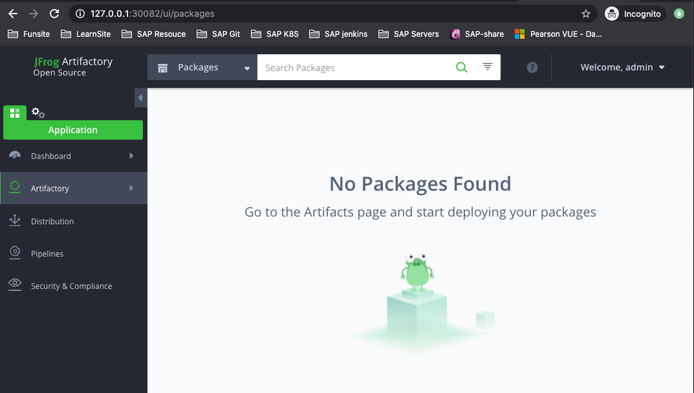
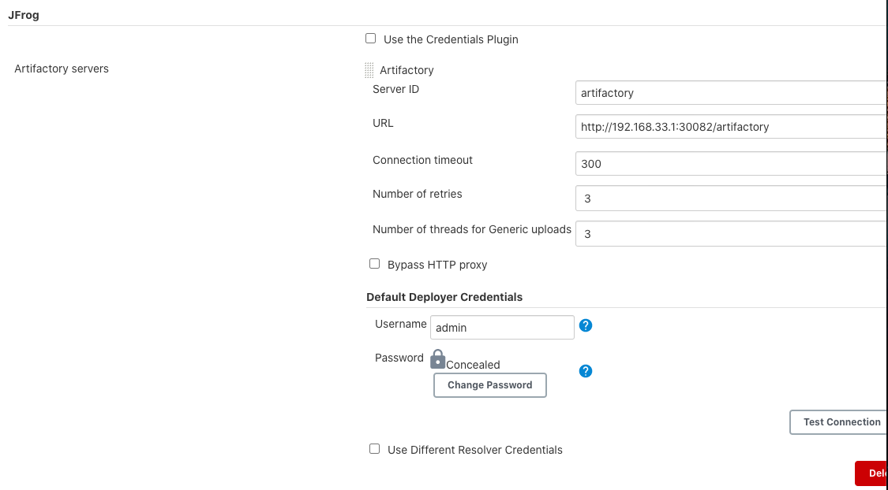
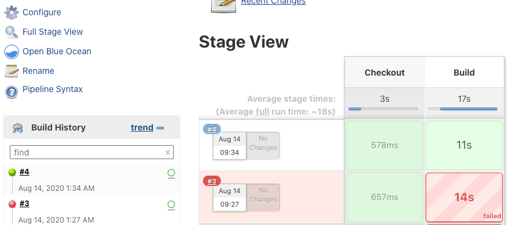
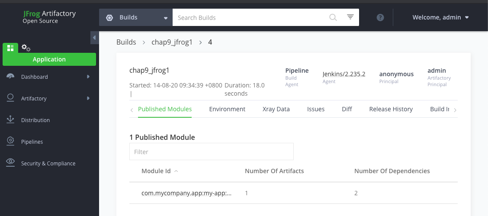
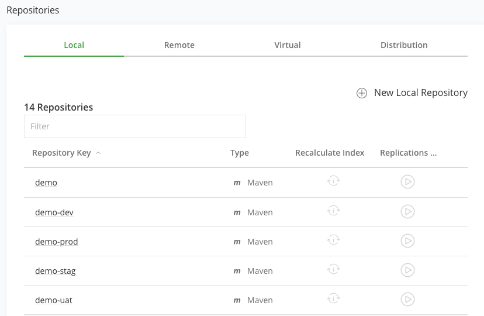
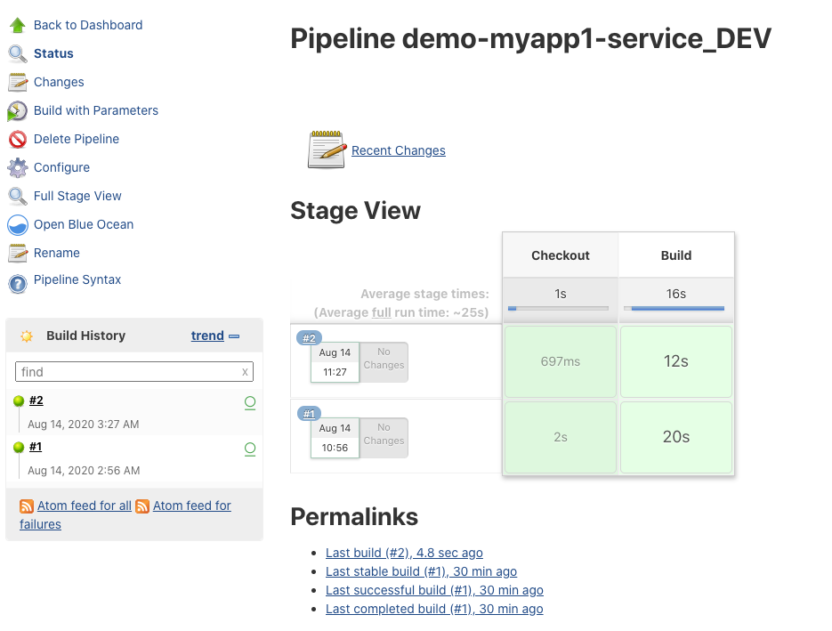
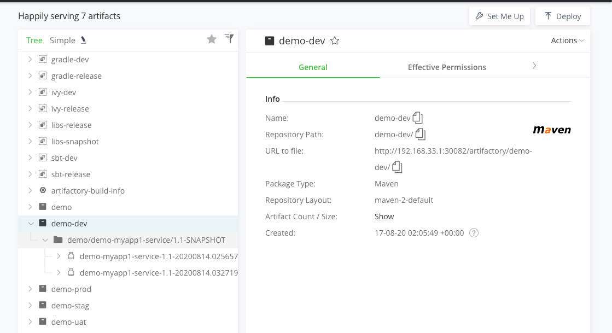

# **第四节 Jenkins & Jfrog Artifactory**


## 1、搭建 K8S Jfrog Artifactory Factory

```
$ kubectl create ns devops
namespace/devops created
```

```
---
kind: Deployment
apiVersion: apps/v1
metadata:
  labels:
    k8s-app: artifactory
  name: artifactory
  namespace: devops
spec:
  replicas: 1
  revisionHistoryLimit: 10
  selector:
    matchLabels:
      k8s-app: artifactory
  template:
    metadata:
      labels:
        k8s-app: artifactory
      namespace: devops
      name: artifactory
    spec:
      containers:
        - name: artifactory
          image: docker.bintray.io/jfrog/artifactory-oss:latest
          imagePullPolicy: IfNotPresent
          ports:
            - containerPort: 8082
              name: web
              protocol: TCP
          resources:
            limits:
              cpu: 1000m
              memory: 2Gi
            requests:
              cpu: 1000m
              memory: 2Gi
          volumeMounts:
            - name: arthome
              mountPath: /var/opt/jfrog/artifactory
      volumes:
        - name: arthome
          emptyDir: {}
          # hostPath:
          #   path: /data/devops/artifactory
          #   type: Directory
---
apiVersion: v1
kind: Service
metadata:
 name: artifactory
 namespace: devops
 labels:
   k8s-app: artifactory
spec:
 selector:
   k8s-app: artifactory
 type: NodePort
 ports:
 - name: web
   port: 8082
   targetPort: 8082
   nodePort: 30082
```

```
kubectl apply -f artifactory.yml 
```

**Login**

Artifactory comes with a pre-configured default "admin" account. Username: **admin**, Password: **password**.

* admin
* admin123





## 2、使用 Artifactory 构建收集数据

**安装`Artifactory`插件**： https://plugins.jenkins.io/artifactory/


### 2-1 Jenkins全局配置`artifactory` 

* Server ID:  **artifactory**
* URL: **http://192.168.33.1:30082/artifactory**
* Username	/ password



### 2-2 `artifactory.groovy`

```
package org.devops


//Maven打包构建
def MavenBuild(buildShell){
    def server = Artifactory.newServer url: "http://192.168.33.1:30082/artifactory"
    def rtMaven = Artifactory.newMavenBuild()
    def buildInfo
    server.connection.timeout = 300
    server.credentialsId = 'jfrog' 
    //maven打包
    rtMaven.tool = 'm2' 
    buildInfo = Artifactory.newBuildInfo()

    String newBuildShell = "${buildShell}".toString()
    println(newBuildShell)
    rtMaven.run pom: 'pom.xml', goals: newBuildShell, buildInfo: buildInfo
    //上传build信息
    server.publishBuildInfo buildInfo
}


//上传制品
def PushArtifact(){
    
    
    //重命名制品
    def jarName = sh returnStdout: true, script: "cd target;ls *.jar"
    jarName = jarName - "\n"
    def pom = readMavenPom file: 'pom.xml'
    env.pomVersion = "${pom.version}"
    env.serviceName = "${JOB_NAME}".split("_")[0]
    env.buildTag = "${BUILD_ID}"
    def newJarName = "${serviceName}-${pomVersion}-${buildTag}.jar"
    println("${jarName}  ------->>> ${newJarName}")
    sh " mv target/${jarName}  target/${newJarName}"
    
    //上传制品
    env.businessName = "${env.JOB_NAME}".split("-")[0]
    env.repoName = "${businessName}-${JOB_NAME.split("_")[-1].toLowerCase()}"
    println("本次制品将要上传到${repoName}仓库中!")   
    env.uploadDir = "${repoName}/${businessName}/${serviceName}/${pomVersion}"
    
    println('上传制品')
    rtUpload (
        serverId: "artifactory",
        spec:
            """{
            "files": [
                {
                "pattern": "target/${newJarName}",
                "target": "${uploadDir}/"
                }
            ]
            }"""
    )
}


def main(buildType,buildShell){
    if(buildType == "mvn"){
        MavenBuild(buildShell)
    }
}
```

### 2-3 使用`artifactory`和`maven`打包构建

```
#!groovy
@Library('jenkinslib@master') _

def build = new org.devops.buildtools()
def sonar = new org.devops.sonarqube()
def artifactory = new org.devops.artifactory()

pipeline {
    agent { node { label "hostmachine" }}
    parameters {
        string(name: 'srcUrl', defaultValue: 'http://192.168.33.1:30088/root/demo-maven-service.git', description: '') 
        choice(name: 'branchName', choices: 'master\nstage\ndev', description: 'Please chose your branch')
        choice(name: 'buildType', choices: 'mvn', description: 'build tool')
        choice(name: 'buildShell', choices: 'clean package -DskipTest\n--version', description: 'build tool')
    }
    stages{
        stage('Checkout') {
            steps {
                script {
                    checkout([$class: 'GitSCM', branches: [[name: "${branchName}"]], doGenerateSubmoduleConfigurations: false, extensions: [], submoduleCfg: [], userRemoteConfigs: [[credentialsId: 'gitlab-admin-user', url: "${srcUrl}"]]])
                } 
            }
        }

        stage('Build') {
            steps {
                script {
                    artifactory.main(buildType,buildShell)
                   // artifactory.PushArtifact()
                } 
            }
        }
    }
 }
```

**Console Output**

```
[Pipeline] artifactoryMavenBuild
Jenkins Artifactory Plugin version: 3.7.3
Artifactory integration is enabled
[chap9_jfrog1] $ /usr/lib/jvm/jre-openjdk/bin/java -classpath /opt/maven/boot/* -Dmaven.home=/opt/maven -Dmaven.conf=/opt/maven/conf -DbuildInfoConfig.propertiesFile=/home/vagrant/workspace/workspace/chap9_jfrog1@tmp/artifactory/buildInfo507882051108967646.properties -Dm3plugin.lib=/home/vagrant/workspace/workspace/chap9_jfrog1@tmp/artifactory/cache/artifactory-plugin/3.7.3 -Dclassworlds.conf=/home/vagrant/workspace/workspace/chap9_jfrog1@tmp/artifactory/classworlds7067099799344911655conf -Dmaven.multiModuleProjectDirectory=/home/vagrant/workspace/workspace/chap9_jfrog1 org.codehaus.plexus.classworlds.launcher.Launcher -f pom.xml clean package -DskipTest
[main] INFO org.apache.maven.cli.event.ExecutionEventLogger - Scanning for projects...
[main] INFO org.jfrog.build.extractor.maven.BuildInfoRecorder - Initializing Artifactory Build-Info Recording
...
Recorder: publish build info set to false, build info will not be published...
[main] INFO org.apache.maven.cli.event.ExecutionEventLogger - ------------------------------------------------------------------------
[main] INFO org.apache.maven.cli.event.ExecutionEventLogger - BUILD SUCCESS
[main] INFO org.apache.maven.cli.event.ExecutionEventLogger - ------------------------------------------------------------------------
[main] INFO org.apache.maven.cli.event.ExecutionEventLogger - Total time:  8.003 s
[main] INFO org.apache.maven.cli.event.ExecutionEventLogger - Finished at: 2020-08-14T01:34:50Z
[main] INFO org.apache.maven.cli.event.ExecutionEventLogger - ------------------------------------------------------------------------
[Pipeline] publishBuildInfo
Deploying build info to: http://192.168.33.1:30082/artifactory/api/build
Deploying build descriptor to: http://192.168.33.1:30082/artifactory/api/build
Build successfully deployed. Browse it in Artifactory under http://192.168.33.1:30082/artifactory/webapp/builds/chap9_jfrog1/4
```






## 3、使用 rtUpload 上传制品

### 3-1 命名规范

**仓库命名规范**

* 业务／项目一环境类型例如：`demo-dev` 
* 制品 

**命名规范**

* 应用名称一版本号一构建`ID.type` 
* 例如：`demo-myapp-service-1. jar` 

**制品** 

* 目录规范 业务／项目 
	* 应用名称 
		* 版本号 
			* 制品 


**` env.serviceName = "${JOB_NAME}".split("_")[0]`**


**Pipeline Name: `demo-myapp1-service_DEV`**

* repoName:  **`demo-dev`**
* businessName： **demo**
* serviceName: **demo**
* pomVersion: **`1.1-SNAPSHOT`**
* buildTag: `1`



### 3-2 `artifactory.groovy`

```
//上传制品
def PushArtifact(){
    
    
    //重命名制品
    def jarName = sh returnStdout: true, script: "cd target;ls *.jar"
    jarName = jarName - "\n"
    def pom = readMavenPom file: 'pom.xml'
    env.pomVersion = "${pom.version}"
    env.serviceName = "${JOB_NAME}".split("_")[0]
    env.buildTag = "${BUILD_ID}"
    def newJarName = "${serviceName}-${pomVersion}-${buildTag}.jar"
    println("${jarName}  ------->>> ${newJarName}")
    sh " mv target/${jarName}  target/${newJarName}"
    
    //上传制品
    env.businessName = "${env.JOB_NAME}".split("-")[0]
    env.repoName = "${businessName}-${JOB_NAME.split("_")[-1].toLowerCase()}"
    println("本次制品将要上传到${repoName}仓库中!")   
    env.uploadDir = "${repoName}/${businessName}/${serviceName}/${pomVersion}"
    
    println('上传制品')
    rtUpload (
        serverId: "artifactory",
        spec:
            """{
            "files": [
                {
                "pattern": "target/${newJarName}",
                "target": "${uploadDir}/"
                }
            ]
            }"""
    )
}
```

### 3-3 `Pipeline Script: demo-myapp1-service_DEV`

```
#!groovy
@Library('jenkinslib@master') _

def build = new org.devops.buildtools()
def sonar = new org.devops.sonarqube()
def artifactory = new org.devops.artifactory()

pipeline {
    agent { node { label "hostmachine" }}
    parameters {
        string(name: 'srcUrl', defaultValue: 'http://192.168.33.1:30088/root/demo-maven-service.git', description: '') 
        choice(name: 'branchName', choices: 'master\nstage\ndev', description: 'Please chose your branch')
        choice(name: 'buildType', choices: 'mvn', description: 'build tool')
        choice(name: 'buildShell', choices: 'clean package -DskipTest\n--version', description: 'build tool')
    }
    stages{
        stage('Checkout') {
            steps {
                script {
                    checkout([$class: 'GitSCM', branches: [[name: "${branchName}"]], doGenerateSubmoduleConfigurations: false, extensions: [], submoduleCfg: [], userRemoteConfigs: [[credentialsId: 'gitlab-admin-user', url: "${srcUrl}"]]])
                } 
            }
        }

        stage('Build') {
            steps {
                script {
                    artifactory.main(buildType,buildShell)
                    artifactory.PushArtifact()
                } 
            }
        }
    }
 }
```

* `demo-myapp1-service_DEV`



**Console Output**

```
...
+ cd target
+ ls my-app-1.1-SNAPSHOT.jar
[Pipeline] readMavenPom
[Pipeline] echo
my-app-1.1-SNAPSHOT.jar  ------->>> demo-myapp1-service-1.1-SNAPSHOT-2.jar
[Pipeline] sh
+ mv target/my-app-1.1-SNAPSHOT.jar target/demo-myapp1-service-1.1-SNAPSHOT-2.jar
[Pipeline] echo
本次制品将要上传到demo-dev仓库中!
[Pipeline] echo
上传制品
[Pipeline] rtUpload
[Pipeline] }
[Pipeline] // script
[Pipeline] }
[Pipeline] // stage
[Pipeline] }
[Pipeline] // node
[Pipeline] End of Pipeline
...
```




