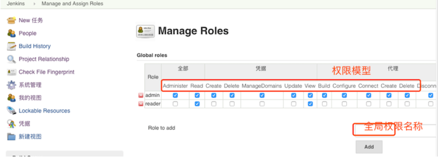

# 第一章 Jenkins 运维管理


`Jenkins`是一个自动化服务器，目前发展超过15年，比较成熟的CI工具（也可以CD) 能够实现自动化集成发布。建立好流水线后，期间无需专业运维人员介入，开发人员随时发布部署，任性！。 

**部分应用场景：** 

* 集成`svn/git`客户端实现源代码下载检出
* 集成`maven/ant/gradle/npm`等构建工具实现源码编译打包单元测试 
* 集成`sonarqube`对源代码进行质量检查（坏味道、复杂度、新增bug等） 
* 集成`SaltStack/Ansibie`实现自动化部署发布 
* 集成`Jmeter/Soar/Kubernetes/`...... 
* 可以自定义插件或者脚本通过`jenkins`传参运行 
* 可以说`Jenkins`比较灵活插件资源丰富，日常运维工作都可以自动化。 


## 2.Jenkins 简介与部署 (How to install Jenkins)

### 虚拟机（Linux) 安装

**Jenkins 安装准备**

* `Jenkins`使用java语言开发， 需要安装JDK，目前已支持`jdk11`.
* `Jenkins`的安装可以跨平台 (Win/Linux/Mac) 
* 部署／更新源：https://mirrors.tuna.tsinghua.edu.cn/jenkins  


**2-1 基于WAR包部署**

Jenkins的web应用程序`archive（war）`包是可以在任何支持`Java`的操作系统上运行。 Jenkins最新 [war包](https://mirrors.tuna.tsinghua.edu.cn/jenkins/war-stable/)

* 将下载的war包放到jenkins的目录中（可以自定义)。
* 运行命令 java -jar jenkins.war启动。
* 此时可以看到Jenkins的启动日志，查看是否有异常。
* 通过浏览器访问http://localhost:8080。

注意：可以通过 `--httpPort`方式指定端口，` java -jar jenkins.war -httpPort=9090`。

**2-2 基于`MAC`系统部署**

* 下载[软件包](http://mirrors.jenkins.io/osx/)手动安装
* `brew install jenkins `#安装jenkins最新版本
* `brew install jenkins-lts` #安装jenkinsLTS版本

**2-3 基于`Windows`系统安装**

下载[软件包](http://mirrors.jenkins.io/windows/)通过向导安装即可。

**2-4 基于Linux系统部署（推荐）**

* 下载[软件包](https://mirrors.tuna.tsinghua.edu.cn/jenkins/redhat-stable/)
* `rpm –ivh jenkins-2.150.3-1.1.noarch.rpm` #安装
* `service jenkins start` #启动服务
* `chkconfig jenkins on` #开机自启

```
service jenkins start
service jenkins status

ps aux | grep java
```

### 基于Docker的安装部署

安装的详细步骤可以查看我原来的文章 [Quick Start Jenkins on Docker](https://github.com/Chao-Xi/JacobTechBlog/blob/master/jenkins/1Quick_Start_Docker.md#quick-start-jenkins-on-docker)

* 安装`docker`环境 (exp: [Install Docker Engine on CentOS](https://docs.docker.com/engine/install/centos/)
* 准备好`plugn.txt` 作为`Jenkins`插件列表 (exp: [plugins.txt](https://github.com/Chao-Xi/JacobTechBlog/blob/master/jenkins/plugins.txt))
* 准备Dockerfile

```
FROM jenkins/jenkins:2.150.2
COPY plugins.txt /usr/share/jenkins/ref/plugins.txt
RUN /usr/local/bin/install-plugins.sh < /usr/share/jenkins/ref/plugins.txt
``` 

* 构建镜像`docker build -t jenkins:v20200630 .`
* 修改`var/lib/jenkins` 权限

```
$ cd /var/lib/
$ ls -la
drwxr-xr-x  2 root    root    4096 Jan 21 03:13 jenkins
$ sudo chown 1000 jenkins/
```

* 启动`docker container`:  

```
docker run -d -p 8080:8080 -p 50000:50000 --env=JAVA_OPTS=-Djenkins.install.runSetupWizard=false -v /var/lib/jenkins:/var/jenkins_home jenkins:v20200630
```

```
$ docker ps
CONTAINER ID        IMAGE               COMMAND                  CREATED             STATUS              PORTS                                              NAMES
1119ddfd13e6        jenkins:v20200531   "/sbin/tini -- /usr/…"   34 hours ago        Up 34 hours         0.0.0.0:8080->8080/tcp, 0.0.0.0:50000->50000/tcp   elegant_varahamihira
```

### 基于`Jenkins-operator`的安装部署

https://jenkinsci.github.io/kubernetes-operator/docs/installation/

## 3. Jenkins 的基本设置

### Jenkins 基本配置

* 配置访问端口: 默认`8080`
* 配置`JENKINS HOME`: 默认`/var/lib/jenkins` 配置启动用户
* 默认`Jenkins` 配置插件更新源: 默认官方源 -> 清华源/Jenkins中文社区源 
* 安装`pipeline`插件 `pipeline/Git／等插件 `

**3-1 解锁`Jenkins`：**

* 当您第一次访问Jenkins的时候，系统会要求您使用自动生成的密码对其进行解锁。
* 解锁秘钥可以通过`$JENKINS_HOME/secrets/initialAdminPassword`文件获取。还可以通过在启动日志中获取。


**3-2 自定义`Jenkins`插件**

* 解锁`Jenkins`之后再自定义`Jenkins`页面，您可以安装任何数量的插件作为初始化的一部分。
* 分别是安装建议的插件和选择要安装的插件（如果不确定要安装那些的时候可以选择此选项，灵活的自定义安装）。
* 插件安装多了也没关系，可以后面再`jenkins`插件管理页面删除哦


**3-3 配置更新站点**

* 由于使用官方的站点速度相对很慢，这里采用清华大学的jenkins更新站点。
* 站点地址: https://mirrors.tuna.tsinghua.edu.cn/jenkins/updates/update-center.json


**3-4 管理页面**

系统管理页面包含系统管理、全局安全管理、全局工具配置、节点管理、授权管理、插件管理、系统备份管理、日志监控管理等


**Jenkins 项目管理页面**


**Jenkins 构建页面**


## 4. Jenkins 添加 Agent

`Jenkins` 是一个单 `Master` 多 `Slave` 的集群架构（以前大多叫 `Slave`，现在大多叫 `Agent`）。

Jenkins 的 Agent 大概分两种，一是基于 `SSH` 的，需要把 `Master` 的 `SSH` 公钥配置到所有的 `Agent` 宿主机上去。二是基于 `JNLP` 的，走 `HTTP `协议，每个 `Agent` 需要配置一个独特的密码。基于 `SSH` 的，可以由 `Master` 来启动；基于 `JNLP` 的，需要自己启动。

* 使用`JNLP`协议添加`SLAVE `
* `Jenkins`配置固定`SLAVE`通信端口 

### 安装`Slave` 节点

**系统管理 -> 节点管理**


**创建完成后会出现`slave`节点启动的命令，下载`agent.jar`，然后启动服务。**


### 启动命令

```
$ java -version
openjdk version "1.8.0_252"
OpenJDK Runtime Environment (build 1.8.0_252-b09)
OpenJDK 64-Bit Server VM (build 25.252-b09, mixed mode)


$ mkdir workspace && cd workspace
$ wget http://192.168.33.11:8080/jnlpJars/agent.jar
$  java -jar agent.jar -jnlpUrl http://192.168.33.11:8080/computer/hostmachine/slave-agent.jnlp -workDir "/home/vagrant/workspace"

# This is will keep running we need this run in the background
```

**Run in back ground**

```
$ cd workspace
$ vim startagent.sh
nohup java -jar agent.jar -jnlpUrl http://192.168.33.11:8080/computer/hostmachine/slave-agent.jnlp -workDir "/home/vagrant/workspace" &


source startagent.sh
```


## 5. Jenkins 用户与权限管理

操作添加删除更新用户。使用插件为用户分配项目授权。


**用户认证方式** 

* 默认`Jenkins`自带数据库 
* `LDAP`认证 
* `ActiveDirctory`认证 
* `Gitlab/GitHub`认证

**用户管理**

* 新增用户 
* 删除用户 

### 5-1 用户管理

* 配置用户接入入口: **系统管理->全局安全配置**。
* 默认使用的是`Jenkins`数据库存储。
* 可以选择集成`LDAP`服务或者是`Gitlab`服务（需要安装插件后才会有）


### 5-2 用户管理权限管理

安装授权插件`Role-Basecd Strategy`用户项目授权 


### 5-3  管理权限

* 系统设置->`Manage and Assign Roles`->`Manage Roles`
* `Global roles`：添加用户和用户组，分配某个用户属于哪个用户组。
* `Project roles`：添加某个工程或某一组工程的用户或用户组
* `Slave roles`：添加某个节点或某一组节点的用户或用户组


凭据参数、字符参数、密码参数、布尔值参数、文件参数、文本参数、运行时参数、选项参数

* 系统设置->`Manage and Assign Roles`->`Assign Roles`


### 5-4 全局权限



### 5-5 项目权限


## 6. Jenkins 凭据管理与应用 

凭证可以是一段字符串如密码，私钥文件等，是Jenkins 进行受限操作时的凭据。比如 SSH 登录远程服务器，用户名，密码或 SSH key就是凭证。这些凭据不要明文写在 `Jenkinsfile` 中，Jenkins有专门管理凭证的地方和插件。

添加凭证后，需要安装`"Credentials Binding Plugin"`插件，就可以在 `pipeline `中使用`withCredentials` 步骤使用凭证了。

### 凭据管理

凭据可以用来存储需要密文保护的数据库密码、Gitlab密码信息。

**`凭据-> 系统-> 全局凭据`**

## 7. Jenkins 项目管理 

简述 Jenkins 的项目类型，创建删除项目。使用视图对项目进行分类。

### 7-1 项目管理 —— 流水线项目管理

**7-1-1 命名规范**

业务名称-应用名称-应用类型_环境类型： `jam-workzone-kops_TEST`, 只有命名规范才方便管理项目。

**7-1-2 新建项目**


**7-1-3 设置构建历史**


**7-1-4 选择参数化构建**


**7-1-5 设置Jenkinsfile**


### 7-2 项目管理 —— 项目基本管理


### 7-3 项目管理 —— 项目文件夹

* 以业务简称为名，创建工程文件夹。将同一个业务的工程全部放到同一个文件夹中。
* 移动项目


### 7-4 项目管理 —— 视图

默认会创建一个all视图里面存放所有的项目。


