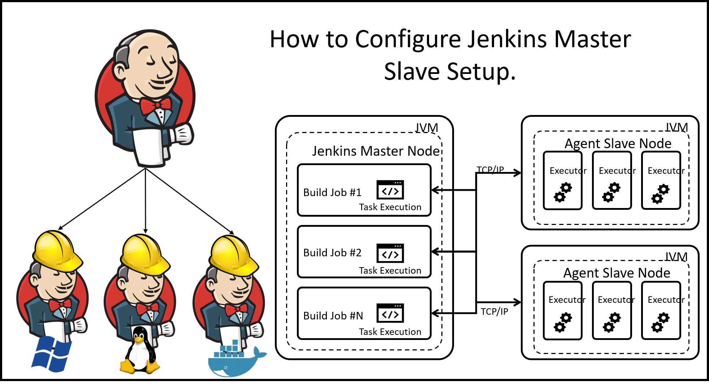
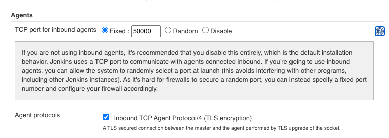

# 第二节 分布式构建与并行构建 

## 1. Jenkins架构 

`Jenkins`采用的是`"master+agent"`架构（有时也称为`master+slave`架构），`Jenkins master`负责提供界面、处理HTTP请求及管理构建环境构建的执行则由`Jenkins agent`负责（早期`agent`也被称为`slave`。目前还有一些插件沿用`slave的`概念）。 

基于这样的架构只需要增加`agent`就可以轻松支待更多的项目同时执行。这种方式称为`Jenkins agent`的横向扩容 

对于`Jenkins matter`存在单节点问题是显而易见的，但是目前还没有很好的解决方案 




* `node`：节点，指包含`Jenkins`环境及有能力执行项目的机器。`master`和`agent`都被认为是节 点。 
* `executor`：执行器，是真正执行项目的单元。一个执行器可以被理解为一个单独的进程（事 实上是线程）。在一个节点上可以运行多个执行器。 
* `agent`:代理，在概念上指的是相对于`Jenkins master`的一种角色，实际上是指运行在机器或 容器中的一个程序，它会连接上`Jenkins master`，并执行`Jenkins master`分配给它的任务。
* `slave`:与`agent`表达的是一个东西，只是叫法不同。 理解`node` 、`executor`、 `agent`、 `slave`之间的关系，对于做好分布式构建很重要。 

总而言之，`executor`：的概念是相对于`node`的，没有`node`也就谈不上`executor`了。`node`通常指的是机器（不论是物理的还是虚拟的）。

`agent`有时指一个程序，有时指一种角色（相对于`master` 而言），这取决于上下文。对一于`slave`，可以等同于`agent`

总而言之，`executor`：的概念是相对于`node`的，没有node也就谈不上executor了。node通常指 的是机器（不论是物理的还是虚拟的）。`agent`有时指一个程序，有时指一种角色（相对于`master` 而言），这取决于上下文。对一于`slave`，可以等同于`agent`


## 2 增加agent 

实现分布式构建最常用、最基本的方式就是增加`agent`. `Jenkins agent`作为一个负责执行任务的程序，它需要与`Jenkins master`建立双向连接。连接方式有多种，这也代表有多种增加`agent`的方式。 在真正介绍如何增加agent前，我们需要了解标签（(label)在分布式构建中的作用。 

### 2-1 对`agent`打标签 

当`agent`数量变多时，如何知道哪些`agent`支持`JDK8`.哪些`agent`支持`Node.js`环境呢？我们可以通过给`agent`打标签（有时也称为`tag`）来确定。 

通过标签将多个`agent` 分配到同一个逻辑组中，这个过程被称为打标签。同一个`agent`可以拥有多个标签。在标签名中不能包含空格，也不能包含`！、&、｛、＜、＞、（、）`这些特殊字符中的任何一个。因为包含特殊字符的标签名与标签表达式（用于过滤agent)冲突。 

对于支持`JDK8`的`agent`，我们打上`jdk8`标签；对于支持`Node.js`的`agent`，我们打上`nodejs` 标签；如果一个`agen`同时支持`JDK8`和`Node.js`，那么就两个标签都打上。 

在打标签时，可以根据以下几个维度来进行。 

* 工具链：`jdk\nodejs\ruby`；也可以加上工具的版本，如`jdk6`、` jdk8`.
* 操作系统：linux、 windows、 osx；或者加上操作系统的版本，如ubuntul 8.04、 centos7.30 
* 系统位数：32bit、64bit 

可以根据实际项目情况新增维度。 对于不同的增加agent的方式，打标签的方式也不同。


### 2-2通过JNLP协议增加`agent `

Java网络启动协议（`JNLP`)是种允许客户端启动托管在远程`Web`服务器上的应用程序的协议。`Jeakins master`与`agent`通过`JNLP`协议进行通信。**而`Jana Web Start(JWS)`可以被理解为 JNLP协议的一个客户端。现实中人们常常将`JNLP`和`JWS`看成是一种东西** 


接下来我们来看看通过JNLP协议城加agent的具体步骤 

进入`Manage Jenkins` ->  `Globa Security` -> `TCP Port for JNLP`配置页面, 我们可以选择开放固定端口或者随机开放`Jenkins Master`的一个端口来提供`JNLP`服务 





随机开放端口不利于自动化所以透择开放周定端口。此端口用于`master`与`agent`之间的
`TCP`通信与访问`Jenkins`界面时的端口有别 。


* `Name`: `agent`名称。
* `Remote root directory`: `agent`机器上的工作目录（`Jenkins master`不关心），使用绝对路径。 `/home/vagrant/workspace/`

```
$ tree -L 1 workspace/
workspace/
├── Chapter2-5Script
├── Chapter2-5Script@tmp
├── Chapter2_test2
├── Chapter2_test2@tmp
├── HelloWorld
└── HelloWorld@tmp

6 directories, 0 files
```

* `Labels`: `agent`的标签。
* `Usage:` `agent`的使用策略。有两种：
	* `Use this node as much as possible`，尽可能使用此`agent` 。
	* `Only build jobs with label expressions matching this node`，只有当构建任务符合本`agent` 的标签时，才使用此`agent` 
* `Launch method`: `agent`的运行方式。`JNLP`协议的`agent`选择`“Launch agent via Java Web Start"` 


