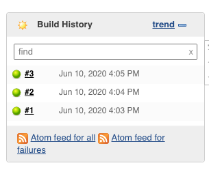
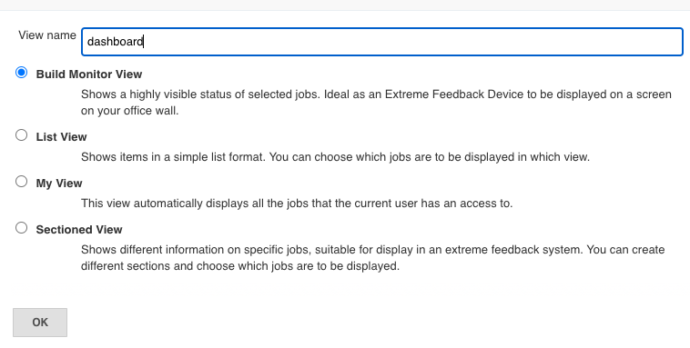
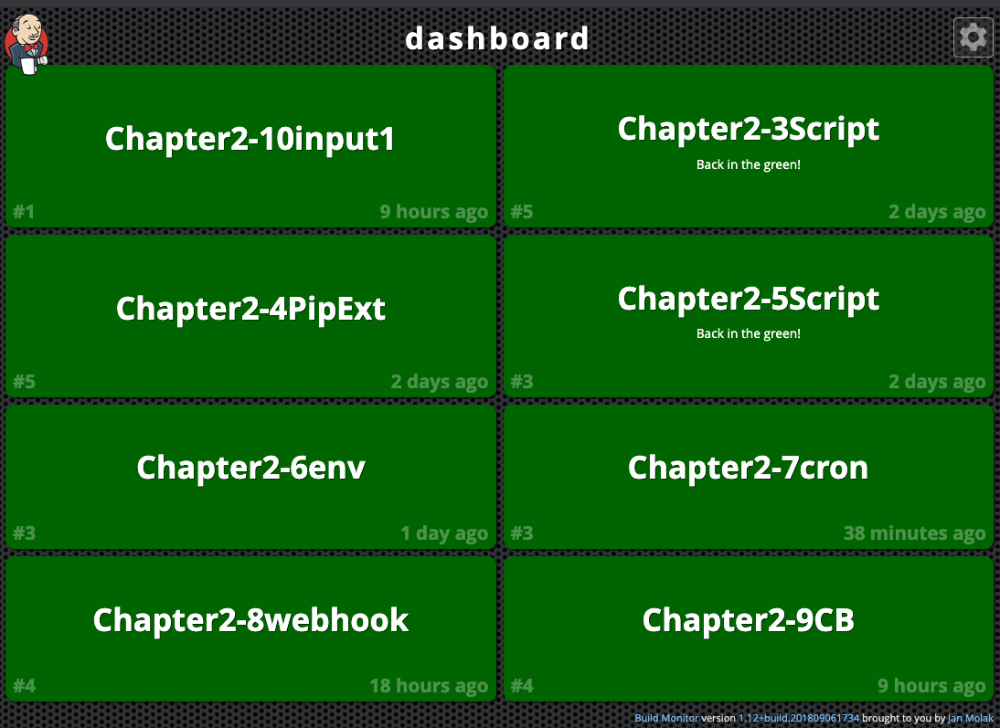

# **第三节 可视化构建试图**

## Green Balls 插件

JUnit 有一句 slogan： 

**Keep the bar green to keep the cork clean**

`Green Balls` 插件的作用就是让构建成功的状态图标变成绿色的。 

## Build Monitor View插件

`Build Monitor View插件`(`https://plugins.jenkins.io/build-monitor-plugin`/）可以将Jenkins项目 以一块"看板”的形式呈现 

安装该插件后，我们需要手动添加这块看板。

步骤如下 

* (1) 单击`+`号添加新视图

* (2) 进人添加表单后，选择“Build Monitor View”选项
* (3）进人`“Build Monitor View”`编辑页，可以选择在视图中显示I哪些`Job`，以及它们的排序规则

当构建失败时，就会出现红块。 

如果条件允许，请将这块“看板”显示在人人都可以看到的大屏幕上。这样做的好处是： 

* (1)大家提交代码会变得更严谨，因为所有人都可以看到你的构建结果。在没有持续集成经 验的团队中，一开始开发人员并不会很在意构建的成功与失败。即使上一次构建失败了，其他人 也会继续推送代码。这样的操作违反了持续集成的一个原则：不修复失败的构建，不提交代码。 
* (2）让项目信息流通更顺畅。人人都可以看到最近执行了什么构建。 

